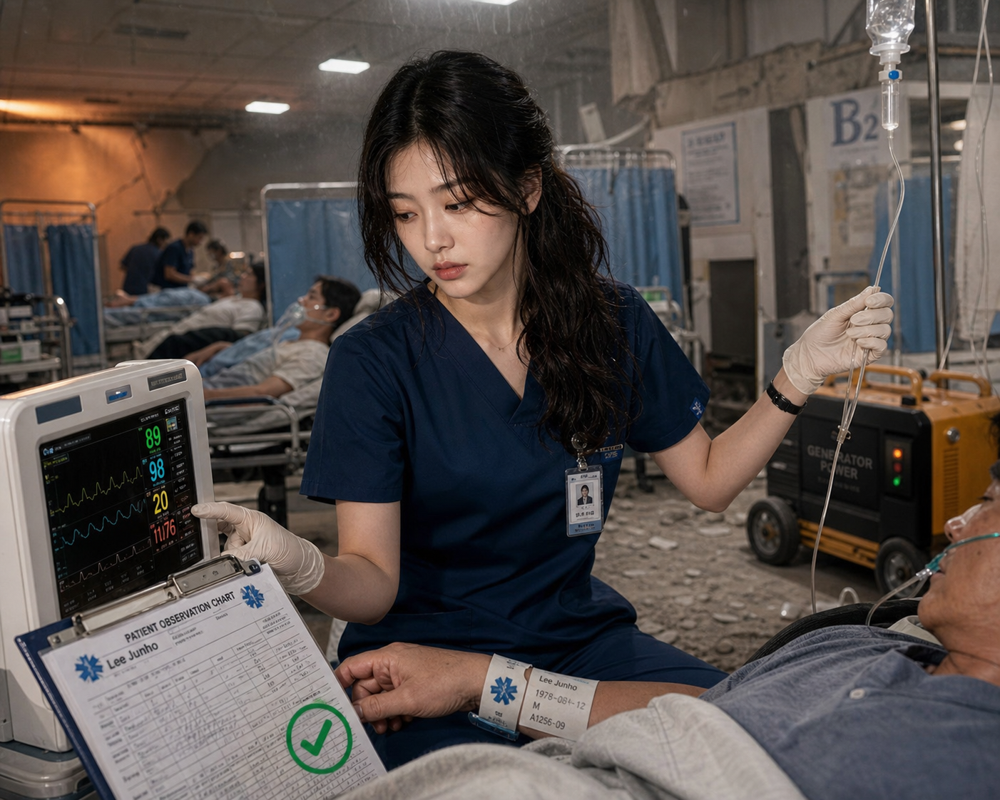
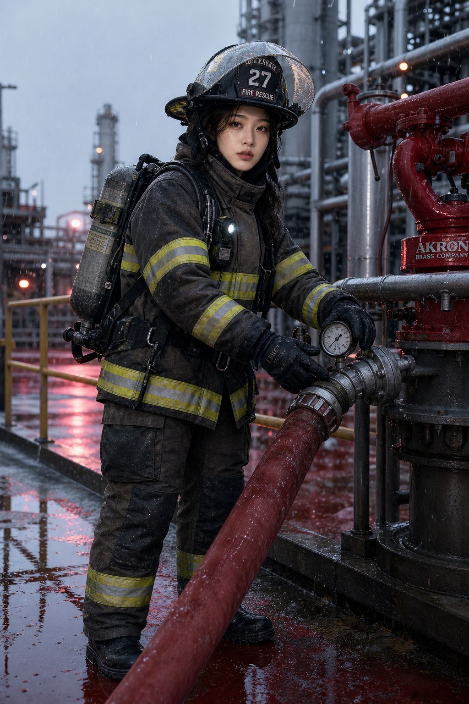
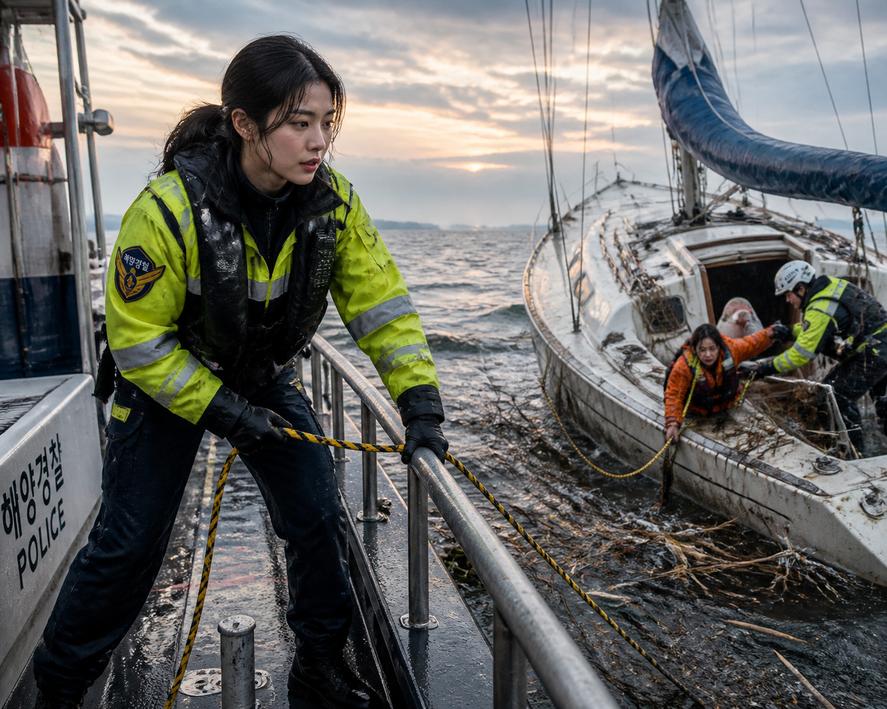
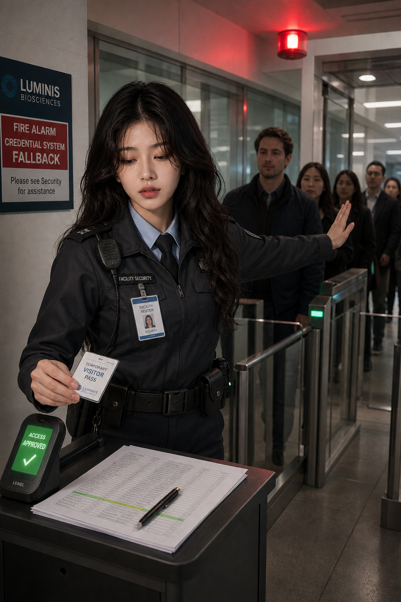

# 여성 직업 제복 시각 의미·후보팩 및 5-arm 픽셀 검증 보고서

검증일: 2026-09-01

## 결론

데이터·후보팩·인덱스·프롬프트 감사는 통과했지만, 엄격한 렌더 충실도 판정은 `revise`다.

- 하드 프로필 완전 통과: 2/5 arm
- 전체 장면 완전 통과: 1/5 arm
- 목표 프로필 게이트: 20/25 통과
- 공통 장면 게이트 포함: 38/47 통과
- 각 arm의 내장 이미지 생성 호출: 1회
- 재생성: 0회
- 사용자 판단: 미평가

소방 보호구 시스템은 목표·공통 게이트를 모두 통과했다. 철도 기관사는 목표 5/5를 통과했지만 시선과 낙엽 부착 상태 때문에 전체 장면은 실패했다. 간호, 해양경찰, 민간 보안은 각각 기록 상태 일치, 구조선 연속성·갑판화, 자격증명-기록-게이트 결과의 인과 연쇄가 픽셀에서 완전히 증명되지 않았다.

## 데이터 반영

하드 시각 프로필 8종을 추가했다.

1. `clinical_nursing_duty_system`
2. `police_public_safety_duty_system`
3. `firefighter_protective_response_system`
4. `emergency_medical_transport_system`
5. `maritime_safety_coast_guard_role`
6. `rail_driver_operation`
7. `rail_platform_dispatch_operation`
8. `private_security_access_control`

각 프로필은 구성요소 그룹, 프롬프트 증거 5개, 픽셀 게이트 5개, 대체 혼동 항목을 가진다. 간호·경찰·소방·응급의료·해양·기관사·플랫폼·보안 외에도 전문 주방, 우편 배달, 호텔 프런트의 후보 묶음과 업무 프리셋을 추가했다. 호텔 복장은 보편 제복으로 강제하지 않고 선택 슬롯으로 유지한다.

`여성 제복`, `female uniform`, `woman in uniform` 같은 포괄어는 어떤 새 직업 프로필도 하드 활성화하지 않는다. `여성`은 성인 착용자·선택적 핏 축이며 치마, 구두, 화장, 몸매 강조 또는 다른 직무를 자동으로 추가하지 않는다.

기존 레시피의 간호사 코스튬, 경찰 코스튬, 소방 헬멧 초상, 해경 시장 장면, 기관사 복도 인계, 플랫폼 작별, 우편 낭만적 편지 전달, 호텔 글래머 경로를 업무 중심 프리셋으로 교체했다.

## 근거 경계

- [NHS England workwear guidance](https://www.england.nhs.uk/publication/uniforms-and-workwear-guidance-for-nhs-employers/): 임상 근무복·식별·업무의 결합
- [Korean police uniform legal interpretation](https://www.law.go.kr/expcInfoP.do?expcSeq=315651): 규제된 공적 표지와 실재 표장 복제 회피
- [OSHA 1910.156](https://www.osha.gov/laws-regs/regulations/standardnumber/1910/1910.156): 소방 보호구를 구성 시스템으로 취급
- [EMS.gov](https://www.ems.gov/becoming-an-ems-clinician/): 평가·안정화·수송 연쇄
- [IMO life-saving appliances](https://www.imo.org/en/ourwork/safety/pages/lifesavingappliances-default.aspx): 구조 설비와 배치 관계
- [RSSB RIS-3703-TOM](https://www.rssb.co.uk/standards-catalogue/CatalogueItem/ris-3703-tom-iss-6): 플랫폼-열차 접점과 발차 절차
- [ORR driver-controlled operation](https://www.orr.gov.uk/guidance-compliance/rail/health-safety/strategy/driver-controlled-operation-dco): 통제된 운전실 작업
- [CISA physical-security recommendations](https://www.cisa.gov/sites/default/files/documents/CatalogofRecommendationsVer7.pdf): 자격증명·리더기·기록·게이트 관계
- [FDA Food Code](https://www.fda.gov/food/retail-food-protection/fda-food-code), [USPS uniform program](https://about.usps.com/manuals/elm/html/elmc9_009.htm), [BLS lodging managers](https://www.bls.gov/ooh/management/lodging-managers.htm): 비보편 서비스 복장과 업무 경계

이 근거는 관찰 가능한 관계를 설계하는 데만 사용했다. 생성 이미지는 법적 권한, 자격, 임상 능력, 보호구 인증, 구조 성공, 운전 자격, 출입 승인 또는 실제 기관 소속을 증명하지 않는다.

## 5-arm 결과

| Arm | 랜덤 복합 컨셉 | 목표 | 전체 | 엄격 판정 | 핵심 실패 |
|---|---|---:|---:|---|---|
| 01 간호 | 지진 여진 뒤 전원 전환 중 임시 병동 | 4/5 | 8/10 | 실패 | 차트↔모니터 수치 일치, 실제 전원 전환 상태 |
| 02 소방 | 결빙우 속 화학 플랜트 대기 장비 점검 | 5/5 | 9/9 | 통과 | 없음 |
| 03 해양경찰 | 폭풍 잔해 속 고장 요트 구조 | 3/5 | 6/10 | 실패 | 갑판화 크롭, 구조선 연속성·회수 종점 |
| 04 기관사 | 저점착 제한 중 가을 낙엽 통근 운전실 | 5/5 | 8/9 | 전체 실패 | 카메라 응시, 레일헤드 낙엽 부착 불명확 |
| 05 민간 보안 | 화재경보 자격증명 폴백 중 바이오랩 방문객 급증 | 3/5 | 7/9 | 실패 | 동일 기록 연결, 승인에 따른 게이트 상태 변화 |

### Arm 01 — 임상 간호

스크럽·식별표·환자·IV·모니터·차트가 한 프레임에서 임상 역할을 만든다. 그러나 차트의 값이 모니터와 실제로 일치하는지 판독할 수 없다. 생성된 팔찌와 차트에는 요청하지 않은 읽을 수 있는 가상 이름·생년 정보가 있어 보조 실패로 기록했다.

### Arm 02 — 소방 보호구

헬멧, 코트, 바지, 장갑, 부츠, SCBA, 압력계, 결합부, 호스가 한 작업 시스템으로 연결된다. 두 손이 실제 장비 점검을 수행하며 게이지 상태도 보인다. 목표와 공통 게이트를 모두 통과했다. 다만 생성된 헬멧·밸브 문자는 비목표 텍스트 아티팩트다.

### Arm 03 — 해양경찰

해양 대응자, 부력복, 무전기, 장갑, 구조선 작업, 고장 요트와 보조 대상은 보인다. 그러나 발이 프레임 밖이라 갑판화를 검증할 수 없고, 주 피사체의 검정-노랑 선과 대상 쪽 가는 선이 하나의 연속 경로인지 불명확하다.

### Arm 04 — 철도 기관사

운전석, 제어기 접촉, 노선 화면, 황색 신호, 40 제한, 젖은 가을 선로가 일관된 운전 관계를 만든다. 목표 프로필은 5/5 통과했다. 하지만 시선이 선로·계기가 아니라 카메라를 향하고 레일헤드 낙엽 코팅이 불명확해 전체 장면은 실패다.

### Arm 05 — 민간 출입통제 보안

민간 시설 보안, 방문증, 승인 리더기, 기록지, 대기열, 게이트는 보인다. 하지만 방문증이 리더기에 닿거나 동일 기록 행과 대조되는 순간이 없고, 승인 결과로 특정 게이트가 열리는 것도 보이지 않는다.

## 증거 층

| 층 | 결과 | 주장 가능한 범위 |
|---|---|---|
| 소스·정책 | 통과 | 공식 근거와 혼동 경계가 데이터에 기록됨 |
| 패키지 | 통과 | 8 프로필, 11 후보 묶음, 11 프리셋, 레시피, 인덱스가 유효함 |
| 프롬프트 | 통과 | 5개 v6 팩이 각각 정확한 하드 프로필을 활성화하고 감사 통과 |
| 전달 | 통과 | 5개 내장 생성 호출 성공, 각 1회, 재시도 0회 |
| 픽셀 | 실패 | 목표 완전 통과 2/5, 전체 장면 통과 1/5 |
| 사용자 판단 | 미평가 | 선호도·실제 닮아 보임·미적 수용은 사용자가 판단해야 함 |

## 독립성 감사

다섯 별도 서브에이전트가 별도 코어, 후보팩, 프롬프트, 생성 호출을 사용했고 다른 arm의 생성 내용을 입력으로 쓰지 않았다. 다만 arm 03은 코어 동결 뒤 저장소 전체에서 스키마 키를 찾는 `rg`를 실행해 다른 arm의 파일명과 동일한 키 한 줄이 검색 결과에 노출됐다고 자진 기록했다. 다른 프롬프트·팩 의미·이미지·리뷰를 열거나 생성에 사용하지 않았지만, 엄격한 `다른 arm 파일을 전혀 보지 않음` 프로토콜은 깨끗한 통과가 아니라 `warn`이다. 병렬 생성 도구가 공용 임시 폴더에 출력을 기록한 뒤, 코디네이터가 내용으로 파일을 매핑하고 각 agent에는 자기 경로만 전달했다.

## 검증

- 새 집중 테스트: 7/7 통과
- 기존 시각 프로필 검색 테스트: 12/12 통과
- 사전 메타데이터: 통과
- 시각 프로필 인덱스: 170 profiles / 1,003 exact terms, 통과
- 후보 의미 인덱스: 7,443 entries / 768 dimensions / 16 shards
- 개선 iteration record: 검증 통과
- 최종 결정: `revise`

다음 개선 우선순위는 분위기나 복장을 더 강조하는 것이 아니라 `결과 상태를 한눈에 증명하는 근접 기하`다. 임상은 동일 값 쌍, 해양은 하나의 구조선과 도착 종점, 보안은 카드-동일 기록-열린 게이트를 한 연속 시선 경로 안에 배치해야 한다.
