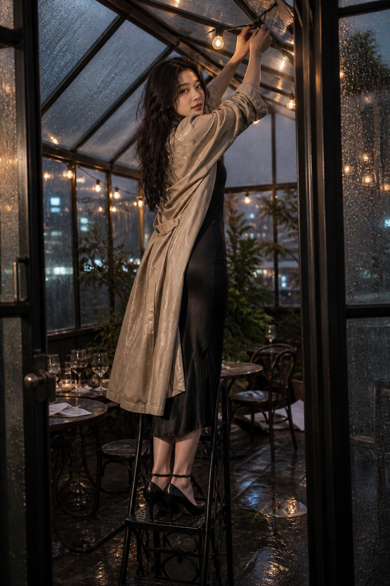

# 은꼴사 중심 독립 재테스트 보고서

## 결론

독립 서브에이전트가 컨셉을 먼저 동결하고, 현재 v6 후보팩 흐름을 사후 적용한 뒤, 첨부 인물 사진을 제한된 외형 참조로 사용해 이미지를 정확히 한 번 생성했다.

- 광의의 관찰 가능 메타 기준: **6/6 PASS**
- 동결된 핵심 사건 기준: **2/3 PASS**
- 엄격 픽셀 적격성: **FAIL** (`partial_is_fail`)
- 사용자 미감 판정: **PENDING**

따라서 한 가지 제한된 해석—성인·비노골적 장면에서 행동, 불투명한 옷감 층, 젖은 재질, 짧은 상호 시선, 행사 후의 흐트러짐이 함께 만드는 간접적 긴장—은 실제 픽셀에 나타났다. 그러나 동결된 전체 컨셉을 완전하게 구현했다고 판정할 수는 없다.

## 독립성 및 실행 조건

- 새 서브에이전트는 이전 3개 테스트의 프롬프트, 후보팩, 이미지, 리뷰를 입력으로 사용하지 않았다.
- OS CSPRNG 시드: `37d16a3044635bedab96065eacb2b3d621a8184eb659b1ad182048fe3a313d4a`
- 저자 코어는 프로젝트 레지스트리·프로필·인덱스를 읽기 전에 동결했다.
- 이후 현재 `photo-candidate-pack/v6` 흐름에서 후보팩 1개(`3ee26db0dbedd511`)를 만들었다.
- built-in 이미지 생성 호출: **1회**
- 재시도: **0회**
- 폴백: **없음**
- 다른 arm 입력 사용: **없음**

## 무작위로 동결된 컨셉

갤러리 리셉션이 끝난 뒤 비에 젖은 옥상 온실. 명확한 성인 여성 한 명이 낮은 철제 발판 위에서 떨어진 전구 줄을 다시 걸기 위해 두 팔을 올린다. 불투명한 검은 새틴 미디 드레스 위에 젖은 연베이지 레인코트를 걸쳤고, 작업 도중 카메라 쪽으로 어깨너머 시선과 절제된 반미소를 보인다. 핵심은 노출 자체가 아니라 유용한 행동, 당겨지는 두 옷감 층, 젖은 머리와 재질, 짧은 상호 시선, 공개 행사의 흔적과 사적인 뒤정리 순간의 대비가 한 프레임에서 결합되는 것이다.

첨부 사진은 보이는 성인 얼굴 비례, 긴 어두운 웨이브 머리, 자연스러운 피부 질감에만 사용했다. 신원·동일인 여부·생체정보·보호 특성·건강·매력도·성격·직업·민족·국적·관계는 추론하지 않았다.

## 생성 결과

원본은 1023×1537이며 SHA-256은 `98ad93acd4cf3206598c9848f52eaac8aca4b5e4343a3b1b8b6648d720d81f58`이다. 340×512 축소본에서도 별도로 판정했다.

## 실제 픽셀 판정

### 반영된 요소

- 명확한 성인 한 명, 불투명한 의상, 비노골적이고 장면 중심인 구성
- 양손으로 전구 줄을 다루는 자기주도적 미완료 행동
- 젖은 연베이지 코트가 검은 새틴 드레스를 부분적으로 덮고 프레이밍하는 옷감 층 관계
- 팔을 올린 동작이 만드는 대각선 주름, 중력으로 떨어지는 코트 패널, 겹침 그림자, 비의 광택이라는 물리 원인
- 어깨너머 시선, 따뜻한 전구, 차가운 도시광, 젖은 유리, 비워진 리셉션 테이블이 만드는 행사 후 순간
- 키워드나 프롬프트를 보지 않아도 위의 시각 명제를 픽셀에서 설명할 수 있음

### 실패한 요소

- 전구를 다시 거는 동작은 보이지만, 받침은 **낮은 철제 발판이 아니라 높은 철제 의자**로 읽힌다.
- 축소 화면에서 입은 절제된 반미소보다 중립적이거나 살짝 벌어진 표정으로 읽힌다.
- 구도는 `medium-full`보다 신발과 의자 전체가 포함된 거의 전신 환경 인물 사진이다.
- 젖은 좁은 의자 좌판 위에 하이힐로 선 자세는 요청한 `believable footing`을 충족하지 못한다.

동결된 핵심 사건의 일부가 깨졌으므로 `partial_is_fail` 정책에 따라 전체 픽셀 적격성은 `FAIL`이다. 다만 이는 이미지 생성 실패나 품질 0을 뜻하지 않는다. 패키지, 프롬프트 감사, 생성 성공, 픽셀 적격성, 사용자 미감 판정은 서로 다른 증거 층이다.

## 판정 경계

이 결과는 광의의 한국어 축약어를 보편적으로 정의하지 않는다. 이번 1회 결과는 독립적으로 저술한 한 가지 관찰 가능한 해석이 이미지에 나타나는지에 대한 제한된 증거이며, 해당 축약어를 exact hard route로 승격할 근거도 아니다. 사용자 미감 수용 여부는 아직 판정하지 않았다.

## 감사 자료

- [동결된 무작위 선택](arm-01/randomization.json)
- [동결된 저자 코어](arm-01/authorial_core.json)
- [후보팩](arm-01/candidate_pack.json)
- [합성 프롬프트](arm-01/composed_prompt.json)
- [합성 프롬프트 감사](arm-01/composed_audit.json)
- [런타임 요청 감사](arm-01/render_request_audit.json)
- [서브에이전트 픽셀 리뷰](arm-01/pixel_review.json)
- [루트 독립 픽셀 리뷰](coordination/root_pixel_review.json)
- [단일 호출 매니페스트](arm-01/run_manifest.json)
