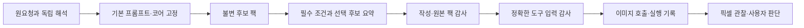

**photo-prompt-image-generator 구조 개선 및 과거 사례 5개 실행 결과 — 2026-09-05**

구조 개선을 적용하고, 과거 요청 다섯 개를 별도 컨텍스트의 서브에이전트가 다시 작성·생성하도록 시험했다. 신규 테스트 25개는 통과했다. 이미지 도구 호출은 총 5회이며 3개가 전달되고 2개가 출력 검사에서 차단됐다. 전달된 이미지 중 츤데레와 얀데레는 필수 의미 표현에 실패했고, 산신령은 부유·금은 도끼 장면을 충족했지만 정확한 발화 내용은 미판정이다. 개선 전후의 이미지 품질 우위를 입증하는 실험은 아니다.

[이미지와 전체 영어 프롬프트 갤러리](/Users/chasoik/Projects/image-prompt/generated_images/skill-architecture-five-case-20260905/gallery.html) · [통합 실행 결과](/Users/chasoik/Projects/image-prompt/generated_images/skill-architecture-five-case-20260905/evaluation_result.json) · [검증된 개선 기록](/Users/chasoik/Projects/image-prompt/generated_images/skill-architecture-five-case-20260905/iteration-record.json)

적용한 변경은 다음과 같다.

| 대상 | 이전 → 변경 후 |
|---|---|
| [SKILL.md](/Users/chasoik/Projects/image-prompt/skills/photo-prompt-image-generator/SKILL.md) | 최초 작성과 재시도의 자료 접근 지시가 충돌 → 최초에는 독립 해석·기본 프롬프트를 먼저 고정하고, 재시도에는 부모의 보존 대상·필수 조건만 읽도록 범위를 명시했다. 기존 승인과 사용자 지시의 우선순위도 명시했다. |
| [공통 계약 정의](/Users/chasoik/Projects/image-prompt/skills/photo-prompt-image-generator/scripts/photo_contracts.py) | 생성기·감사기에 흩어진 상수 → 33개 공통 정의와 JSON 해시 함수를 순수 모듈로 분리했다. 의미 재구성과 검증 로직은 각 검사기에 유지했다. |
| [작성 자유도 정책](/Users/chasoik/Projects/image-prompt/skills/photo-prompt-image-generator/scripts/prompt_generator.py) | 열린 차원과 추가 작성 결정을 항상 2개 이상 요구 → 새 v6는 열린 차원이 0/1/2개 이상이면 최소 작성 결정도 0/1/2개로 제한한다. 정책을 코어·의도 해시와 연결하고 감사기가 독립 재계산한다. 이전 계약은 기존 최소 조건을 유지한다. |
| [작성용 요약 뷰](/Users/chasoik/Projects/image-prompt/skills/photo-prompt-image-generator/scripts/compose_pack_view.py) | 전체 후보 상세를 한 번에 읽음 → 필수·미지의 계약은 그대로 노출하고, 알려진 선택 후보 목록만 필요한 때 상세 조회한다. 원본 팩 해시와 뷰를 검증하며 최종 감사는 항상 원본 팩을 사용한다. |
| [런타임 절차](/Users/chasoik/Projects/image-prompt/skills/photo-prompt-image-generator/references/image-runtime.md) | 특정 캐릭터명에 고정된 시선·포즈 지시, 정상 PASS를 차단한다고 쓴 문구 → 해당 팩의 실제 계약으로 판정하고, 누락·실패한 감사가 생성을 차단하도록 바로잡았다. 승인된 실행의 반복 확인도 제거했다. |
| 참조 문서 | 검색 상세와 과거 모에 절차를 별도 문서로 옮겼다. 진입 문서는 317→293행, 현행 모에 안내는 198→40행이다. |

확인한 [OpenAI 최신 모델 가이드](https://developers.openai.com/api/docs/guides/latest-model)는 스킬 지시 충돌 점검, 사용자 지시와 기존 승인 존중, 명시적인 위임, 변경 범위에 맞는 검증을 강조한다. 이 원칙을 위 구조 변경에 적용했다. 모델별 API 파라미터 변경이나 이미지 모델의 성능 향상으로 해석하지 않았다.

다섯 사례는 생성 전에 선택을 고정했다. 과거의 원요청 전체 문자열과 활성 구간을 보존하고, 두 인물 참조는 눈에 보이는 얼굴 외형만 사용했다. 각 에이전트에는 새 컨텍스트, 같은 소스 스냅샷의 별도 복사본, 개별 입력·캐시·출력·원장을 제공했다. 이전 프롬프트·팩·이미지·평가와 다른 사례 결과는 작성 입력에서 제외했다. 호스트, Python 의존성, 임베딩 인증 접근은 공유하므로 운영체제 수준의 격리는 아니다.

각 사례는 기본 프롬프트를 고정한 뒤 v6 의미 검색 팩 1개를 생성했다. 형식 오류는 원본 초안과 수정 내역을 남기고 기본 프롬프트 바이트를 보존하여 수정했다. 모든 사례의 합성 프롬프트 감사와 실제 런타임 입력 감사는 PASS였다. 선택 후보의 검색 누락 안내와 얀데레의 단어 수 권고 등 품질 경고는 보존했다. 따라서 감사 PASS를 미적 품질 PASS로 바꾸어 보고하지 않는다.

| 과거 사례 | 생성 결과 | 독립 픽셀 검토 |
|---|---|---|
| 분홍색 큐피드 | 출력 검사 `sexual` 차단 | 전달 이미지가 없어 미평가. [프롬프트·기록](/Users/chasoik/Projects/image-prompt/generated_images/skill-architecture-five-case-20260905/environments/arm-01-cupid/artifacts/result.json) |
| 금은도끼 산신령 | [이미지 전달](/Users/chasoik/Projects/image-prompt/generated_images/skill-architecture-five-case-20260905/environments/arm-02-mountain-spirit/artifacts/final.png) | 연못 위 부유, 금·은 도끼를 각각 쥔 손은 충족. 정확히 어느 도끼인지 묻는 대사는 정지 이미지로 미판정. |
| 네코미미 츤데레 메이드 | [이미지 전달](/Users/chasoik/Projects/image-prompt/generated_images/skill-architecture-five-case-20260905/environments/arm-03-tsundere/artifacts/final.png) | FAIL. 귀·메이드·차 전달은 보이지만 방어적인 표정과 애정이 새어 나오는 작은 미소의 대비가 부족하다. 작성한 손 비비기·컵 감싸기 장면도 빠졌다. |
| 도끼를 든 얀데레 간호사 | [이미지 전달](/Users/chasoik/Projects/image-prompt/generated_images/skill-architecture-five-case-20260905/environments/arm-04-yandere/artifacts/final.png) | FAIL. 도끼를 쥔 손이 방문자의 코트 소매로 이어진다. 간호사는 카메라를 바라보며 같은 상대를 향한 통제 관계가 구현되지 않았다. |
| 항공기 화장실 승무원 | 출력 검사 `sexual` 차단 | 전달 이미지가 없어 미평가. [프롬프트·기록](/Users/chasoik/Projects/image-prompt/generated_images/skill-architecture-five-case-20260905/environments/arm-05-aircraft/artifacts/result.json) |

생성은 사례별 1회, 재시도와 대체 API 호출은 0회다. 별도 평가자는 원요청과 이미지만 보고 최초 관찰을 고정한 다음 계약을 읽었다. 작성자의 결과·픽셀 리뷰·감사 보고서는 읽지 않았다. 계약을 읽는 과정에서 일부 후보 검색 메타데이터를 보았다는 한계는 평가 기록에 명시했다. 요청 의미, 추가한 장면 연출, 비시각적 조건을 나누어 38개 항목을 빠짐없이 검토했다. 이 항목 수에는 상위 의미와 하위 세부 항목이 함께 포함되므로 성공률 통계로 사용하지 않는다. [독립 관찰과 전체 판정](/Users/chasoik/Projects/image-prompt/generated_images/skill-architecture-five-case-20260905/independent-pixel-review/final_review.json)

실제 실행에서 드러난 두 오류도 수정했다.

- 참조 이미지 없는 실행에서 `reference_sha256: []`를 누락으로 오인해 manifest 생성을 거부했다. 이제 참조가 없는 성공·차단 실행 모두 정직한 빈 목록으로 기록한다. 기존 원장 5행과 이미지 호출 수를 유지한 채 manifest를 완성했으며 원래 오류·초기 기록은 보존했다. [후속 검증](/Users/chasoik/Projects/image-prompt/generated_images/skill-architecture-five-case-20260905/validation/manifest_repair.json)
- 픽셀 리뷰 감사기가 v6 `character_response.render_gates`를 읽지 않았다. 이제 고정 코어의 9개 인과 항목을 독립 재구성하고 실제 시각 의무와 합쳐 정확한 집합을 요구한다. 누락·추가·부분 충족·게이트 삭제 후 재해시는 거부한다. 기존 츤데레 기록은 9개, 얀데레 기록은 20개 항목으로 다시 검사했으며 실패 판정을 유지했다. 이 재검사는 기록 형식과 계약의 검증이며 새 픽셀 판단이 아니다. [재검사 근거](/Users/chasoik/Projects/image-prompt/generated_images/skill-architecture-five-case-20260905/validation/character-render-review-replay/replay-summary.json)

이미지 실행에 사용한 스킬 SHA-256은 `bf51c5390b59b41c6737f87840fa9c842aae67ed68bacc5e2013a6c4ee91ad0e`다. 위 두 오류와 런타임 설명을 고친 최종 소스는 `269ee8d1983d3d09b47166c1649d74afe12a0efcace8bcbdbdd9259de1d6022e`이며, 평가 환경의 75개 원본 파일은 각 사례에서 동일한 해시로 보존됐다. 기존 프롬프트와 이미지를 최종 소스로 다시 생성했다고 주장하지 않는다. [소스 차이](/Users/chasoik/Projects/image-prompt/generated_images/skill-architecture-five-case-20260905/validation/final_source_manifest.json) · [원요청·팩·런타임·원장 무결성](/Users/chasoik/Projects/image-prompt/generated_images/skill-architecture-five-case-20260905/validation/run_integrity.json)

| 코드 검증 | 결과 |
|---|---|
| 신규 테스트 | 작성 자유도 9개, 요약 뷰 5개, 빈 참조 manifest 4개, v6 픽셀 리뷰 7개: 총 25개 PASS |
| 기존 v5/v6 작성 계약 + 새 정책 | 36개 PASS |
| 사전 팩 격리 + 요약 뷰 | 11개 PASS |
| 실행 기록 + 신규 manifest | 7개 PASS |
| 캐릭터 픽셀 리뷰 + 기존 시각 의무 | 11개 PASS |
| 사전 격리·재시도·구버전 호환성 | 82개 중 77개 PASS, 5개 FAIL |
| 실패 5개의 기준 버전 재실행 | 깨끗한 `c94563b`에서도 5개 모두 동일한 예외 문구로 재현 |
| 패키지·데이터 | 스킬 형식, 사전, 336개 시각 프로필 인덱스, 장면 표현 검사 및 `git diff --check` PASS |

표의 테스트 묶음은 일부 겹치므로 합산하지 않는다. 실패 5개는 이전 모에 프리셋 기대값 2개, 연구 메모의 특정 문자열 기대값 1개, v4 열린 `action` 슬롯 기대값 2개다. 실패를 없애려고 기존 테스트나 데이터를 고치지 않았다. 전체 테스트 탐색은 범위가 정해진 검사와 중복되어 중단했으며 전체 스위트 통과를 주장하지 않는다. [후보·기준 비교](/Users/chasoik/Projects/image-prompt/generated_images/skill-architecture-five-case-20260905/validation/compatibility-comparison.json) · [전체 탐색 상태](/Users/chasoik/Projects/image-prompt/generated_images/skill-architecture-five-case-20260905/validation/full-suite-status.json)

요약 뷰의 정규화 JSON 바이트 수는 다섯 실제 팩에서 9.7–14.7% 줄었다. 필수 계약과 선택 상세를 보존하는지는 검사했지만 토큰 비용·지연 시간·이미지 품질 향상은 측정하지 않았다. 남은 개선 과제는 복잡한 인물 간 소품 소유·표정·행동을 같은 화면에 구현하는 신뢰성과, 인간의 고양이 귀 의상을 `subject_kind: animal`로 분류한 보조 품질 진단이다. 사용자 미적 판단은 전 사례에서 대기 상태다.
