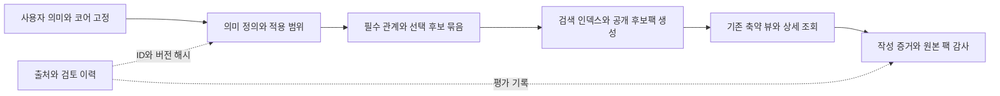

**photo-prompt-image-generator 시각 의미·후보 데이터 점검 및 개선안 — 2026-09-06**

개선이 필요하다. 우선순위는 **넓은 용어에 과도한 필수 장면을 부여하는 데이터**, **촬영 관계의 잘못된 정의**, **검색·후보팩으로 전달되는 과정의 의미 손실**이다. 현재 자료를 폐기하거나 동의어를 대량으로 추가하는 방식보다, 의미의 본질과 특정 연출 예시를 분리하고 실제 소비되는 데이터 계약을 명확히 하는 편이 적절하다.

이 문서는 진단과 변경 제안이다. 운영 스킬·데이터·인덱스·테스트 기대값은 수정하지 않았다. 기준 커밋은 `0330d8118398d9dabc6c11ba39fdb54a8d2e6235`이며 점검 시작 시 작업 트리는 깨끗했다. 추가한 파일은 이 문서와 유지보수용 재현 자료뿐이다.

**1. 확인 범위와 판단의 한계**

| 대상 | 현재 확인값 |
|---|---:|
| 기본 / 확장 병합 후 프리셋 | 575 / 706 |
| 병합 후 슬롯 / 슬롯 후보 레코드 | 112 / 7,400 |
| 기본 시각 프로필 / 확장 포함 프로필 | 333 / 354 |
| 정확 검색 lookup 행 | 1,758 |
| 일반 의미 인덱스 엔트리 | 8,142 |
| 프로필의 필수 증거 규칙 / 렌더 게이트 | 1,688 / 1,710 |
| `visual_semantics` 묶음 | 10개 확장 파일의 102개 |
| 캐릭터 의미 그래프의 추상 개념 | 3개: tsundere, yandere, kuudere |
| 레시피 역할 / 믹스인 / 별칭 | 110 / 133 / 524 |

전체 병합 데이터의 수량·키·연결·중복·검색 투영을 기계적으로 검사하고, 활성화 범위가 넓거나 규칙이 경직된 프로필을 골라 정의·구성요소·증거 문구·게이트·실제 함수 동작을 읽었다. 촬영 용어 일부는 장비 제조사의 설명과 대조했다. **354개 개념과 7,400개 후보의 사실성을 모두 외부 자료로 검증했다는 뜻은 아니다.**

실제 저장된 v6 팩은 하렘·조명·사진 시대의 세 사례를 읽고 현재 `compose_pack_view`로 재구성·검증했다. 이들은 과거 팩이다. 현재 데이터에 대한 새 의미 검색 팩 생성, 임베딩 API 호출, 이미지 생성·픽셀 평가는 하지 않았다. 아래 라우팅 재현은 현행 인덱스와 정상 resolver를 직접 호출한 합성 유지보수 사례이며, 실제 사용자 요청 envelope 또는 전체 v6 생성 성공으로 취급하지 않는다.

수량·파일 SHA-256·모든 연결·재현 입력과 결과는 [data-audit.json](/Users/chasoik/Projects/image-prompt/docs/analysis/2026-09-06-photo-data-audit/data-audit.json)에 남겼다. 구조 검사는 전수이고 의미 검토는 선택적이라는 범위를 이 파일에도 명시했다.

**2. 확인한 문제와 변경 제안**

| 번호 | 우선순위 | 확인한 문제 | 우선 변경 대상 |
|---|---|---|---|
| D1 | P1 | 부위·역할 이름이 특정 포즈·업무를 필수화 | 시각 프로필의 activation·의미 범위 |
| D2 | P1 / P2 | 렘브란트의 near/far 고정으로 유효한 조명 조합 충돌, 망원 화각 문구 오류 | 조명·촬영 프로필 전체 증거 경로 |
| D3 | P1 | 추상 캐릭터 의미에 특정 연출·대명사·요청별 표현·일괄 장면 제한 혼입 | 캐릭터 그래프와 시각 프로필의 경계 |
| D4 | P2 | 확장 파일의 의미 묶음과 정책 설명이 병합 결과에서 사라짐 | 확장 스키마·후보 묶음 계약 |
| D5 | P2 | 후보를 낱말로 분해하면서 관계가 사라지고 관리용 태그가 노출됨 | 후보 원자료·공개 투영 |
| D6 | P2 | 반례·비시각적 주장 제한이 긍정 검색 문서에 포함됨 | 정의·검색 텍스트·반례의 분리 |
| D7 | P2 | 필수 의미 검사와 사전에 적힌 특정 문장 복사 요구가 결합됨 | 증거 규칙의 작성 구조 |
| D8 | P3 | 카테고리의 과도한 세분화와 소수 중복, 검토 이력 연결의 유지비 | 분류·중복·유지보수 메타데이터 |

P1은 요청 충실도 또는 계약 간 양립 가능성에 직접 영향을 주는 항목, P2는 전달·검색·작성 품질의 구조적 문제, P3는 정리와 유지보수 개선이다. 이 구분은 이미지 실패율이나 사용자 선호 점수가 아니다.

**D1. 일반 명칭과 특정 시각 연출을 분리해야 한다**

[`deliberate_underarm_salience`](/Users/chasoik/Projects/image-prompt/skills/photo-prompt-image-generator/assets/photo_prompt_visual_obligations.json:583)는 `underarm / armpit / 겨드랑이 / 腋`에 반응한다. 그러나 실제 계약은 팔을 머리 위로 들기, 얼굴과 겨드랑이를 같은 초점면에 두기, 썸네일에서 해당 부위를 주 영역으로 읽히게 하기를 요구한다. 신체 부위를 언급했다는 사실만으로 자세·구도·강조도를 모두 지정한 것은 아니다.

[`cabin_crew_safety_role`](/Users/chasoik/Projects/image-prompt/skills/photo-prompt-image-generator/assets/photo_prompt_visual_obligations.json:3281)와 [조종사 프로필](/Users/chasoik/Projects/image-prompt/skills/photo-prompt-image-generator/assets/photo_prompt_visual_obligations.json:3042)도 비슷하다. 항공기 객실·조종석이라는 장소만 있으면 정확 검색의 문맥 조건을 통과하지만, 이어서 안전 절차 또는 조종·체크리스트 업무와 그 결과를 필수로 요구한다.

| 합성 진단 입력 | 현행 resolver 결과 | 요청 의미와의 차이 |
|---|---|---|
| 객실에서 책을 읽으며 쉬는 성인 승무원 | `cabin_crew_safety_role`이 `required` | 휴식 장면에 안전 절차·안전 대상·업무 결과가 추가됨 |
| 조종석에서 손을 모으고 눈을 감아 쉬는 성인 조종사 | `aircraft_pilot_operation`이 `required` | 휴식에 조종 장치 접촉·체크리스트가 추가됨 |
| 작은 겨드랑이 문신이 있는 성인 러너가 신발 끈을 묶음 | `deliberate_underarm_salience`가 `required` | 부수적 외형이 머리 위 팔 자세·주요 초점으로 격상됨 |
| 성인의 손이 underarm deodorant 병을 들고 있음 | 같은 프로필이 `required` | 제품 용도가 인물의 부위 강조 포즈로 해석됨 |

모두 `hard_eligible: true`였다. [resolver](/Users/chasoik/Projects/image-prompt/skills/photo-prompt-image-generator/scripts/prompt_generator.py:10704) 이후 [의무 생성](/Users/chasoik/Projects/image-prompt/skills/photo-prompt-image-generator/scripts/prompt_generator.py:12461)이 프로필의 필드와 게이트를 그대로 복사하는 것도 확인했다. 전체 생성·감사가 이 모순을 해결하는지는 이번에 실행하지 않았다.

제안은 다음과 같다.

- 부위·역할의 일반 의미와 `부위가 의도적으로 강조되는 포즈`, `실제로 안전 절차를 수행하는 업무 장면`을 별도 범위로 둔다. 기존 세부 계약은 후자의 좁은 범위에서 보존한다.
- 일반 이름은 의미 검색과 후보 발견에 활용하고, 강한 연출 의무는 정확한 연출 요청 또는 고정 코어의 해당 차원·대상·강조도에서 근거를 얻는다. 일반 이름을 새 별칭 목록으로 바꾸는 것만으로 해결하지 않는다.
- 기존 `context_disambiguation.any_terms`의 장소 단어를 행위의 증거로 간주하지 않는다. “객실에 있음”과 “안전 업무를 수행함”을 구분한다.
- 새 회귀 사례는 같은 대상의 업무·휴식·서비스·의상 촬영·제품 설명을 짝지어 검사한다. 명확한 업무 요청의 필수 의미는 약화시키지 않는다.

**D2. 렘브란트 조명의 기준 좌표와 망원 설명을 바로잡아야 한다**

[`rembrandt_face_light_pattern`](/Users/chasoik/Projects/image-prompt/skills/photo-prompt-image-generator/assets/photo_prompt_visual_obligations.json:21596)은 키라이트가 `near side`를 밝히고 `far eye` 아래에 삼각광을 남기도록 정의·구성요소·증거·게이트에서 반복한다. 반면 [쇼트 라이팅 프로필](/Users/chasoik/Projects/image-prompt/skills/photo-prompt-image-generator/assets/photo_prompt_visual_obligations.json:22886)은 좁고 먼 볼이 주광을 받고 카메라에 가까운 넓은 볼이 그림자가 된다고 명시한다.

현행 resolver에 두 조명 관계를 함께 요청하면 **두 프로필 모두 필수로 활성화**된다. near/far를 카메라 기준으로 읽으면 같은 얼굴의 주광 소유 관계를 서로 반대로 요구한다. 기준 좌표를 명시하지 않은 표현도 함께 바로잡아야 한다.

렘브란트의 기준은 광원 반대쪽, 즉 그림자 쪽 볼의 삼각광이다. 카메라에 가까운지 먼지가 정의의 필수 조건은 아니다. 쇼트/브로드는 얼굴의 어느 카메라 측 면이 빛을 받는지에 대한 별도 차원으로 다뤄야 한다. 이는 [Profoto의 렘브란트 설명](https://www.profoto.com/us/en/still-photography/tips-tricks/how-to-create-rembrandt-light/ImportedBlogPage)과 [Westcott의 쇼트·브로드 설명](https://westcottu.com/4-essential-portrait-lighting-patterns)을 대조한 판단이다.

개정 정의의 예:

> An elevated off-axis key joins the nose shadow to the shadow-side cheek, leaving a contained triangle of light beneath the shadow-side eye. Camera-near and camera-far orientation remain independent of this pattern.

정의 한 줄만 고치지 말고 `component_semantics`, `concept_terms`, `composition_instruction`, `must_mention_any`, `render_gates`를 함께 수정해야 한다. 좌우 반전·정면·브로드·쇼트 조합을 검사하되 삼각광과 코-볼 그림자 연결은 계속 필수로 둔다.

별도로 [망원 프로필의 정의](/Users/chasoik/Projects/image-prompt/skills/photo-prompt-image-generator/assets/photo_prompt_visual_obligations.json:21290)에 `long field of view`가 적혀 있다. 망원 화각을 뜻하는 적절한 표현은 `narrow field of view`다. [Nikon은 초점거리가 길수록 화각이 좁아진다고 설명한다.](https://www.nikonusa.com/learn-and-explore/c/tips-and-techniques/understanding-focal-length) 이 문구는 우선 교정하고, 기존 정의에 있는 먼 카메라 위치와 깊이 평면 관계는 유지한다.

**D3. 캐릭터의 본질과 특정 연출·장면 제한이 섞여 있다**

[캐릭터 그래프의 yandere 정의](/Users/chasoik/Projects/image-prompt/skills/photo-prompt-image-generator/assets/photo_prompt_character_moe_extension.json:5918)는 애정·같은 상대·경계 침범 행동·그 상대에게 생긴 결과를 중심으로 두고 고정 시선·미소·직업·소품을 요구하지 않는다고 명시한다.

그런데 [동일 의미를 다루는 시각 프로필](/Users/chasoik/Projects/image-prompt/skills/photo-prompt-image-generator/assets/photo_prompt_visual_obligations.json:1349)의 정의에는 `the character herself dominates the frame`가 들어 있다. 증거의 허용 문구에도 특정 간호사·환자·키카드·신발·주사기 장면과 특정 눈·미소 묘사가 누적돼 있다. 허용 문구 중에는 일반적인 대안도 있으므로 **모든 결과가 간호사나 여성으로 강제된다고 단정할 수는 없다.** 확인되는 문제는 추상 개념과 개별 요청에 맞춘 연출 예시가 같은 범용 계약에 함께 저장된다는 것이다.

또한 [`composite_overwhelmed_expression`의 게이트](/Users/chasoik/Projects/image-prompt/skills/photo-prompt-image-generator/assets/photo_prompt_visual_obligations.json:379)는 표정 외에 `fully clothed, nonsexual, and nonexplicit`까지 요구한다. [`contained_affect_self_presentation`](/Users/chasoik/Projects/image-prompt/skills/photo-prompt-image-generator/assets/photo_prompt_visual_obligations.json:949)도 단어의 의미와 특정한 “통제된 표면·작은 감정 누출·중단된 자기조절 동작” 연출을 결합한다. 이런 조건을 특정 요청용 해석으로 유지할 수는 있지만, 사용자의 실제 정의와 무관한 일반 의미로 취급하면 요청을 바꾸게 된다.

수정 방향:

- 개념의 추상 의미는 그래프와 시각 프로필 사이에서 하나의 소유자를 갖게 한다. 프로필은 그 개념의 어떤 가시적 불변 조건을 구현하는지 참조한다.
- `herself / her` 같은 불필요한 성별 고정과 직업에 묶인 예시는 중립적 역할 변수 또는 선택 가능한 연출 예시로 옮긴다. 역할·성별·구도는 요청이 지정한 값을 따른다.
- 강한 외형 관습을 사용자가 원할 때는 별도의 선택 연출 계약으로 다루고, 선택되면 그 계약 전체를 검증한다. 현재 필수 관계를 몰래 선택 사항으로 내리는 방식은 피한다.
- 성인 조건처럼 적용에 필요한 값과 표정의 시각적 정의, 요청에 따른 복장·장면 경계를 구분한다. 플랫폼 집행을 범용 의미의 일괄 대체 문장으로 직렬화하지 않는다는 현행 스킬 원칙과 정렬한다.
- `menhera` 등 맥락에 따른 해석이 필요한 명칭은 현재 설명이 표준 정의인지, 프로젝트용 좁은 해석인지 출처와 함께 재검토한다. 이번 검토에서 그 단어의 유일한 의미를 새로 확정하지 않는다.

**D4. 102개 의미 묶음은 존재하지만 런타임 연결 계약은 아니다**

[조명 확장 파일](/Users/chasoik/Projects/image-prompt/skills/photo-prompt-image-generator/assets/photo_prompt_lighting_extension.json:3)에는 `semantic_policy`와 `visual_semantics`가 있고, 각 묶음에 `primary_visual_proposition`, `hard_profile_ids`, `component_groups`, `candidate_ids`가 있다. 같은 형태의 `visual_semantics`가 10개 파일에 102개 있다.

그러나 [확장 병합 함수](/Users/chasoik/Projects/image-prompt/skills/photo-prompt-image-generator/scripts/prompt_generator.py:1504)는 이 두 키를 읽지 않는다. 우주 확장의 `representation_modes`도 같은 방식으로 병합되지 않는다. 기본 사전의 실제 `semantic_policy`와 확장 파일의 설명형 `semantic_policy`는 이름은 같아도 처리 경로가 다르다.

메모리 안의 조명 확장 복사본에서 `hard_profile_ids`를 존재하지 않는 ID로 바꾸고 `semantic_policy.hard_activation`을 바꿔도 병합 결과와 그 해시는 동일했다. 원본 파일은 바꾸지 않았다. 기존 102개 묶음의 후보·프로필 참조 자체는 모두 존재하므로, **현재 끊어진 ID가 있다는 발견은 아니다.** 일부 전용 테스트는 원본 확장 파일을 직접 읽어 이 설명을 검사하지만, 그것이 팩에서의 연결을 증명하지는 않는다.

개선안은 두 경로를 구분하는 것이다.

- 설명·연구·주장 한계는 `docs/research-evidence/photo-prompt/`의 유지보수 자료로 옮기고 명시적인 스키마와 소유자를 둔다.
- 후보의 조합 관계로 실제 필요한 내용은 `candidate_bundles` 같은 실행 가능한 선택 묶음 계약으로 만들어 컴파일·검색·팩에 전달한다. 이름은 예시이며 현행 지원 필드는 아니다.
- 이때 `hard_profile_ids`를 읽기 시작했다고 연결 프로필을 자동으로 필수화하면 안 된다. 후보 묶음의 연관 프로필, 사용자 근거가 있는 필수 의미, 명시 선택으로 승격되는 의무를 각각 구분한다.
- 확장 파일에서 허용하지 않는 실행 키는 오타로 조용히 무시하지 말고 검증 오류로 처리한다. 설명 전용 키는 별도로 선언한다.

**D5. 후보팩에서 관계는 약해지고 관리용 단어는 남는다**

[공개 후보 투영](/Users/chasoik/Projects/image-prompt/skills/photo-prompt-image-generator/scripts/prompt_generator.py:14569)은 영문·국문 설명, ID, 태그를 개별 낱말로 쪼개 섞고 최대 20개를 남긴다. 이는 원문 복사를 줄이는 의도는 있지만, 수식 대상과 대소·위치·소유 관계까지 보존하지는 못한다.

예를 들어 [`lit_clean_low_ratio_open_shadow`](/Users/chasoik/Projects/image-prompt/skills/photo-prompt-image-generator/assets/photo_prompt_lighting_extension.json:1371)의 원문은 `low key-fill difference with shadows still present`다. 현재 공개 투영에는 `low / difference / key-fill / shadow`가 분리돼 있고, `semantics / lighting / intensity / clean` 같은 다른 토큰도 섞인다. 원자료의 “키-필 차이가 낮다”는 관계를 독립 낱말만으로 동일하게 복원해야 한다.

전체 후보 중 **484개는 공개 태그 함수에서도 `*_visual_semantics` 관리용 태그가 남는다.** 조명 후보 예시에서는 이것이 `visual / semantics`라는 영감 단어로도 들어간다. 과거 하렘 v6 팩에서도 해당 형태의 태그가 실제 후보에 남은 것을 확인했다. 484개 모두가 한 팩에 노출된다는 뜻은 아니다.

제안:

- 순서가 없는 목록은 유지하되 단위를 “낱말”에서 짧은 의미 단위로 바꾼다. `lower fill`, `small key-fill difference`의 내부 관계는 해체하지 않는다.
- 대소·접촉·방향·동일 대상·재료 귀속은 짧은 구조화 관계로 전달한다. 새로운 문장·연출은 여전히 작성자가 결정한다.
- 소스의 분류·연구 배치·정책 태그는 제어 메타데이터로 분류해 공개 후보 텍스트와 검색 텍스트에서 제거한다. 시각적으로 유용한 “조명”이나 실제 장르 단어까지 일괄 삭제하지 않는다.
- `compose_pack_view`는 원본 팩에 있는 자료만 복구할 수 있다. 원본 팩 생성 전에 빠진 관계를 축약 뷰가 되살릴 수는 없으므로, 개선 위치는 원자료와 공개 투영이다.

다음은 구현 전 설계 예시다. 새로운 필드를 현행 v6에서 바로 읽는다고 가정하지 않는다.

```json
{
  "candidate_id": "lighting_upper_key_lower_fill",
  "concept_units": ["upper soft key", "lower fill", "retained facial shadows"],
  "relations": [
    {"type": "above", "subject": "key", "object": "face"},
    {"type": "below", "subject": "fill", "object": "face"},
    {"type": "weaker_than", "subject": "fill", "object": "key"}
  ],
  "affected_dimensions": ["lighting"],
  "adoption": "optional"
}
```

**D6. 반례·주장 제한이 긍정 검색 문서를 오염시킬 수 있다**

[`visual_profile_semantic_text`](/Users/chasoik/Projects/image-prompt/skills/photo-prompt-image-generator/scripts/prompt_generator.py:2570)는 “긍정 의미 프로토타입”을 만든다고 설명하지만, 실제로는 `definition`과 `concept_terms`를 그대로 넣는다. [BM25F 투영](/Users/chasoik/Projects/image-prompt/skills/photo-prompt-image-generator/scripts/prompt_generator.py:2618)도 같다. 별도 `contrast_examples`를 빼더라도 정의 내부의 반례는 남는다.

`inner_thigh_negative_space`의 정의는 건강·체중·생식능력 등을 판단할 수 없다는 경계를 적절하게 적고 있다. 그런데 그 문장이 긍정 검색 문서에 포함되면서, 현행 인덱스에 `health weight fertility`만 질의해도 이 프로필이 BM25F 1위로 나온다. `fully clothed nonsexual` 질의에도 관련 제한 문구를 가진 범죄·표정 프로필이 상위에 나온다.

이것은 **적용 필터 전의 원시 검색 결과**다. 실제 사용자 요청에서 해당 프로필이 채택되거나 필수화되었다는 증거는 아니다. 다만 반례에 포함된 단어가 긍정 관련성 점수에 기여함은 재현됐다.

`no / not / without / rather than` 등의 경계 표현을 찾는 휴리스틱으로는 정의 206개, 후보 concept terms 135개, 최종 임베딩 텍스트 299개 프로필이 검토 대상으로 잡혔다. 이는 오류 개수가 아니다. `no-makeup makeup`처럼 부정 표현 자체가 의미의 일부인 경우도 있어 정규식 일괄 삭제는 부적절하다.

제안은 긍정 정의·관측 요소·관계와 `confounders`, `claim_limits`, 적용 제한을 분리하는 것이다. 반례는 별도 대조 문서나 판정 단계에서 소비하고, 단순히 긍정 검색량을 늘리는 역할을 하지 않게 한다. 이미 캐릭터 그래프에 존재하는 confounder 분리 방식은 재사용할 만하다. 반례를 자동 `negative_en`으로 옮기는 것은 사용자 제외 의도와 다른 개념이므로 금지한다.

**D7. 의미 보존과 특정 문장 보존을 구분해야 한다**

필수 증거 규칙 1,688개 중 **990개는 `must_mention_any`의 선택지가 단 하나**다. 렘브란트 예처럼 긴 완성 문장이 유일한 허용 문구이고, 같은 내용이 정의·그룹·작성 지시·게이트에도 중복된다. 선택지 하나 자체가 결함은 아니지만, 현재 구조에서는 동일한 시각 관계를 다른 자연스러운 문장으로 작성해도 사전의 특정 문장을 다시 넣어야 할 수 있다.

제안은 문자 검사를 없애는 것이 아니다. 독립 작성한 코어와 최종 프롬프트 사이의 literal evidence·해시 결합은 유지한다. 다만 유지보수 데이터는 “어느 관계가 필수인가”를 한 번만 선언하고, 그 관계에 대응해 요청 시점에 고정된 증거 문구를 downstream 계약이 보존하도록 한다.

- 불변 조건, 가능한 구현 방식, 선택적 보조 단서를 분리한다. 예를 들어 클램셸의 상부 키·하부 필 관계와 눈에 보이는 캐치라이트 증거를 구분한다. 사용자가 눈을 감는다고 명시했다면 눈에 보이는 캐치라이트를 증명 방법으로 강제해서는 안 된다. 정확히 캐치라이트 쌍 자체를 요청한 경우에는 계속 필수다.
- 문구·게이트·구성요소를 한 authored component에서 생성해 수정 누락을 줄인다. “다섯 그룹·다섯 게이트”라는 수량보다 필요한 구별 능력을 기준으로 한다.
- 이미 있는 `photo-visual-relation/v1` 구조와 v6 `semantic_assertions`를 먼저 활용한다. 구조화 관계 블록은 현재 354개 중 3개 프로필에만 있다. 다른 프로필에 관계 의미가 없다는 뜻은 아니며, 대부분 산문에 담겨 있다는 뜻이다.
- [스플릿 디옵터 게이트](/Users/chasoik/Projects/image-prompt/skills/photo-prompt-image-generator/assets/photo_prompt_visual_obligations.json:21416)의 “조명·원근·가림이 한 번의 촬영을 증명한다” 같은 문장은 시각적 연속성 판정으로 한정한다. 최종 이미지의 일관성으로 실제 촬영 공정이나 합성 이력을 확정하지 않는다.

**D8. 분류·중복은 선별 정리가 필요하다**

354개 프로필에 카테고리 288개가 있고 이 중 266개는 단일 프로필만 가진다. 현재 `category`는 여러 도메인에서 재사용되는 분류와 개별 프로필의 긴 이름이 혼재한다. 데이터가 잘못되었다는 증거는 아니지만, 관련 의미를 묶어 찾거나 일괄 검토하는 효용은 작다.

같은 슬롯의 정규화 영문 라벨 완전 중복은 **두 묶음**만 확인됐다.

| 후보 | 판단 |
|---|---|
| genre의 `street` / `street_photography` | 같은 영문 라벨, 다른 태그·가중치. ID 참조·레시피 사용처를 확인한 뒤 대표 개념과 스타일 변형으로 정리할 후보 |
| location의 `convenience_store_night` / `late_night_convenience_store` | 같은 영문 라벨이지만 전자는 국문·phrase에 “편의점 앞”이라는 외부 위치가 명시됨. 무조건 합치지 말고 외부 장면과 일반 장소를 명시적으로 구별 |

전 프로필의 정규화 exact term·프로젝트 별칭에는 **프로필 간 충돌이 없었다.** 102개 의미 묶음의 후보·프로필 ID 참조도 모두 유효했다. 따라서 대규모 중복이나 잘못된 연결이 많다는 가정으로 삭제 작업을 시작할 근거는 없다.

분류는 `domain → mechanism → relation` 정도의 소수 공통 축으로 정리하고 안정적인 프로필 ID는 유지한다. 파일 분할은 이 분류와 리뷰 소유권이 정해진 뒤 시행한다. 파일을 나누는 것만으로 의미 문제가 해결되지는 않는다.

출처·검토 상태는 외부 유지보수 영역에서 `profile_id + revision/hash`로 연결하는 개선을 권한다. 의미 출처 확인, 라우팅 검사, 프롬프트 감사, 픽셀 판정, 사용자 선호는 다른 칸에 기록한다. 출처 URL·원문·연구 보고서 문구를 런타임 후보에 넣는 방식은 현재의 분리 원칙을 훼손한다.

**3. 권장 데이터 구조**

현재 입력 자료를 읽기 시작하는 시점은 그대로 유지한다. 일반 이미지 요청에서는 사용자 의미와 기본 프롬프트를 먼저 고정하고, 그 이후에만 아래 데이터를 조회한다. 이번 유지보수 검토를 이유로 pre-core에 사전 정의를 읽히게 하지 않는다.



| 데이터 층 | 소유해야 할 내용 | 섞지 않을 내용 |
|---|---|---|
| 의미 정의 | 용어의 맥락·본질, 관측 요소, 구별 관계, 사용자 정의 우선순위 | 특정 요청의 직업·포즈·카메라 예문 |
| 필수 관계 | 근거가 있는 활성화 조건, 대상·관계·불변 조건, 검증 규모 | 관련 검색 결과라는 이유만으로 생긴 의무 |
| 선택 후보 | 짧은 의미 단위, 관계, 변경 가능한 차원, 선택 시 함께 지킬 제약 | 점수·선택 정답·원문 프롬프트·관리용 태그 |
| 제어 정책 | 자격·충돌·적용 범위·사용자 제외 의도 | 긍정 영감용 텍스트에 반복되는 금지 문장 |
| 생성 산출물 | 위 원자료에서 만든 인덱스·팩·뷰와 소스 해시 | 별도로 손으로 편집하는 두 번째 정의 |
| 유지보수 근거 | 출처·검토 범위·실패와 미평가·픽셀 및 사용자 판단 | 런타임에 복사할 원문·연구 과정·평가 답안 |

현행 해시 결합, 정확 검색과 유사 검색의 권한 차이, 선택 후보를 거절할 자유, 전체 선택 의무의 검증, 축약 뷰의 원본 보존은 유지할 부분이다. 세 과거 팩의 뷰도 모두 원본 재구성 검사를 통과했다. 이 작업에서 이를 재구현할 필요는 없다.

**4. 적용 순서와 완료 조건**

| 단계 | 작업 | 완료 조건 |
|---|---|---|
| 1. 의미 교정 | D1의 일반명/연출 분리, D2의 조명 정의, D3의 개념/예시/장면 제한 정리 | 현재 재현된 오활성화·조명 모순이 해소되고, 명확한 원래 요청의 필수 조건은 유지 |
| 2. 전달 계약 | D4의 설명 전용 키와 실행 묶음 구분, D5의 관계 보존·관리 태그 제거 | 선택 후보의 관계와 제약을 팩·상세 뷰까지 추적 가능, 묶음만으로 필수 의미가 새로 생기지 않음 |
| 3. 검색 정리 | D6의 긍정 의미/반례 분리, D7의 authored component 정규화 | 반례 단어만의 양성 검색 기여를 제거하고 유효한 부정형 용어·다국어 표현을 보존 |
| 4. 정리와 검증 확대 | D8의 분류·선별 중복·외부 검토 이력 연결 | 안정 ID·소스 해시·별칭 소유권·실제 소비 경로가 모두 검증됨 |

1단계는 원자료 교정이 중심이고, 2~3단계는 생성기·검증기·팩 계약의 변경을 동반한다. 새 필드를 JSON에 적어놓는 것만으로 구현 완료로 보지 않는다. 도메인별 한 묶음씩 먼저 적용해 변경 범위를 확인한 뒤 확대하는 것을 권한다.

| 검사 축 | 구체적인 합격 기준 |
|---|---|
| 활성화 | 업무와 휴식, 부위 강조와 제품 용도, 주요 의미와 부수적 외형을 구분. 한국어·영어·일본어를 실제 명칭 범위에 맞춰 확인 |
| 의미 조합 | 렘브란트 × 브로드/쇼트 × 좌우 반전에서 주광·그림자 소유 관계가 양립. 원래 다른 조명인 split/loop는 구분 |
| 사용자 우선순위 | 사용자 정의·제외·잠긴 자세/행동이 프로필 기본값 때문에 바뀌지 않음. 새로운 필수 관계가 생기면 출처 span·차원 근거가 있어야 함 |
| 후보 보존 | 의미 단위와 관계의 방향·대상·범위가 원자료→팩→상세 뷰에서 동일. 선택 후 전체 제약이 활성화되고 거절한 후보는 의무를 만들지 않음 |
| 검색 | 반례만 포함한 질의, 동형이의어, 조사 변화, 새 표현을 별도 확인. 관리 문구의 기여와 실제 의미 단서의 기여를 분리 |
| 스키마 | 잘못된 참조·모르는 실행 키·빠진 필수 확장을 검출. 현재 102개 묶음의 연결을 이관 전후 대조 |
| 증거 | core/final literal evidence·해시를 유지. 불변 의미를 삭제하거나 느슨하게 바꿔 통과시키지 않음 |
| 호환성 | 이전 팩과 당시 소스 스냅샷은 불변으로 보존. 새 스키마·텍스트 레시피와 이전 계약의 읽기 경로를 구분 |
| 인덱스 | 의미 텍스트 변경은 해당 벡터와 파생 BM25F를 갱신. registry 변경은 시각 인덱스 해시를 갱신. 변경 없는 벡터는 재사용 |
| 평가 | 이번 결함에서 만든 회귀 사례는 독립 holdout으로 부르지 않음. 기존 실패 기대값을 완화해 점수를 올리지 않음 |

실제 이미지 품질 향상을 주장하려면 이후 별도의 이미지 검증이 필요하다. 같은 요청·같은 평가 조건의 변경 전후 기록을 보존하고, 계약 자체를 바꾼 항목은 의미 교정과 렌더 성능 변화를 나누어 비교해야 한다. 이번 요청은 개선안 작성이므로 새 이미지 실행을 포함하지 않았다.

**5. 이번 검증 결과와 재현 자료**

사전 검증, 시각 인덱스 검사, 일반 의미 인덱스 검사가 통과했다. 장면 표현 검사는 112개 경로 모두 구조 기준을 통과했다. 이는 데이터 스키마·파생 인덱스·장면 구성 수량에 대한 결과다. D1~D7의 의미 문제를 자동으로 검출한다는 뜻은 아니다.

관련 테스트는 **36개 중 35개 통과, 1개 오류**였다. 오류는 `test_embedding_only_paraphrase_projects_optional_candidate_from_one_resolution`에서 테스트용 기본 프롬프트가 31단어라 현행 최소 48단어 계약을 통과하지 못한 것이다. 검색 검증에 도달하기 전에 코어 정규화에서 멈췄다. 이번에 수정하지 않은 현행 소스·테스트의 결과이며, 이전 작업에서 보고된 다른 실패들과 같다고 간주하지 않는다.

구현 단계에서는 이 테스트 입력도 유효한 코어로 보완한 뒤 원래의 “embedding 검색은 선택 후보이며 필수 의무가 아님” 검증을 실행해야 한다. 최소 단어 수나 검색 기대값을 낮춰 통과시키지 않는다. 원본 실패 로그는 [focused-tests.log](/Users/chasoik/Projects/image-prompt/docs/analysis/2026-09-06-photo-data-audit/focused-tests.log), 전체 검증 기록은 [validation-results.json](/Users/chasoik/Projects/image-prompt/docs/analysis/2026-09-06-photo-data-audit/validation-results.json)에 보존했다. 전체 테스트 스위트나 이미지 검증을 통과했다고 주장하지 않는다.

| 자료 | 내용 |
|---|---|
| [재현 스크립트](/Users/chasoik/Projects/image-prompt/docs/analysis/2026-09-06-photo-data-audit/audit_data.py) | 원본을 수정하지 않고 전체 통계·연결·부정 문구 검사·라우팅·검색·공개 투영 사례를 기록 |
| [데이터 점검 JSON](/Users/chasoik/Projects/image-prompt/docs/analysis/2026-09-06-photo-data-audit/data-audit.json) | assets 최상위 JSON 32개 해시, 102개 연결, 5개 라우팅 입력·결과, 검색 결과, 후보 투영 전후. 벡터 샤드의 개별 파일 해시는 별도로 수록하지 않음 |
| [과거 팩 확인](/Users/chasoik/Projects/image-prompt/docs/analysis/2026-09-06-photo-data-audit/historical-pack-inspection.json) | 세 v6 팩의 원본 해시·후보 수·관리 태그·뷰 재구성 검증 |
| [장면 구조 검사](/Users/chasoik/Projects/image-prompt/docs/analysis/2026-09-06-photo-data-audit/scene-expression-summary.json) | 현재 병합 사전의 112개 경로 구조 검사 |

재현 명령은 저장소 루트에서 실행한다. 출력 경로를 달리하면 이번 기록을 덮어쓰지 않는다.

```bash
.venv/bin/python docs/analysis/2026-09-06-photo-data-audit/audit_data.py \
  --output /tmp/photo-data-audit-replay.json
```
