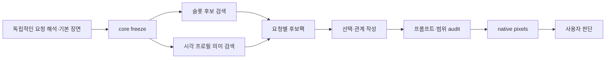

# 프롬프트 키워드 기반 시각 의미·후보 데이터 보강 연구

2026-10-07 · 참조: [프롬프트 키워드 분석](chatgpt-conversation://6ac5a9d2-43ac-83ee-9634-97c845156052)

**보강의 중심은 표현의 수보다 대상·속성·관계·순간의 명료성이다.** 현재 데이터는 이미 후보 10,500개와 시각 의미 프로필 2,290개를 갖고 있다. 이번 사전의 480개 표현을 모두 새 태그나 강제 프로필로 넣는 방식보다, 기존 의미의 접근 경로를 보강하고 관계가 빠진 곳에 작은 선택형 문법을 추가하는 편이 적절하다. 이는 구조와 출처를 검토한 연구 판단이다. 생성 품질의 향상은 앞으로 비교 실험으로 확인할 가설이다.

연구 결과는 **24개 분류 전체의 어휘 대조표, 공식 자료·논문 24개를 정리한 출처 원장, 40개 보강 제안, 단계별 반영 계획**으로 구성했다. 40개 제안은 P0 16개, P1 22개, 매체 경로를 먼저 결정할 P2 2개다. 원문의 142개 표현을 구체적인 제안의 씨앗으로 연결했고, 나머지도 분류별 반영 경로와 어휘 이웃을 기록했다. 480개 각각의 의미 동등성이나 채택을 판정한 것은 아니다.

- [반영 실행 계획](/Users/chasoik/Projects/image-prompt/docs/research-evidence/photo-prompt/keyword-lexicon-research-20261007/implementation-plan.md)
- [40개 상세 제안 카드](/Users/chasoik/Projects/image-prompt/docs/research-evidence/photo-prompt/keyword-lexicon-research-20261007/research-proposals.md)
- [480개 대조표 CSV](/Users/chasoik/Projects/image-prompt/docs/research-evidence/photo-prompt/keyword-lexicon-research-20261007/keyword-coverage.csv) · [상세 JSON](/Users/chasoik/Projects/image-prompt/docs/research-evidence/photo-prompt/keyword-lexicon-research-20261007/keyword-coverage.json)
- [공개 출처와 검토 한계](/Users/chasoik/Projects/image-prompt/docs/research-evidence/photo-prompt/keyword-lexicon-research-20261007/sources.json) · [검증 기록](/Users/chasoik/Projects/image-prompt/docs/research-evidence/photo-prompt/keyword-lexicon-research-20261007/validation.json)

## 1. 무엇을 실제로 확인했는가

참조 대화를 읽고, 대화의 첨부 ZIP을 공식 UI에서 내려받아 JSON 원본을 읽었다. 원본은 24개 분류, 분류마다 20개인 480개 표현, 24개 조합, 완성 프롬프트 예시 6개, 개인 라이브러리 참조 39개를 포함한다. ZIP SHA-256은 `417272b80b5ebb1ee06f850f37bff756408dd3ed87910819ae4ccb63f35a3666`이다.

| 원문 출처 표시 | 개수 | 이번 연구에서의 취급 |
|---|---:|---|
| 확인 표현 | 102 | 이전 분석자가 읽은 원문에서 확인했다고 표시한 구절 |
| 기록 표현 | 55 | 과거 대화 기록·요약에서 확인했다고 표시한 구절 |
| 기존 제안 | 83 | 이전 가이드의 제안어 |
| 재구성 | 217 | 시각적 발상을 재사용 가능한 표현으로 바꾼 항목 |
| 확장 제안 | 23 | 이전 사용 사실을 주장하지 않는 새 제안 |
| 통제 실험으로 효과 확인 | **0** | 모든 항목의 해당 플래그가 false |

39개 라이브러리 참조는 공개 웹 출처 39개가 아니다. 원본 분석은 대표 이미지 5점을 검토했다고 설명하지만, 이번 연구에서 그 원이미지 5점과 모든 과거 생성·선호 결과를 다시 검증한 것은 아니다. 따라서 사용 흔적, 원문 출처, 의미 정의의 타당성, 생성 효과, 사용자 선호를 분리했다.

외부 연구는 미술관의 조형·매체 자료, Nikon·ARRI·Adobe·Kodak의 기술 자료, PBRT의 반사 모델, 감정 지각 및 이미지 평가 연구를 사용했다. 논문은 공개 초록·프로젝트 설명과 확보한 발췌를 중심으로 검토했다. CAMEO 새틴·faille 원문은 직접 열기에서 403이었고, 기관의 검색 제공 설명을 검토했다. 감정 연구의 PMC 원문도 직접 접근은 챌린지 페이지여서 검색에 제공된 논문 설명을 사용했다. 접근 수준을 [출처 원장](/Users/chasoik/Projects/image-prompt/docs/research-evidence/photo-prompt/keyword-lexicon-research-20261007/sources.json)에 각각 기록했다.

## 2. 현재 데이터의 양과 해석 범위

전수 어휘 진단은 2026-10-07 **11:56:29–11:58:34 KST**에 로드한 작업 트리 기준이다. 당시 HEAD는 `4c9a0054473c4383ca5287ca3bf294b277e5c6e7`이고, 커밋에 없는 진행 중 변경도 포함했다. 파일별 SHA-256과 로드 중 변경 여부는 [기준 스냅샷](/Users/chasoik/Projects/image-prompt/docs/research-evidence/photo-prompt/keyword-lexicon-research-20261007/source-snapshot.json)에 있다.

| 집계 단위 | 수량 | 의미 |
|---|---:|---|
| 후보 슬롯 | 112 | 서로 다른 표현·행동·재료·구도 등 슬롯 |
| 슬롯 후보 엔트리 | 10,500 | 태그·라벨·구체적 의미가 서로 다른 수준으로 섞인 원본 |
| 의미 검색 문서 | 10,536 | 슬롯 엔트리와 캐릭터 반응 그래프 문서 등을 포함 |
| 컴파일된 시각 의미 프로필 | 2,290 | 구성 요소·증거·검사 조건을 가진 재사용 의미 |
| 컴파일된 후보 번들 | 1,099 | 원본 확장에서 파생된 조합 단위 |
| 등록된 확장 원본 | 후보 58 / 시각 프로필 40 | source manifest가 로드하는 원본 파일 |
| 명시적인 concept_units가 있는 후보 | 3,126 / 10,500 = 29.8% | 나머지는 짧은 라벨 등을 fallback으로 사용할 수 있음 |
| 명시적인 relations가 있는 후보 | 2,387 / 10,500 = 22.7% | 독립 원자 후보에는 관계가 불필요할 수 있음 |
| 명시적인 affected_properties가 있는 후보 | 1,777 / 10,500 = 16.9% | 나머지는 슬롯 차원의 범위를 사용할 수 있음 |

이 비율은 전체 데이터가 부족하거나 잘못됐다는 비율이 아니다. “리넨” 같은 단일 재료와 “손이 놓은 가방을 바닥이 받는다” 같은 관계형 후보는 요구하는 구조가 다르다. 우선 보강할 곳은 **관계형 의미인데 짧은 라벨에 머무는 항목, 여러 대상을 바꾸면서 소유자·속성 범위가 넓은 항목, 자연스러운 표현으로 정확한 의미가 발견되기 어려운 항목**이다.

### 동일 구절 검색과 의미 지원을 구별해야 한다

실제 코드의 positive-field projection과 BM25F 인덱스 작성·랭킹 함수를 메모리에서 사용했다. 480개 영어 구절마다 분류에 해당하는 슬롯 후보와 전체 시각 프로필의 어휘 이웃을 조사했다. 같은 구절이 정규화된 positive 필드에 들어 있는 항목은 후보 11개, 프로필 4개, 중복을 제외한 합집합 13개였다.

**나머지 467개를 의미 누락으로 계산하면 안 된다.** 예를 들어 아래 의미는 표현이 달라도 이미 지원된다.

| 원문 씨앗 | 확인한 기존 원본·프로필 | 반영 판단 |
|---|---|---|
| K097 lips pressed closed | `ae_lip_press` / `ae_profile_lip_press` | 눌림과 닫힘의 경계를 유지해 동등한 표현만 보강 |
| K128 한쪽 다리에 체중 | `pv_single_support` / `contrapposto_weight_shift` | 단순 지지와 전체 contrapposto 변형을 구별해 재사용 |
| K145 양손으로 컵 감싸기 | `cv_two_hand_cup` / `cv_profile_two_hand_cup` | 두 손의 소유자·같은 컵 접촉은 이미 구체적 |
| K198 배경도 알아볼 수 있는 초점 | `rb_readable_environment_focus` | 장소 단서를 읽히게 하는 기존 관계 재사용 |
| K284 하이라이트 계조 | `highlight_rolloff_tone_response` | 밝은 영역의 계조·세부 유지가 이미 정의됨 |
| K294 저채도 속 강조색 | `cr_vivid_on_muted` | 색의 대상과 범위를 추가 검토 |
| K335 천의 무게와 주름 | `pr_fabric_tension_fold_attachment` | 주름의 시작점과 당김·접촉 원인 재사용 |
| K363 역광 잔머리 | `pr_hair_strand_owner_and_cause` | 모근·방향·원인의 기존 구조 재사용 |

짧은 구절만 넣은 이웃에는 다른 뜻도 섞였다. `unfinished reply`의 이웃에 미완성 취미 프로젝트가, `ethereal gothic`의 이웃에 blackletter 글자 형태가, 얼굴·손·장소의 가독성 구절의 이웃에 의도적으로 얼굴을 가리는 초상이 나타났다. 이는 **이 문맥 없는 연구 질의의 어휘 이웃**이며 실제 frozen-core 검색의 오작동을 입증하지 않는다. 실사용의 subject·context·property guards가 제거할 수 있다. 반영 계획은 그런 가까운 다른 의미를 반드시 반례에 포함한다.

## 3. 24개 분류별 반영 방향

분류별 20개 표현 전부의 출처 성격·긍정 필드 존재·어휘 이웃·슬롯 매핑은 대조표에 있다. 아래는 분류 전체를 어떤 방식으로 강화할지 정한 지도다. 제안 ID는 상세 카드에 연결된다.

| 분류 | 강화할 의미 | 반영의 중심 | 제안 |
|---|---|---|---|
| C01 매체·사진의 정체성 | 스냅·화보·실물 작품 촬영·회화 출력의 구별 | 매체 경로와 authoring guidance | G01, G39 |
| C02 컨셉·장르 결합 | 장르마다 건축·의상·풍경 등 운반체 배정 | 기존 원자 + 관계 번들 | G02, G03 |
| C03 분위기·정서 | 상황·행동·관찰 단서에 연결되는 정서 해석 | 고정 표정 공식 대신 창작 지침 | G04 |
| C04 감정의 이중성·인물성 | 유지되는 태도와 작게 새는 반응·현재 동작 | 기존 축 보강, 과거 성격 추론 분리 | G05, G06 |
| C05 미세 표정 | 웃음의 이완 상태·입술 닫힘과 압박의 차이 | 관계 후보 + 기존 얼굴 구성 재사용 | G07, G08 |
| C06 시선·관객 위치 | 카메라 위치·주의의 대상·두 끝점 | 기존 촬영 관계와 상호 주의 보강 | G09, G10 |
| C07 포즈·균형 | 지지 다리·신체 연결·동작 단계 | 기존 자세 재사용와 지지 이전 | G11, G12, G14 |
| C08 손·소품·시간성 | 도구 접촉·가방 놓기·두 손의 컵 | 접촉·소유자·결과의 관계 | G07, G12–15 |
| C09 여백·시각 중심 | 낮은 정보 영역·한 강조점·경계 위계 | 기존 구성·색 관계 재사용 | G16, G17, G40 |
| C10 깊이·가림·반사 | 필수 단서의 공동 가독성·평면과 입체 | 초점·층·가림 관계 보강 | G18, G19 |
| C11 거리·시점·크롭 | 관계를 읽히는 거리와 크롭·크기 기준물 | 카메라·소유자·스케일 분리 | G09, G20, G38 |
| C12 자연광 | 광원 형태·수신 표면·윤곽의 결과 | 기존 빛 관계의 접근 표현 보강 | G21, G22 |
| C13 인공광·혼합광 | 플래시와 주변광·색 구역의 역할 | 혼합광 원본과 장면 관계 번들 | G22, G23 |
| C14 광학·입자 | 렌즈/유리/공기/이미지 평면의 발생 위치 | 의미 경계 정리와 증거 보존 | G24, G25 |
| C15 색보정·명암 | 검정 바닥·계조·저채도와 강조색 | 서로 다른 마감 변형의 조건부 사용 | G17, G26 |
| C16 팔레트 | 주색·보조색·강조색의 소유자·면적 | 기존 색 바인딩 구조 보강 | G17, G27 |
| C17 원단·재질 | 섬유·직조·마감·주름·반사 차이 | 기존 표면과 faille 신규 원자 trial | G28, G29 |
| C18 재단·모티브 | 리본과 절개선의 시각/물리적 연결 | 새 관계 후보, 의상 소유자 보존 | G30 |
| C19 헤어 | 뿌리·묶임·습기·바람·빛의 반응 | 기존 헤어 의미와 공동 원인 | G31, G35 |
| C20 피부·메이크업 | 결·고유색·조명색·동일성의 구별 | 기존 표면 보강, 매체별 조건 | G32 |
| C21 장소·생활 흔적 | 장소 단서와 현재 행동에 소유된 흔적 | 기존 장면 보강와 관계 연결 | G03, G13, G33 |
| C22 환경 | 물 접촉·젖음·바람의 여러 수신체 | 접촉 원인과 공동 반응 관계 | G31, G34, G35 |
| C23 초현실·전환·스케일 | 규칙 영역·예외·전환 경계·상대 크기 | 기존 연산자 + 특수 관계 trial | G19, G36–38 |
| C24 선·붓질·밀도 | 종이와 워시·흑연·실루엣·경계 위계 | 실물 작품 촬영 또는 별도 illustration 경로 | G37, G39, G40 |

## 4. 리서치에서 얻은 구체적인 설계 근거

### 4.1 감정어는 얼굴 형태의 동의어가 아니다

감정 지각 연구는 동일한 얼굴 운동이 맥락·사람·문화에 따라 다르게 읽힐 수 있음을 설명한다. 따라서 `lips pressed closed`는 입술 압박 형태로 정의할 수 있지만, 이를 부끄러움·애정·반항과 일대일로 연결해서는 안 된다. [Barrett 등, 2019](https://pmc.ncbi.nlm.nih.gov/articles/6640856/)

반영에서는 형태와 해석을 분리한다. 형태 후보에는 입술의 두 경계, 눈의 방향, 어깨의 유지 상태처럼 눈에 보이는 구성을 넣는다. 정서나 인물성은 실제 요청의 상황과 관계에 연결한다. G05는 같은 인물의 유지되는 태도와 국소 반응을 묶는 가설이고, G07은 입과 눈이 서로 다른 이완 상태에 놓인 순간을 제안한다. 두 문법은 특정 실제 내적 감정의 진위를 판정하지 않는다.

`an unfinished reply`를 그대로 소품 없는 라벨로 늘리는 대신, “막 하려던 말이 멈춰 입이 다물린 상태”, “주의가 옆의 기존 대상에 이동한 상태”처럼 현재 보여줄 구성을 작성한다. 정지 그림이 실제 대화의 중단이나 회복 시점을 증명한다고 주장하지 않는다. character-response는 사용자 요청이 그 반응 의미를 갖는 경우에만 사용한다.

### 4.2 포즈는 지지·접촉·연결을 함께 가진다

Met의 contrapposto 설명은 체중을 지지하는 다리에 몸이 반응하는 자세를 다룬다. 이를 “S자 실루엣”이나 “자연스러운 포즈”라는 수식어만으로 대체할 수 없다. [The Met, Rodin의 contrapposto](https://www.metmuseum.org/art/collection/search/207693)

현재 `pv_single_support`는 단순 지지 관계를, `contrapposto_weight_shift`는 더 구체적인 전신 자세를 가진다. 둘을 무조건 같은 동의어로 합치지 않는다. G14의 가방 놓기는 손-손잡이 접촉의 변화, 가방이 향하는 기존 지지면 또는 궤적, 팔과 몸의 연결을 함께 설계한다. 어깨가 풀리는 모양은 제안할 수 있으나 그 사람이 실제 피곤하거나 안도했다는 증거로 쓰지 않는다.

G13의 연필 접촉도 “연필”, “종이”, “창조적”이라는 세 태그의 합으로 끝내지 않는다. 손이 가진 연필의 끝이 지지된 종이에 닿고, 그 접촉 부근에 새 선이 연결되어야 한다. 그림 속 읽을 수 있는 문장이나 새로운 연구 도구는 별도 요청이 없으면 추가하지 않는다.

### 4.3 카메라의 관계와 신분·이력을 구별한다

“맞은편 친구가 찍은 듯한 사진”은 카메라 위치·거리·높이·시선의 관계를 정하는 데 유용하다. 그러나 그 거리만으로 실제 친구 관계를 입증할 수 없다. G09는 기존 companion viewpoint의 공간 구성을 보강하고, G10은 두 사람이 같은 대상을 보는 경우와 서로를 보는 경우의 끝점을 구별한다.

기존 `affiliative_reassurance_smile`처럼 돌봄 행동과 상대의 상태까지 요구하는 프로필을 일반적인 상호 주의로 끌어오지 않는다. 화면 밖 상대가 요청에 없는 경우에는 검색 후보가 상대나 연애 관계를 새로 만들 수 없다. 이는 얼굴 단서에 맥락을 붙이는 창작 설계이며, 실제 감정 추론과는 구별된다. [Barrett 등](https://pmc.ncbi.nlm.nih.gov/articles/6640856/)

### 4.4 여백·강조색·디테일은 같은 위계를 공유한다

Getty는 시각적 무게를 물체·색·질감·공간의 배치로, 강조를 주변과의 크기·색·형태·질감 차이로 설명한다. 따라서 “한 가지 강조점”을 개별 색 이름이나 `highly detailed`라는 품질 태그보다 관계로 표현할 근거가 있다. [Getty, Principles of Design](https://www.getty.edu/education/teachers/building_lessons/formal_analysis2.html)

G16은 피사체와 넓고 단순한 배경 영역의 관계를 재사용한다. 신체 윤곽 안의 틈을 요구하는 `body_bounded_negative_space`와는 다르다. G17·G27은 어느 표면이 주색·보조색·강조색을 갖는지, 강조색의 범위가 하나인지 하나의 작은 군집인지를 구별한다. 저채도 배경은 무채색 배경과 동일하지 않다.

G40은 2D에서 실루엣·큰 명암·국소 디테일의 역할을 나누는 제안이다. 이 방식이 모든 작품에 적합한 법칙은 아니다. 극단적인 고밀도나 의도적 혼란을 요청하면 그 선택을 보존한다.

### 4.5 초점은 필수 관계를 읽히게 하는 수단이다

Adobe의 심도 설명은 장면을 카메라로부터 다른 거리에 놓인 여러 평면으로 다룬다. 실제로 초점의 범위와 위치가 달라지면 얼굴·손·배경의 단서가 서로 다르게 읽힌다. [Adobe, Control depth of field](https://www.adobe.com/learn/photoshop/web/use-aperture-to-control-depth-of-field)

K187 “얼굴·손·장소 하나의 가독성”은 카메라 숫자 하나보다 의미가 구체적이다. 기존 환경 가독성 프로필에 얼굴과 손의 개별 증거를 무조건 붙이지 않고, G18의 선택형 관계 조합으로 검토한다. 필요한 증거가 손의 컵 접촉이면 초점이나 가림이 이를 지우는지 확인한다. 사용자가 흐림·얼굴 가림을 원한 경우 그 선택을 검증 편의 때문에 없애지 않는다.

G19에서는 배경 그림이 평평한 종이/인쇄물 위에 있고, 전경 물체가 가림이나 그림자로 입체성을 가진다는 관계를 보강한다. 단순한 피사계 심도와 “그림이 실물로 바뀌는 경계”는 다른 의미다.

### 4.6 빛은 광원·경로·수신면·결과로 설명한다

Nikon은 직접광과 반사광의 방향·광질, 반사면의 색이 사진에 미치는 영향을 설명한다. ARRI의 핸드북은 주광·보조광·분리광과 주변광 색의 차이를 다룬다. [Nikon, Flash Photography](https://www.nikonusa.com/learn-and-explore/c/tips-and-techniques/the-basics-of-flash-photography), [ARRI Lighting Handbook](https://www.arri.com/resource/blob/83996/409091c612f371b0c68b41d9dcb636db/arri-lighting-handbook-english-data.pdf)

이를 바탕으로 G21은 좁은 광원 뒤에서 인물이 가리는 부분과 윤곽에 남는 빛을 연결한다. G22는 창 쪽 소매와 램프 쪽 탁자처럼 각 광원의 수신 면을 배정한다. G23은 가까운 인물에 닿는 정면 플래시와 뒤쪽의 따뜻한 실내등을 구분한다.

“warm highlights × cool shadows”는 실제 광원 관계일 수도 있고 후처리 방향일 수도 있다. 두 의미를 하나의 hard alias로 묶지 않는다. 실제 혼합광 프로필을 선택하면 수신 구역이 보여야 하고, 색보정만 선택했다면 실제 램프를 새로 만들 필요가 없다.

### 4.7 렌즈 흔적·공기의 안개·필름 반응은 다른 층이다

Kodak의 필름 자료는 반사된 빛의 영향을 줄이는 anti-halation 층을 설명한다. 이 물리적 원인을 일반적인 lens bloom·diffusion·장면의 안개와 그대로 동의어로 취급할 수 없다. [Kodak, 2383/3383 Technical Information](https://www.kodak.com/content/products-brochures/motion-picture/KODAK-VISION-Color-Print-Film-2383-3383-technical-information.pdf)

G24는 렌즈/유리의 물방울·김, 장면 속 공기, 밝은 가장자리 번짐, 이미지 평면의 누광을 발생 위치로 구별한다. 현행 `diffusion_filter_highlight_halation`은 정의가 optical diffusion을 설명하므로, 필름 현상을 의미하는 새 표현을 추가하기 전에 명칭·의미 경계를 확인한다.

G25는 입자·센서 노이즈·종이 결과 움직임 흐림을 분리한다. Adobe의 설명처럼 움직임의 흔적은 화면 전체가 똑같이 흐려져야 하는 것을 뜻하지 않는다. [Adobe, Motion blur](https://www.adobe.com/creativecloud/photography/technique/motion-blur.html) 필요한 손·눈·재료 증거가 읽히는지는 해당 요청의 조건으로 판단한다.

### 4.8 섬유·직조·마감·주름을 따로 정의한다

CAMEO는 새틴을 직조 구조로, 실크를 섬유로, faille를 가로 리브가 있는 직물로 설명한다. 따라서 실크·새틴·faille는 같은 분류 축의 동의어가 아니다. [MFA CAMEO, Satin](https://cameo.mfa.org/wiki/Satin), [Faille](https://cameo.mfa.org/wiki/Faille), [Silk](https://cameo.mfa.org/wiki/Silk)

K323의 faille는 현재 긍정 의미 텍스트에서 이름이 발견되지 않았고, 가로 리브라는 특징도 별도 검토 가치가 있다. G29는 색과 실루엣을 바꾸지 않는 재료 원자 후보로 제안한다. 새 광택을 넣는 것으로 faille를 대신하지 않는다. organza·velvet는 이번 공식 설명 확보가 충분하지 않아 새 과학적 정의를 작성하지 않았다. organdy 검색 결과를 organza의 근거로 사용하지도 않았다.

G28은 같은 빛 아래 두 재료가 다르게 반응하는 관계다. PBRT의 확산 반사·정반사·투과 구분은 무광 천과 닦인 금속을 같은 광택으로 만들지 않는 데 도움이 된다. [PBRT, Diffuse Reflection](https://www.pbr-book.org/4ed/Reflection_Models/Diffuse_Reflection), [Specular Reflection and Transmission](https://www.pbr-book.org/4ed/Reflection_Models/Specular_Reflection_and_Transmission) 결과 픽셀이 실제 섬유 성분이나 제작 방식의 증거라는 주장은 하지 않는다.

### 4.9 환경 단어보다 같은 장면의 결과를 연결한다

“rainy”와 “젖은 돌의 색 변화·속눈썹의 물방울·손끝의 잔물결”은 다른 정보다. G34는 접촉점과 국소 수면 반응을 연결하고, G35는 같은 국소 바람에 여러 운반체가 반응하는 관계를 다룬다.

여기서 같은 바람은 모든 머리카락·리본이 완전히 평행해야 한다는 뜻이 아니다. 지지·질량·탄성·위치에 따라 휘어짐이 달라질 수 있다. 현재 몸동작 때문에 천이 움직이는 후보를 바람의 동의어로 등록하지 않는다. G33의 생활 흔적도 기존 물건·공간과 현재 동작을 연결하는 정도로 제한하며, 지능·기억·사회적 신분의 사실로 쓰지 않는다. 이 관계 설계는 연구자의 추론이다.

### 4.10 초현실성은 구역·경계·크기 기준으로 비교한다

MoMA의 초현실주의 자료는 꿈·연상·자동기술 등 다양한 접근을 설명한다. “불가능한 규칙 하나”가 초현실주의의 법칙이라는 근거는 아니다. [MoMA, Surrealism and Dreams](https://www.moma.org/collection/terms/surrealism/surrealism-and-dreams)

G36은 사전의 시간 정지 사례를 비교 가능한 실험으로 바꾸기 위해 정지 구역과 예외의 소유자를 정하는 제안이다. 물방울 한 장의 선명도만으로 시간 정지가 확인되지는 않는다. 실제 사용자 요청에 여러 규칙이 있으면 이를 보존한다.

G37은 종이 위 선 → 올라온 실 → 입체 줄기/꽃이라는 연결 경계다. “아름다운 마법”보다 서로 다른 상태와 그 중간 연결을 검사하기 쉽다. 이전 상태 전체를 없애는 변신이나 그림 옆에 꽃을 놓는 정물과 구분한다.

G38은 실제 상대 크기와 미니어처 인상을 나눈다. Nikon 설명에서 tilt는 초점면을, shift는 구도·수렴을 다룬다. 초점 띠만으로 물리적 축소 크기를 입증할 수 없다. [Nikon, PC Lens Advantage](https://www.nikonusa.com/learn-and-explore/c/tips-and-techniques/the-pc-lens-advantage-what-you-see-is-what-youll-get) 이미 있는 같은 공간의 기준물과 상대 크기를 검사한다.

### 4.11 수채·흑연은 사진용 입자와 다른 매체 의미다

Met는 수채에서 종이의 밝기, 투명 워시, 젖은 지지체와 마른 지지체의 경계 차이, 드라이브러시가 종이의 높은 결만 스치는 효과를 설명한다. 흑연 자료는 선·명암·측면광의 반응·지워낸 흔적을 설명한다. [The Met, Watercolor](https://www.metmuseum.org/perspectives/materials-and-techniques-drawing-watercolor), [Graphite](https://www.metmuseum.org/perspectives/materials-and-techniques-drawing-graphite)

현재 `pe_watercolor_print`·`pe_pencil_print`는 **사진 속 종이 작품 표면**으로 활용할 수 있다. 이 원본의 존재가 순수 수채·2D 출력을 지원하는 별도 경로를 의미하지는 않는다. G39·G40은 매체 경로를 결정한 뒤 적용한다. 사진에는 종이 객체의 물성으로, 순수 일러스트에는 선·명암·붓질 위계로 보존한다.

### 4.12 충실도와 취향을 다른 평가로 확인한다

GenEval은 개체 존재·수·색·위치 같은 세부 정렬을, T2I-CompBench++는 속성 바인딩·공간 관계·수량·복합 구도를 나누어 다룬다. [GenEval](https://arxiv.org/abs/2310.11513), [T2I-CompBench++ v3](https://arxiv.org/abs/2307.06350v3)

TIFA의 질문 분해와 DSG의 원자 질문·의존 관계는 이번 문법 검증에 참고할 수 있다. “꽃이 존재하는가?”가 실패했는데 “그 꽃은 실과 이어지는가?”만 통과했다고 답하는 식의 모순을 피해야 한다. [TIFA](https://arxiv.org/abs/2303.11897), [DSG](https://google.github.io/dsg/)

이 평가기를 그대로 들여와 미세 표정·faille·종이 경계를 자동 판정하는 계획은 아니다. 해당 항목은 원본 크기에서 사람이 확인하고, 질문 설계·가림·대상 부재를 구별한다. HPS v2 같은 집단 선호 모델도 실제 사용자 취향을 대체하지 않는다. [HPS v2](https://arxiv.org/abs/2306.09341)

## 5. 데이터로 옮기는 방법

### 기존 의미와 동등한 경우

기존 후보 ID·시각 프로필의 의미·owner·guards·effects를 유지하고, 한국어/영어 동등 표현만 positive discovery 영역에 보강한다. 후보의 `existing_slot_context_extensions`는 검토된 동등 paraphrase와 맥락을 추가하는 데 사용할 수 있다. 문맥 설명·반례·출처는 positive retrieval text와 구별한다.

`양손으로 컵 감싸기`에 증기·뜨거운 음료·친밀한 관계를 동의어처럼 넣거나, 단순 다리 지지에 고전적인 골반·어깨 각도를 합치는 것은 동등 표현 보강이 아니다. G08·G11·G15·G16·G17·G22·G26·G31은 이런 변형 경계부터 확인한다.

### 조각은 있지만 전체 관계가 없는 경우

서로 다른 기존 원자를 하나의 실제 요청에서 검토할 수 있도록 선택형 번들을 작성한다. 번들마다 “기존 두 대상”, “관계의 방향”, “각 구성 요소”, “전체 변경 범위”, “서로 바뀌면 안 되는 반례”를 기록한다. 태그를 붙였다는 이유만으로 후보 자신의 전제 조건이 충족되지는 않는다.

G18의 공동 가독성, G23의 플래시/실내등, G28의 재료 대비는 같은 조명·카메라 문제처럼 보여도 대상과 변경 범위가 다르다. 카메라만 열려 있다면 얼굴·손을 새 자세로 옮기거나 소품을 추가하는 번들은 사용할 수 없다.

### 별도의 시각 의미가 필요한 경우

G07·G13·G14·G19·G29·G30·G34·G37은 신규 관계/재료 trial로 제안한다. 현재의 일반 연산자로 충분한지 먼저 확인하고, 실제 의미가 다를 때만 새 candidate/profile을 작성한다. 신규 후보 수나 신규 프로필 수는 이번에 고정하지 않았다. 40개 제안은 40개 새 프로필의 할당량이 아니다.

아래는 G37의 **작성 설계 예**다. 로드 가능한 완성 원본이 아니며 대상 이름은 실제 요청의 owner binding으로 바뀌어야 한다.

```json
{
  "concept_units": [
    "a drawn contour remains flat on the declared paper",
    "the same contour continues into a raised thread",
    "that thread joins the declared dimensional stem"
  ],
  "relations": [
    {
      "id": "line_thread_continuity",
      "type": "continues_into",
      "subject": "declared drawn contour",
      "object": "same contour as raised thread"
    },
    {
      "id": "thread_stem_connection",
      "type": "joins",
      "subject": "declared raised thread",
      "object": "declared dimensional stem"
    }
  ],
  "affected_dimensions": ["material", "composition"],
  "affected_properties": [
    {"dimension": "material", "target": "declared artwork", "property": "junction"},
    {"dimension": "composition", "target": "declared artwork", "property": "layout.depth"}
  ]
}
```

신규 시각 프로필이 필요하면 같은 authored component 원본에서 발견용 구성, literal prompt evidence, composition instruction, render gates를 파생한다. 좋은 분위기라는 이유로 필수 검사를 만들지 않는다. 실제 요청의 명시 의미 또는 합법적인 opt-in 선택이 duty를 정한다.

## 6. 후보팩에는 어떻게 나타나야 하는가

연구 자료는 유지보수자가 데이터를 작성하는 근거다. 일반 이미지 생성의 pre-core 단계에서 읽는 영감 사전으로 배포하지 않는다. 기존 스킬은 요청 의미와 기본 장면을 독립적으로 작성하고 freeze한 뒤에야 프로젝트 데이터를 조회한다.



이 그림은 논리적 입력 관계다. 현재 코드에서는 슬롯 retrieval 이후 한 번의 profile resolution 결과를 `visual_obligations`·`visual_concept_candidates`·`semantic_clarification`에 투영한다. 시각 프로필 검색이 먼저 발견한 후보만을 대상으로 한다는 뜻은 아니다. 두 검색의 근거는 frozen core/request다.

후보팩은 authored source로부터 매번 만들어지는 결과물이다. 과거 candidate_pack JSON을 수작업으로 고치지 않는다. 공개 후보는 non-empty concept_terms, authored 관계와 변경 범위, 선택 계약을 갖고, 순서·점수·출처가 추천 정답으로 노출되지 않게 한다. 후보 번들을 찾거나 일반 후보를 골랐다는 이유만으로 연관 hard profile이 활성화되지는 않는다. 별도의 opt-in 계약과 요청 의미를 확인한다. 선택하지 않는 것도 유효하다.

## 7. 반영 순서와 완료 기준

40개 제안의 반영 경로는 기존 재사용·검증 8개, 기존 보강 10개, 관계 번들 trial 7개, 새 관계 trial 7개, 새 재료 trial 1개, 의미 경계 검토 1개, 작성 지침 4개, 매체 경로 보류 2개다.

**첫 배치 16개**는 세 묶음으로 진행한다.

| 묶음 | 제안 | 먼저 해결할 문제 |
|---|---|---|
| 기존 강점을 자연스러운 표현으로 접근 | G11, G16, G17, G18 | 지지·여백·강조색·공동 가독성 |
| 인물·행동의 관계 | G05, G07, G09, G13, G14 | 같은 actor, 현재 순간, 접촉과 시점 |
| 재료·장면·환경의 관계 | G02, G03, G23, G24, G28, G34, G37 | 운반체 분리, 광원/재료 소유자, 전환 경계 |

완료는 항목 수 증가로 판정하지 않는다. 첫 배치의 긍정 요청·인접 반례·부정 표현·잠금 사례에서 의미 접근이 개선되고, 잘못된 hard activation과 잠금 변경이 없어야 한다. 그 다음 원본 크기에서 필수 의미 충실도와 미감 선호를 별도로 확인한다. 세부 작업·의존 관계·검증 메뉴는 [반영 계획](/Users/chasoik/Projects/image-prompt/docs/research-evidence/photo-prompt/keyword-lexicon-research-20261007/implementation-plan.md)에 있다.

## 8. 이번에 끝낸 것과 다음 검증의 경계

| 단계 | 이번 연구 상태 |
|---|---|
| 참조 JSON 원본 확보·480개 표현 읽기 | 완료 |
| 현재 로더 기준 슬롯·시각 의미 인벤토리 | 완료 |
| 480개 positive-field 어휘 대조·BM25F 이웃 | 완료 |
| 공개 출처와 접근 수준·한계 기록 | 완료 |
| 24개 분류의 반영 방향·40개 상세 제안 | 완료 |
| 제안에 적힌 기존 후보·프로필 ID 존재 확인 | 통과 |
| 실제 frozen-core applicability·live pack 노출 | 다음 구현/검증 단계 |
| 새 데이터·인덱스·스킬 반영 | 이번 요청은 연구·계획 범위 |
| 이미지 생성·native pixel review·선호 비교 | 이번 연구에서 0회 |
| 키워드가 미감을 개선한다는 인과적 효과 | 미검증 |

연구 중 다른 작업이 캐릭터 그래프와 실행 코드를 변경했다. 480개 진단은 위 기준 스냅샷을 그대로 유지했고, 40개 제안의 기존 ID와 원본은 [후속 현재 상태](/Users/chasoik/Projects/image-prompt/docs/research-evidence/photo-prompt/keyword-lexicon-research-20261007/reference-current-state.json)에서 다시 확인했다. 후보·프로필 수는 같지만 dictionary hash는 바뀌었다. 따라서 어휘 대조를 새 코드의 실사용 결과로 바꿔 주장하지 않는다.

캐릭터 그래프의 intentional/involuntary affect 조건이 보조 advisory로 옮겨진 변경도 확인했다. G05 보강은 이 축을 새 필수 조건으로 되돌리는 방식으로 구현하지 않는다. 기존 작업과 겹치는 부분은 반영 때 최신 원본으로 다시 비교한다.

이 연구가 작성한 것은 별도의 분석·근거·계획 파일과 gitignored 원본 캐시다. 운영 assets·검색 인덱스·스킬·테스트를 수정하거나 commit/push하지 않았다.
