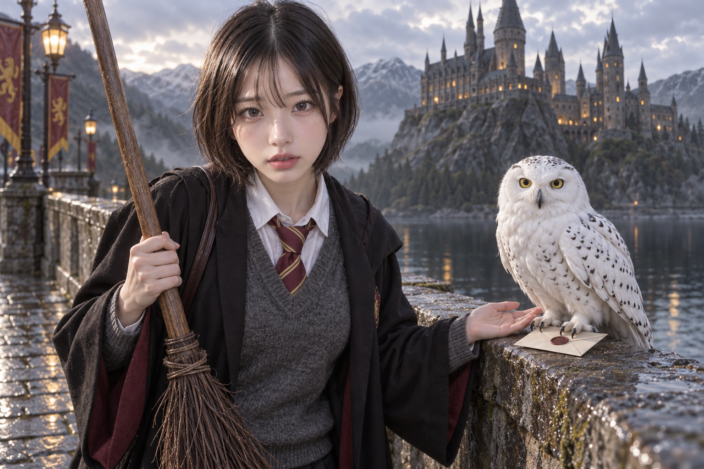
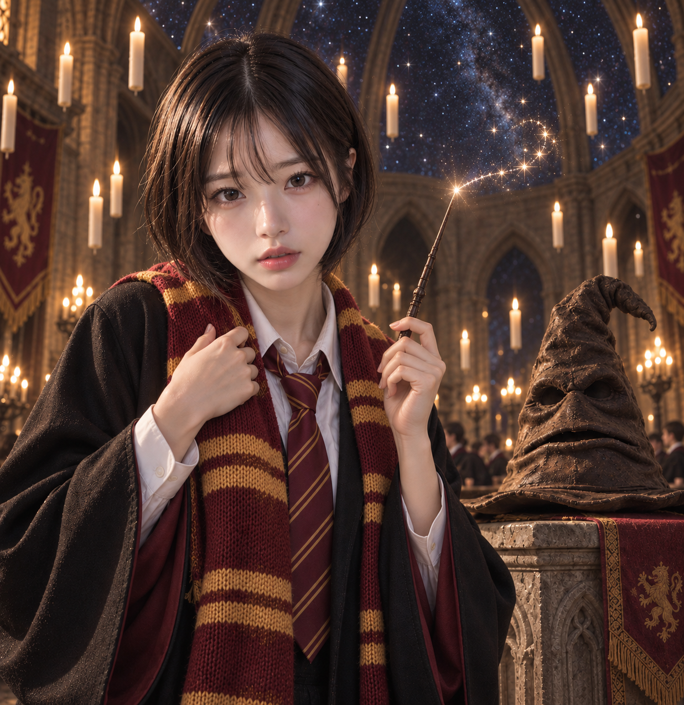

# 해리포터 외형 리서치 데이터 반영과 독립 이미지 테스트

시각 의미 데이터와 후보 데이터를 기본 작업폴더에 반영했다. 기존 의미를 유지한 대체 표현 보강을 우선했고, 기존 정의와 다른 형태는 별도 프로필·후보로 추가했다. 원본 이미지를 이용한 독립된 세 실험의 엄격한 판정은 **A PASS, B FAIL, C FAIL**이다. 부분 구현이나 보이지 않는 필수 요소를 통과로 합산하지 않았다.

| 반영 내용 | 실제 수량 |
|---|---:|
| 기존 시각 프로필에 추가한 한영 대체 문장 | 45개 프로필 / 90문장 |
| 별도로 보강한 기존 구성요소 행 | 19개 행 / 38표현 |
| 기존 후보에 추가한 한영 대체 문장 | 14개 후보 / 28문장 |
| 새 완전한 형태 관계 | 42개 프로필 + 42개 후보 |
| 새 프로필의 대체 문장 / 구성요소 표현 | 126문장 / 126개 구성요소의 252표현 |
| 선택 가능한 조합 | 6개 |

예를 들어 ‘교복’이라는 넓은 이름 대신 **한 사람의 칼라 셔츠 → 그 셔츠 위의 타이 → 타이를 겹치는 니트 목선 → 세 안층을 감싸는 겉로브**를 한영 표현으로 유지했다. 후드의 안팎 면, 타이 가장자리 안의 대각 띠, 윗머리와 옆·아래 모발의 색 영역, 두 새 문양이 이루는 하트, 가면의 파인 홈과 실제 눈 구멍, 대체 눈·손의 접속부, 중앙 모래시계와 둘레 링 및 목걸이 줄의 관계도 같은 방식으로 기록했다.

기존 45개 프로필의 활성 조건, 의미 정의, 효과 범위, 구성요소 최소 수, 증거 최소 단어 수, 원본 픽셀 판정 조건은 유지했다. 추가한 대체 표현은 검색과 의미 확인에 쓰이며, 검색 유사도나 후보 선택만으로 사용자 필수 조건이 되지 않는다. 새 프로필의 정확 표현 84개도 완전한 관계를 서술하며 인물명이나 작품명 자체를 강제 외형 별칭으로 등록하지 않았다. 후보에는 실제 머리·눈·피부·의복·장신구·소품 속성별 효과를 명시했고, 여섯 조합은 선택 가능한 상태로 유지했다.

120개 연구 단위의 채택 여부는 [JSON](RESEARCH-ADOPTION-COVERAGE.json)과 [CSV](RESEARCH-ADOPTION-COVERAGE.csv)에 남겼다. 42개 단위는 일반적인 관찰 가능 형태로 채택했고, 52개 단위는 보강한 기존 프로필과, 17개 단위는 보강한 기존 후보와 연결된다. 이 수치는 중복을 포함한다. 나머지 단위의 기존 연결·판본·문화 맥락·시간 변화·정확한 사례를 검토 기록으로 유지했으며, 기존 프로필과 연결됐다는 이유로 그 프로필의 더 좁은 의미를 다른 사례에 적용하지 않았다. 책·영화·복제품·개별 팬 작품의 출처도 연구 기록에서 구분했다.

데이터 원문은 [새 시각 의미 파일](../../../../skills/photo-prompt-image-generator/assets/photo_prompt_visual_obligations_appearance_relations.json), [새 후보 파일](../../../../skills/photo-prompt-image-generator/assets/photo_prompt_character_appearance_extension.json), [기존 표현 보강 목록](EXISTING-EXPRESSIONS.psv), [기존 구성요소 보강 목록](EXISTING-COMPONENT-EXPRESSIONS.psv)에서 확인할 수 있다. 두 새 소스만 현재 중앙 소스 매니페스트에 등록했고, 기존 소스의 순서와 등록 정책을 유지했다. 새 시각 소스에 처음 적용한 필수 파일 플래그는 독립 레지스트리 검사와 충돌하여 기존 35개 시각 소스와 같은 선택 소스 정책으로 수정했다. 실제 전체 설치에서 해당 파일이 빠지면 42개 프로필이 빠져 인덱스의 `registry_sha256` 검증이 거부함을 별도 검사했다. 후보 소스는 필수 파일이며, 프로필·후보의 의미와 인덱스 해시는 이 등록 수정으로 바뀌지 않았다. [등록 수정 기록](PROFILE-REGISTRATION-REPAIR.json).

시각 프로필 **1,922 → 1,964**, 슬롯 항목 **10,089 → 10,131**로 늘었다. 파생 의미 인덱스는 관계 문서까지 포함해 **10,167개 항목**이다. 양쪽 인덱스를 재생성했고 실제 샤드 로드, 메타데이터·BM25F·원문 해시 바인딩, 데이터 사전 검증을 기본 작업폴더의 현재 런타임에서도 통과했다. [현재 런타임 검증](PRIMARY-RUNTIME-VERIFICATION.json), [복사와 보존 영수증](PRIMARY-SYNC.json)에 해시를 남겼다. 과거 인덱스 샤드를 삭제하지 않았다.

세 에이전트는 서로의 컨셉·프롬프트·결과를 읽지 않았다. 허용된 사전 입력과 원본 이미지로 각자 여러 복잡한 컨셉을 제안한 뒤 OS 난수로 하나를 골랐고, 기본 프롬프트와 테스트 조건을 데이터 조회 전에 동결했다. 원본 이미지의 외형을 사용하는 명시적인 성인 가상 인물로 작성했으며, 실제 인물의 신원·나이·성격을 추론하지 않았다. 각 실험의 추가 세부 조건은 에이전트가 정한 테스트 설계이고 사용자가 직접 정의한 조건으로 재분류하지 않았다.

| 실험 | 복잡한 컨셉과 핵심 요소 | 실제 채택 데이터 | 최종 엄격 판정 |
|---|---|---|---|
| A | 비가 갠 돌다리의 출발: 네 겹 교복, 손으로 쥔 나뭇가지 빗자루, 올빼미와 봉투, 호수 건너 첨탑 성, 참고 얼굴 | `appearance_h002`의 네 의복 겹침 관계 | **PASS** / 생성 1회 |
| B | 별빛 홀의 기숙사 스카프 수여식: 로브·타이·스카프, 주름으로 된 얼굴의 모자, 떠 있는 촛불과 실내 별빛 천장, 지팡이 별빛, 참고 얼굴 | 보강 후보 h050/h082 노출 후 부적합하여 미채택 | **FAIL** / 초기 + 수정 1회 |
| C | 차가운 빛의 가마솥 보정: 지팡이와 액체 반응, 둥근 검은 가마솥, 초록 안감·은색 테두리 로브, 세 링 모래시계 목걸이, 참고 얼굴 | `appearance_h077`의 중앙 모래시계·둘레 링·같은 목걸이 줄 | **FAIL** / 초기 + 수정 1회 |

A의 셔츠·타이·니트·로브는 같은 착용자의 네 층으로 구별되고, 타이와 니트의 겹침을 원본에서 확인했다. 올빼미는 돌 위의 봉투를 발톱으로 누르고 잡는다. 이 관찰은 봉투를 들고 날아간다는 증거가 아니다. 빗자루·올빼미·성은 새 후보 채택 증거가 없는 독립 기본안의 구현으로 기록했다. [A 결과](render-tests/arm_a/RESULT.md), [프롬프트](render-tests/arm_a/final_prompt.txt), [이미지](render-tests/arm_a/image_attempt_1.png).

B의 수정 결과에서는 모자의 먼 쪽 챙 끝이 프레임 밖으로 잘렸고, 별이 높은 아치형 창·벽 패널과 구분되는 실내 천장 면에 있다는 관계가 불명확했다. 모두 `UNOBSERVABLE_NOT_PASS`이다. 첫 시도의 모자와 두 번째 시도의 다른 통과 요소를 합쳐 통과로 판정하지 않았다. 담당 에이전트는 손가락의 국소 하이라이트를 지팡이 빛의 구현으로 판정했지만, 주 에이전트는 동시에 켜진 촛불·주변광과 분리하기 어려워 그 세부 관계도 관찰 불충분으로 기록했다. 양쪽 원본 판정을 보존했고 전체 FAIL 결론은 같다. 적합한 보강 후보를 채택하지 않았으므로 이 실험은 데이터가 이미지 품질을 개선했다는 증거가 아니다. [B 결과](render-tests/arm_b/REPORT.md), [프롬프트](render-tests/arm_b/prompt_en_repair.txt), [수정 이미지](render-tests/arm_b/generated_images/astronomical-house-investiture-attempt-2.png), [초기 이미지](render-tests/arm_b/generated_images/astronomical-house-investiture-attempt-1.png).

C의 목걸이는 두 번 모두 중앙 모래시계·둘레 링·목걸이 줄의 관계를 구현했다. 그러나 독립 테스트에서 요구한 **분리된 세 링 대신 두 링**만 보인다. 가려진 것이 아니라 수가 틀린 `FAIL`이다. 데이터 h077은 ‘별도 둘레 링들’을 정의하며, 공식 백과와 복제품 출처가 정확한 링 수를 보편적인 불변 조건으로 뒷받침하지 않아 세 개로 강제하지 않았다. C가 데이터 조회 전에 정한 세 링 기준은 그대로 유지했다. [C 결과](render-tests/arm_c/C_REPORT.md), [후보 연결 증거](render-tests/arm_c/data_effect_trace.json), [프롬프트](render-tests/arm_c/final_prompt_attempt_2.txt), [수정 이미지](render-tests/arm_c/generated_images/cold-light-cauldron-attempt-2.png), [초기 이미지](render-tests/arm_c/generated_images/cold-light-cauldron-attempt-1.png).

세 실험의 총 native 생성 호출은 **5회**, 출력은 **5개**다. 각 시도의 원본 PNG, 실제 프롬프트·negative 바이트, 요청 감사, 조회 후보, 채택 근거, 원본 픽셀 판정, 실패와 수정 기록을 보존했다. 내장 도구는 구체적인 모델 ID를 노출하지 않았으므로 모델 이름을 추정하지 않았다. 주 에이전트도 원본과 진단용 1:1 crop을 확인했으며 [교차 검토](ROOT-NATIVE-PIXEL-REVIEW.json)에 판정 범위를 기록했다.

**증명한 범위:** A와 C에서 새 일반 후보의 노출 → 선택 → 실제 프롬프트 표현 → 해당 관계의 원본 픽셀 구현을 확인했다. 새 시각 프로필 자체의 선택·대체 표현에 의한 픽셀 효과는 이 세 실험에서 입증되지 않았다. 동결 기본안의 별도 이미지나 변경 전 데이터와의 동일 조건 비교를 생성하지 않았으므로, 데이터 보강이 결과를 인과적으로 개선했다는 주장도 하지 않는다. 사용자 이미지 선호와 수락은 아직 확인되지 않았다.

새 회귀 테스트 **9개 모두 통과**했다. 최초 8개는 격리 체크아웃과 기본 작업폴더에서 통과했고, 등록 수정 후 파일 누락과 실제 인덱스 바인딩 검사까지 추가한 최종 9개를 기본 작업폴더에서 재검증했다. 기존 활성화·효과·관찰 조건 보존, 한영 전체 구성요소와 한 요소씩 제거, 부정·작가 선택·인물명의 강제화 금지, 잘못된 소유자·대체 형태, 후보 효과의 실제 속성 잠금, 조합의 선택성을 검사한다. [테스트 원문](../../../../tests/test_photo_harry_appearance_semantics.py), [최종 기본폴더 로그](primary-scoped-tests-final.log).

전체 회귀는 처음 수집한 1,690개를 모두 검사하고, 추가한 등록 검사와 필요한 재검증을 합쳐 **1,691개 중 1,682개 통과, 3개 FAIL, 6개 ERROR**로 기록했다. **전체 통과가 아니다.** 이번 데이터 반영으로 발생한 등록·호환 문제와 격리 환경의 누락 자료 문제는 해결하여 관련 검사들이 통과했다. 초기 순차 로그, 이어 실행한 세 프로세스의 검사별 결과, 수정 전 실패, 수정 후 재검증을 모두 보존했다. [전체 검사 연결과 원인 분류](FINAL-TEST-COVERAGE.json), [최종 검증 영수증](FINAL-VERIFICATION.json).

남은 9개 중 6개는 시작 스냅샷에서 같은 실패를 재현하거나 변경 전 입력·코드의 충돌을 확인했다. 과거 프로필 보존 비교의 10개 하위 실패, 직물 소스의 오래된 유지보수 해시, 오래된 장면 재생의 소유자 의존성, V22의 봉인 인벤토리, 기존 `importlib` 경계 검사에 해당한다. 나머지 3개는 현재 V22 팩 바이트와 옛 봉인 값의 충돌이다. 시작 당시에도 의미·시각 인덱스의 봉인 바인딩이 이미 달랐다는 증거로 기존 문제로 추정했으며, 정확한 과거 전체 명령은 다시 실행하지 않았다. 이 추정과 직접 재현한 결과를 구분했다. [동일한 10개 하위 실패](BASELINE-FAILURE-COMPARISON.json), [직물 유지보수 해시](CLOTHING-BASELINE-DEPENDENCY-COMPARISON.json), [장면 재생 시작 비교](LIMINAL-BASELINE-COMPARISON.json), [V22 시작 인벤토리](V22-START-INVENTORY-COMPARISON.json), [경계·봉인 바인딩 증거](ILLUSTRATION-PREEXISTING-EVIDENCE.json).

기존 검사 세 곳은 이번에 허용된 추가분에 맞춰 좁게 갱신했다. 오간자·시폰 후보의 두 대체 문장만 정확히 허용하고 나머지 원본 필드를 그대로 비교하며, 과거 장면 재생에서는 새 오버레이만 제외하고 원래 23개 해시를 유지한다. 소스 등록 검사는 봉인된 기존 순서에 새 두 등록만 정확히 붙였는지 확인한다. 과거 쿼리·기대 데이터·사용자 수락·실패 판정 파일을 다시 쓰지 않았다. 격리 환경에 없던 과거 JSON 의존 자료는 기본폴더와 봉인 해시를 확인해 복원하고 해당 검사만 재실행했다. [자료 복원](DEPENDENCY-RESTORATION.json), [호환 수정과 재검증 목록](FINAL-TEST-COVERAGE.json).

이번 작업은 13개 데이터 소스, 새 테스트 파일 1개, 기존 호환 검사 파일 3개, 파생 인덱스에 한정했다. 기존의 다른 수정과 작업 도중 갱신된 런타임 파일 4개를 보존했다. 세 이미지 실험은 처음에 동결한 격리 런타임을 사용했고, 기본 작업폴더의 이후 프롬프트 예산 변경은 별도 작업의 상태로 검증 영수증에 남겼다. 커밋·푸시·PR·배포는 수행하지 않았다.

남은 우선 작업은 B의 완전한 모자 외곽과 천장 평면을 동시에 읽히게 하는 구도, C의 세 링 수를 지키는 장신구 표현, 그리고 기존 데이터와 새 데이터의 같은 요청 비교다. 이번 실패를 완전 통과 사례나 대표 이미지로 승격하지 않았으며, 테스트 조건과 실패 이미지를 다음 검증의 고정 비교 자료로 유지한다.
