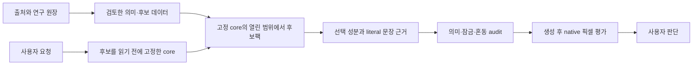

# 사진 편집 용어를 시각 의미와 후보팩 데이터로 반영하기 위한 조사

조사일: 2026-10-01, Asia/Seoul. 기준 커밋: `769f005f01fd54e302e0399e44ac1b2b20122c69`.

이 문서는 최초 조사 시점의 기준 기록이다. 이후의 운영 반영과 이미지 검증은 [반영 보고서](implementation-report.md)에 기록한다. 아래의 운영 미반영 상태·카탈로그 수는 이 기준 시점을 뜻한다.

참조 대화 **사진 편집 용어 조사**의 키워드 표 245개 행을 88개 설계 의미군으로 정리하고, 제조사·개발사 문서, 공정 보존 기관, 원저자 자료 등 54개 출처를 연결했다. 핵심 반영 방향은 **용어의 적용 대상과 관찰 결과를 분리하고, 기존 의미 계약을 재사용하며, 효과의 조합과 대체를 구분하는 것**이다. 모든 편집 기능명을 자동 생성 후보로 추가하면 LUT·ICC 같은 작업 정보가 미감으로 변하거나 영상 입자가 물체 표면으로 옮겨 갈 수 있다.

이 결과는 연구·반영 설계다. 운영 자산과 인덱스에는 적용하지 않았다. 연구용 후보 25개·조합 6개의 초안을 별도 디렉터리에 두었으며, 출처·데이터 구조·인메모리 계약을 검토하는 수준이다. 실제 요청의 후보팩 노출, 선택, 최종 프롬프트, 생성 이미지, 사용자 수용은 각각 후속 검증 대상이다.

## 읽는 순서와 증거 범위

- [반영 계획](implementation-plan.md): 단계, 변경 파일, 우선순위, 완료 기준.
- [키워드별 매핑](keyword-matrix.md), [상세 JSON](keyword-matrix.json): 245개 행 모두의 의미군·owner·관찰 결과·혼동 경계·출처·현재 검색 항목.
- [의미군 제안](concept-proposals.json): 88개 그룹의 설계 근거와 적용 경로.
- [출처 원장](sources.md), [기계 판독 원장](source-ledger.json): 직접 확인한 범위와 제품·방법별 한계.
- [검증 계획](validation-plan.json): 검색, 잠금, 조합, 출력·작업 정보, 픽셀 검증의 예정 사례.
- [후보·조합 초안](runtime-projection-draft.json), [초안 provenance](prototype-provenance.json): 운영 미등록 구조 예시.
- [현재 자산 스냅샷](current-catalog-snapshot.json), [검토 결과](research-validation.json): 집계 및 연구 산출물의 검사 결과.

참조 대화는 `read_thread`로 처음 20,000자를 읽고, 인증된 브라우저의 같은 대화 표에서 잘린 끝부분을 회수했다. 키워드 표는 완전한 245행 목록이지만 전체 답변의 byte-exact Markdown 복제본은 아니다. 16번의 5개 조합 예시와 본문 Fujifilm 룩 이름은 표 행 수에서 제외했다. 이전 답변의 설명은 조사 씨앗으로 취급했고, 이번의 출처 검증과 설계 판단을 구분했다. [수집 기록](reference-conversation.md), [원문 키워드](reference-keywords.json).

출처가 직접 지지하는 것은 용어·제품 작동·공정 관계다. 아래의 후보 슬롯, 의미군, 강도 표현, 혼동 경계, 픽셀 판정 기준은 이를 프로젝트에 적용하기 위한 **작성자의 설계 추론**이다. 공급자의 제품 예시를 보편적인 레시피나 사용 빈도 근거로 쓰지 않는다. 발췌만 확인한 출처는 원장에 따로 표시했다.

## 1. 현재 데이터에서 확인한 공백

등록된 확장을 합친 로더 기준으로 후보 9,012개, preset 706개, optional bundle 610개, visual profile 1,076개다. 기본 JSON 하나만 세거나 원문 용어가 없다는 이유로 기존 의미가 전혀 없다고 판단하지 않았다.

| 245개 원문 행의 어휘 조사 | 행 수 | 해석 |
|---|---:|---|
| label·alias·keyword 등에 동일 문자열 | 48 | owner·정의·슬롯의 의미 검토가 필요 |
| 본문·프로필에서만 언급 | 84 | 독립 후보, 직접 별칭, 활성화 여부는 미확인 |
| 이 조사 방식에서 어휘 매칭 없음 | 113 | 의미가 없다는 판정이 아니라 우선 검토 목록 |

예를 들어 `Natural` 매칭에는 자연 모발·메이크업 항목도 섞인다. 사진 전체의 natural finish를 커버한다고 볼 수 없다. 반대로 `Gradient map`의 정확한 문자열이 없어도 `cr_gradient_mapping` 프로필은 이미 있다. 이 집계는 검색어 검토이며 검색 recall, 실제 후보팩 노출률, 의미 품질 점수가 아니다.

관련 슬롯은 `color` 148개, `color_grading` 36개, `texture` 163개, `grain_profile` 9개, `film_emulation` 21개, `focus` 39개, `motion` 53개다. 특히 아래 구조가 반영 설계에 영향을 준다.

| 현재 계약 또는 항목 | 확인 내용 | 반영 제안 |
|---|---|---|
| `texture` 슬롯 | 기본 영향 차원은 `material` | 영상면 grain·noise를 물체 재질로 읽지 않도록 새 항목의 owner와 `affected_dimensions`를 명시 |
| `motion` 슬롯 | 기본 차원 목록이 비어 있음 | panning·shutter 효과의 `camera` 등 실제 영향 차원을 항목에 선언; 무조건 기본값으로 채우지 않음 |
| `slot:texture:halation` | 영어가 `film halation and soft light bloom`으로 두 효과를 묶음 | 기존 ID의 의미를 단일 halation으로 몰래 축소하지 않고, 독립 효과 후보와 legacy 조합의 이행 방안을 검토 |
| `cool_digicam_grain` | 차가운 디카 인상과 영상 노이즈가 한 label에 결합 | 색 편향·노이즈·시대적 룩을 독립 성분으로 표현; CCD 고유색 주장 금지 |
| `iso3200_noise_grain` | ISO 숫자, noise, grain을 결합 | 숫자 장비 metadata와 관찰 결과의 연계를 고정하지 않고 noise 종류·범위를 분리 |
| `highlight_rolloff_tone_response` | 제외어에 `bloom` 포함 | 함께 요청된 계조 전이와 국부 블룸이 정당하게 공존하는지 우선 검증 |

현재 프로필의 제외어는 단순 혼동 예시를 넘어 context 검사를 통과시키거나 막는 입력이다. 롤오프 단독과 롤오프+국부 블룸의 직접 context 함수 호출을 [검토 결과](research-validation.json)에 남겼다. 이 호출은 전체 v6 요청 라우팅·최종 프롬프트 검증이 아니므로, 영향 범위를 그 수준으로 한정한다. 향후 수정은 부정 표현과 잘못된 대체를 계속 거절하면서 **동시 요청의 독립 성분을 보존**해야 한다.

직접 helper probe 7개 중 명시적 공존의 3개 문맥은 `request_exclusion`으로 거절되었다. 롤오프+국부 블룸, 광학 diffusion+film halation, panning+rear-curtain flash다. 각각의 단독 문맥은 이 helper를 통과했다. 따라서 단순히 새 후보를 추가하기 전에 공존 의미의 라우팅을 검토할 구체적인 근거가 있다.

## 2. 데이터의 의미를 여섯 층으로 나눌 것

| 층 | 예 | 저장·판정 방식 |
|---|---|---|
| 목적·접근 | candid, documentary, editorial | 장면·행동·프레이밍의 맥락; 필터 하나로 치환하지 않음 |
| 전체 룩 | cinematic, matte, nostalgic, lo-fi | 요청에 맞는 관찰 성분의 조합; 고정 공식 없음 |
| 관찰 효과·관계 | 국부 bloom, tonal roll-off, panning | owner, 적용 범위, 공간·계조 관계, 세부 보존 조건 |
| 연산·작업 | mask, healing, focus stacking, blend mode | 입력·대상·적용 영역·기대 결과·보존 영역 필요 |
| 진단·실제 이력 | clipping, histogram, 원본 복원, 공정명 | 원본/비교 자료·측정·provenance가 있어야 사실 판정 |
| 작업·출력 정보 | LUT, RAW, ICC, soft proof, bit depth | metadata와 출력 계약; 자동 미감 후보로 넣지 않음 |

한 용어가 여러 층을 가질 수 있다. `cyanotype`은 공정명이며 cyanotype-like image의 색·접촉 흔적을 요청하는 표현도 가능하다. 실제 공정 이력과 공정에서 착안한 결과 묘사는 별도 필드와 검증 경로를 가져야 한다. [V&A 공정 자료](https://www.vam.ac.uk/articles/photographic-processes).

## 3. 계열별 상세 조사와 반영 판단

### 3.1 스타일·정서·목적: edit_01–08

Natural·clean·candid·documentary·editorial·commercial·fine-art는 결과 인상과 제작 목적이 섞인 말이다. 장르·접근 분류는 도입 단서가 되지만 특정 LUT·grain·조명 세트와 일대일 관계가 아니다. [Adobe 장르 안내](https://www.adobe.com/creativecloud/photography/discover/types-of-photography.html), [편집 스타일 예시](https://blog.adobe.com/en/publish/2021/10/19/11-contemporary-photo-editing-styles-to-keep-your-feeds-fresh).

반영은 `cinematic → teal-orange+letterbox`, `nostalgic → sepia+dust`, `dreamy → 전역 blur` 같은 기본 공식을 줄이고, 필요한 색·계조·초점·광원 성분을 optional로 제시하는 방식이 적절하다. `matte look`도 종이의 무광 물성과 matte painting을 섞지 않는다. 사진 계조를 원한다면 lifted black floor 같은 관찰 표현으로 구체화하되, 사용자에게 그런 의도가 없으면 자동으로 고정하지 않는다.

### 3.2 노출·계조·색: edit_09–23

Lightroom의 Highlights/Shadows와 Whites/Blacks는 같은 위치에 작용하는 조절 이름이 아니다. 후자는 밝고 어두운 끝점에 관련되고, 전자는 밝은/어두운 영역의 정보를 조절한다. 제품의 image-adaptive 동작을 다른 편집기의 동일 수치로 이식하지 않는다. [Adobe tone controls](https://helpx.adobe.com/uk/lightroom-classic/desktop/help/tone-control-adjustment.html).

Saturation과 Vibrance, Texture와 Clarity 같은 control은 서로 다른 목적을 가진다. `saturation +20` 같은 연산 지시는 결과 룩과 별도로 저장하고, 입력 파일·제품 버전이 없는 생성 요청에서는 원하는 결과를 언어로 묘사한다. Temperature는 WB 조절 문맥과 실제 장면 광원의 색온도 문맥을 나눠야 한다. `Luminance`와 HSL의 Lightness도 하나의 물리량으로 합치지 않는다. [Camera Raw 색·계조](https://helpx.adobe.com/camera-raw/desktop/using/make-color-tonal-adjustments-camera.html), [Lightroom 편집](https://helpx.adobe.com/ie/lightroom/desktop/edit-photos/edit-photos.html).

Gradient Map은 계조에 gradient의 색을 대응시키는 연산이고, 인쇄 duotone은 grayscale 재현에 잉크와 각 잉크의 곡선을 사용한다. 생성용 두 색 룩, 인쇄 공정, 파란 배경과 크림색 물체 두 개는 구분해야 한다. [Adobe Gradient Map 등](https://helpx.adobe.com/photoshop/desktop/adjust-color/color-effects-techniques/apply-special-color-effects-to-images.html), [duotones](https://helpx.adobe.com/photoshop/using/duotones.html).

`Color splash`는 선택 대상을 남기고 나머지를 무채색화하는 결과 제안으로 다룬다. Photoshop의 `Selective Color`는 색군 내 CMYK 기여를 조절하는 별도 기능이다. 한국어 선택적 색 보정이라는 겹치는 표현 때문에 같은 alias로 합치면 안 된다. [Adobe Selective Color](https://helpx.adobe.com/photoshop/desktop/adjust-color/selective-color-adjustments/make-selective-color-adjustments.html).

반영 우선 항목은 lifted/crushed blacks, highlight roll-off, muted chroma, split toning, gradient mapping, duotone, 선택 대상별 색 보존이다. 색 잠금이 있으면 전역 grading도 영향을 준다. 빨간 옷을 보존하라는 요청에서 “이 효과는 배경 스타일일 뿐”이라는 이름으로 색 잠금을 우회할 수 없다.

### 3.3 조명·광학적 번짐: edit_24–35

Soft light의 판정 근거는 광원과 그림자 경계의 관계다. 낮은 대비 grading, 피부 smoothing, soft focus와 구분한다. 광원의 밝기나 최종 사진 밝기만으로 soft/hard를 정하지 않는다. [ARRI Lighting Handbook](https://www.arri.com/resource/blob/83996/409091c612f371b0c68b41d9dcb636db/arri-lighting-handbook-english-data.pdf).

| 용어 | 데이터에서 관찰할 특징 | 가까운 혼동 대상 |
|---|---|---|
| Bloom | 밝은 영역 주위의 국부 공간 번짐 | 계조 roll-off, 전역 blur |
| Glow | 맥락에 따른 발광·번짐·후처리 인상 | bloom의 보편 동의어, 광원의 실제 자발광 |
| Film halation | 필름 문맥의 밝은 고대비 경계에 색을 가진 halo | 전역 붉은 grade, RGB split, 광학 색수차 |
| Optical diffusion halation | 광학 필터 문맥의 하이라이트 확산 | 모든 필터가 동일한 붉은 halo를 만든다는 가정 |
| Veiling flare | 광원 쪽 veil과 국부 대비 감소 | 실제 안개, 단순 저대비 grade |
| Ghosting | 광원과 관련된 분리된 반사 모양 | 장면 속 구슬, light leak, 피사체 중복 |
| Light leak | 장면 광원과 별개일 수 있는 필름형 빛샘 패치 | 광원 중심 플레어 |
| Starburst / streak | 중심에서 다방향 광선 / 특정 방향 광선 | 실제 anamorphic 렌즈 사용 이력 |

Dehancer는 필름 halation의 적주황 경계 번짐과 국부 bloom을 구별한다. 한편 Tiffen도 광학 diffusion 설명에 halation이라는 말을 사용하며, 제품마다 하이라이트 번짐과 세부 감소가 다르다. 따라서 **unqualified halation을 항상 붉은 film halo로 정규화하지 않는다.** [Dehancer Halation](https://www.dehancer.com/learn/article/halation), [Bloom](https://www.dehancer.com/learn/articles/bloom-how-it-works), [Tiffen Diffusion Guide](https://tiffen.com/pages/diffusion-guide).

Light leak은 필름에 새어 들어간 빛과 관련되며 색·위치는 고정되어 있지 않다. “필름이면 가장자리에 주황 띠”를 기본으로 넣는 근거가 아니다. Star FX의 다방향 광선과 Blue Streak의 방향성 선은 다른 모양이며, 후자의 필터로 anamorphic-like 인상을 만들 수 있다. 모양만으로 렌즈 종류를 증명할 수 없다. [Lomography Light leaks](https://www.lomography.com/magazine/335909-diana-f-let-the-light-in), [Tiffen Star FX](https://tiffen.com/products/star-fx-screw-in-filter), [Blue Streak](https://flysteadicam.tiffen.com/collections/tiffen-motion-picture-filters-mptv/products/blue-streak-filters).

반영은 각 효과의 owner를 `bright edge`, `highlight neighborhood`, `light-facing image region`, `source-aligned ghost`, `image-plane leak patch`처럼 분리한다. 실제 광원 위치를 필수로 요구하는 효과와 이미지 overlay를 구분하고, 둘을 함께 요청하면 각각의 근거를 유지한다.

### 3.4 초점·움직임·합성된 깊이: edit_36–44, 70

얕은 심도는 초점면과 깊이에 따른 선명도 변화이고, bokeh는 흐린 영역의 표현을 설명한다. 전역 Gaussian Blur나 피부 smoothing으로 얕은 심도를 대체하면 안 된다. Lens Blur 구현은 광학 흐림을 모사하는 연산이며 실제 렌즈·촬영 이력의 증거가 아니다. [Adobe Lens Blur 개발 설명](https://blog.adobe.com/en/publish/2024/06/26/inside-lens-blur), [Blur Gallery](https://helpx.adobe.com/photoshop/using/blur-gallery.html).

Panning은 움직이는 대상의 추적과 배경 흔적의 관계가 핵심이다. ICM은 의도적인 카메라 이동의 표현이며, zoom·spin·물체 자체의 움직임을 자동 동의어로 묶지 않는다. [Canon Panning](https://www.usa.canon.com/learning/training-articles/training-articles-list/how-do-i-get-a-panning-effect), [Michael Orton 직접 설명](https://www.photography.ca/fine-art-photographers/orton/).

Slow sync는 긴 셔터로 주변·배경 빛을 기록하는 플래시 문맥이고, rear-curtain은 발광 시점을 지정한다. Shutter drag가 rear-curtain을 반드시 뜻하지 않는다. [Nikon Flash Modes](https://onlinemanual.nikonimglib.com/z7_z6/en/11_on-camera_flash_photography_04.html). Orton의 디지털 변형은 정렬한 sharp/blur 성분을 결합하는 방식으로 확인했다. 원조 슬라이드 노출 배수나 고정 blur 반경은 보편 계약에 넣지 않는다. [Orton·Wiggett 인터뷰와 방법 설명](https://www.photography.ca/blog/2009/06/03/67-orton-imagery-the-orton-effect-interview-with-michael-orton-and-darwin-wiggett/).

Focus stacking은 서로 다른 초점 지점의 여러 이미지를 결합하는 작업이다. `near-to-far readable focus`라는 보이는 결과와 실제 합성 이력을 구분하고, 접합부·세부·형태 연속성을 판정한다. 단일 deep focus도 결과가 닮을 수 있으므로 이미지만으로 stack의 실제 실행을 확정하지 않는다. [Adobe focus stacking](https://helpx.adobe.com/photoshop/desktop/create-masks/blend-images/create-a-composite-with-extended-depth-of-field.html).

### 3.5 필름·디카·입자·디테일: edit_45–58

Film simulation, film emulation, film-scan look은 겹치는 결과 인상을 가질 수 있지만 같은 처리 이력은 아니다. Fujifilm의 Velvia, ASTIA, CLASSIC CHROME, ETERNA, ACROS는 해당 제품의 설명에 연결하고, grain 설정은 film simulation 이름과 별도로 다룬다. 브랜드 룩을 모든 필름 또는 센서의 일반색으로 확장하지 않는다. [Fujifilm X-T5 image quality](https://fujifilm-dsc.com/en/manual/x-t5/menu_shooting/image_quality_setting/).

Bleach bypass는 은 제거 단계의 처리와 관련된 공정이며, cross-processing은 필름을 의도된 공정과 다른 방식으로 처리하는 맥락이다. 생성 후보에는 공정에서 착안한 대비·채도·색 편향을 구체화한다. 어느 공정이든 특정 하나의 색 결과를 고정하지 않는다. [Kodak processing techniques](https://www.kodak.com/en/motion/page/processing-techniques/), [Lomography cross-processing](https://www.lomography.com/school/what-is-cross-processing-fa-bne2kolj).

Film grain, luminance noise, chroma noise는 같은 단어로 합치지 않는다. Dehancer의 grain 설명은 그 구현의 계조별 입자 표현을, Camera Raw의 설명은 밝기·색 노이즈 축을 지원한다. 물체 표면의 거침·먼지·피부결도 별도 owner다. [Dehancer Grain](https://www.dehancer.com/learn/article/grain), [Camera Raw noise reduction](https://helpx.adobe.com/camera-raw/desktop/using/sharpening-noise-reduction-camera-raw.html).

Sharpening·Clarity·Texture·Structure·Dehaze는 디테일을 늘리는 하나의 슬라이더가 아니다. 피부 미세결, 국부 대비, 대기적 veil, 경계 강조를 각각 다룬다. Snapseed Structure의 작동을 모든 제품의 Texture와 수치 등가로 취급하지 않는다. [Adobe sharpening](https://helpx.adobe.com/photoshop/desktop/effects-filters/smart-filters/sharpening-overview.html), [Unsharp Mask](https://helpx.adobe.com/photoshop/desktop/effects-filters/smart-filters/sharpen-images-with-unsharp-mask.html), [Google Snapseed Details](https://support.google.com/snapseed/answer/3113306?hl=en), [Lightroom controls](https://helpx.adobe.com/ie/lightroom/desktop/edit-photos/edit-photos.html).

Digicam·CCD·instant·disposable 룩은 기기 이력과 시대적 인상의 조합이어서 단일 보편 recipe를 채택할 근거가 약하다. 노이즈 종류, 직광 플래시, 색 편향, highlight 처리, 압축 흔적을 요청 문맥에 따라 독립 후보로 제시한다. CCD=차가운 색, ISO3200=필름 grain, film scan=종이 테두리 같은 등식을 넣지 않는다. JPEG block·banding·moiré를 신규 hard profile로 만들기 전에는 각각의 주파수·공간 패턴을 지원하는 추가 자료와 대조 픽셀을 보완한다. 이번 그룹 수준 출처 연결만으로 이들의 개별 패턴 검증을 완료했다고 주장하지 않는다.

### 3.6 피부·리터칭·기하: edit_59–65

Healing·clone·spot healing은 수정 방식이고, frequency separation은 세부 texture와 색·톤을 나누는 편집 구조다. 이것만으로 texture-preserving 결과를 보증할 수 없다. `피부 톤을 정리하되 미세결을 유지`처럼 관찰 결과와 보존 조건을 따로 적는다. 원본의 모공·주름·잡티를 실제로 복원했는지는 비교 원본이 있어야 한다. [Adobe frequency separation](https://www.adobe.com/products/photoshop/frequency-separation.html), [Spot Healing](https://helpx.adobe.com/photoshop/desktop/repair-retouch/clean-restore-images/remove-small-spots-with-the-spot-healing-brush.html).

Dodge/burn은 국부 노출 조절이다. 얼굴·몸의 비율 변경을 기본으로 따라오게 하지 않는다. Crop·aspect ratio·straighten·perspective correction·lens distortion·Liquify/Warp도 서로 다른 범위다. 프레이밍 변경, 기하 변형, 광학 보정이 적용되는 대상을 분리하고 잠금을 존중한다. [Adobe dodge/burn](https://helpx.adobe.com/photoshop/desktop/repair-retouch/adjust-light-tone/dodge-or-burn-image-areas.html), [lens distortion and perspective](https://helpx.adobe.com/photoshop/desktop/effects-filters/artistic-stylize-filters/correct-lens-distortion-and-perspective.html).

### 3.7 마스크·레이어·합성: edit_66–73

Mask는 적용 영역을 지정하고 Feather는 경계 전이를 지정한다. Blur의 전역 결과로 치환하지 않는다. Blend mode는 입력 레이어의 색·불투명도·연산 조건에 따라 결과가 달라진다. `Soft Light` blend와 `soft light` 조명을 alias normalization으로 합치지 않는다. 대소문자는 원문 목록의 구분 단서일 뿐, 실제 요청의 문맥 해석은 조명·레이어 단어와 적용 대상을 이용한다. [Adobe layer masks](https://helpx.adobe.com/photoshop/desktop/create-masks/layer-masks/add-layer-masks.html), [selection edges](https://helpx.adobe.com/photoshop/desktop/make-selections/refine-modify-selections/refine-and-soften-selection-edges.html), [blending modes](https://helpx.adobe.com/uk/photoshop/desktop/repair-retouch/adjust-light-tone/blending-mode-descriptions.html).

Double exposure·photomontage·collage는 합성할 성분의 위치·중첩·가독성을 요구해야 한다. 무조건 인물을 복제하거나 얼굴 위에 꽃을 넣지 않는다. HDR merge, focus stacking, panorama는 각각 노출 정보, 초점 정보, 시야의 결합이다. `HDR` 출력·HDR-like 강한 국부 대비도 따로 다룬다. [Adobe HDR/panorama merge](https://helpx.adobe.com/lightroom/desktop/edit-photos/hdr-panorama.html?linkId=100000359333812), [HDR output](https://helpx.adobe.com/lightroom/desktop/edit-photos/hdr-output.html).

### 3.8 그래픽·물리 공정·복원·생성 편집: edit_74–84

Posterization·threshold·invert·solarize·halftone·pencil·watercolor·cutout·glitch는 전체 이미지의 표현인지, 사진 안의 인쇄물·그림·화면 표현인지 구분해야 한다. 사진 속 cyanotype 인쇄물과 전체 cyanotype-like 결과에 같은 owner를 붙이면 화면 경계가 바뀐다. RGB split은 색수차와 닮아도 채널 이동의 공간 범위가 다르다. [Adobe filter effects](https://helpx.adobe.com/photoshop/using/filter-effects-reference.html), [special color effects](https://helpx.adobe.com/photoshop/desktop/adjust-color/color-effects-techniques/apply-special-color-effects-to-images.html), [glitch](https://www.adobe.com/creativecloud/photography/discover/glitch-effect.html).

Gelatin silver·platinum·wet plate·daguerreotype·photogravure·photogram·luminogram은 역사적 공정·재료 관계에 근거를 둔다. photogram의 물체 흔적과 luminogram의 빛 관계를 렌즈·카메라 recipe로 억지 설명하지 않는다. 생성 결과에 실제 판·종이·금속의 provenance를 부여하지 않는다. [V&A processes](https://www.vam.ac.uk/articles/photographic-processes), [MoMA Photogram](https://www.moma.org/collection/terms/photogram), [V&A cameraless photography](https://www.vam.ac.uk/articles/cameraless-photography).

Colorization은 그럴듯한 색 추정이며 실제 과거 색의 증명이 아니다. Upscaling·Super Resolution도 없던 역사적 세부의 진실성을 보증하지 않는다. 생성 편집의 inpainting/outpainting은 원본·마스크·보존 영역과 변경 결과의 비교가 필요한 작업 계약이다. [Colorful Image Colorization 원논문](https://arxiv.org/abs/1603.08511), [Adobe Enhance](https://helpx.adobe.com/camera-raw/desktop/edit-and-enhance-images/sharpening-and-noise/enhance.html), [Generative Fill](https://helpx.adobe.com/uk/photoshop/desktop/create-open-import-images/create-images/edit-images-with-generative-fill.html), [Generative Expand](https://helpx.adobe.com/uk/photoshop/desktop/create-open-import-images/create-images/explore-beyond-the-canvas-with-generative-expand.html).

### 3.9 작업·출력 정보: edit_85–88

RAW development, adjustment layers, smart objects, nondestructive editing, action, batch는 편집 실행과 보존 방식이다. 결과 사진에 특정한 감성이나 피부 형태가 필수로 생기지 않는다. 이 계열은 생성용 자동 분위기 후보보다 작업 metadata와 도구 연산 계획으로 다루는 편이 적절하다. [Adobe nondestructive editing](https://helpx.adobe.com/photoshop/using/nondestructive-editing.html).

일반 색 LUT의 색·대비 변환만으로 공간적인 grain·bloom·halation·vignette가 들어 있다고 해석하지 않는다. 그런 효과가 함께 들어간 preset이라면 별도 성분이 필요하다. [Dehancer LUT 설명](https://www.dehancer.com/learn/article/lut). ICC·soft proof·bit depth는 장치·파일·표시 조건을 포함하는 출력 계약이다. “부드러운 gradient”를 픽셀에서 보았다는 사실과 실제 16-bit 파일·ICC 상태는 다른 증거다. [ICC profile](https://www.color.org/getting-started/), [display calibration and proofing](https://www.color.org/displaycalibration/), [Adobe bit depth](https://helpx.adobe.com/photoshop/desktop/adjust-color/color-modes/bit-depth-in-photoshop.html).

## 4. 기존 의미 계약의 재사용

다음 17개 프로필 ID는 현재 merged registry에 존재함을 확인했다. 존재 확인은 새 용어의 정당한 활성화나 픽셀 충족 확인이 아니다. 세부 활성화·제외어·필수 증거·render gates는 현재 프로필을 기준으로 검토한다.

| 계열 | 재사용 검토 프로필 |
|---|---|
| 색·계조 | `cr_duotone`, `cr_gradient_mapping`, `cr_split_toning`, `highlight_rolloff_tone_response` |
| 광질·암부 | `soft_light_shadow_edge_relation`, `hard_light_shadow_edge_relation`, `low_key_selective_illumination` |
| 번짐 | `film_halation_highlight_edge_relation`, `diffusion_filter_highlight_halation`, `veiling_flare_contrast_loss_relation`, `lens_ghosting_flare_alignment` |
| 초점·움직임 | `shallow_depth_focus_falloff_relation`, `focus_stacked_extended_depth_composite`, `panning_subject_tracking_motion_relation`, `rear_curtain_flash_motion_trace` |
| 매체·시대 | `cyanotype_contact_print_prussian_blue_relation`, `early_2000s_compact_digicam_social_repost` |

Digicam 프로필은 `requires_adult_character=true`다. 일반 CCD 룩이나 비인물 사진에 그대로 강제하지 않는다. `physical_print_scan_material_context`도 별도 인쇄물 문맥이므로 모든 film-scan look에 종이·테두리를 붙이는 식으로 재사용하지 않는다.

새 hard profile은 요청자가 명시한 효과를 기존 계약으로 표현할 수 없고, 독립적인 요청 근거·관찰 성분·혼동 반례·픽셀 gate가 충분할 때만 추가한다. 발견한 후보·선택한 bundle 때문에 hard 의미가 자동으로 생겨서는 안 된다. 현재 소스의 `hard_profile_ids` 연결도 컴파일하면 advisory `associated_profile_ids`이며 별도 요청 근거가 필요하다.

## 5. 후보팩에 필요한 데이터 표현

새로운 후보의 기본 단위는 **짧은 이름 + 독립 관찰 성분 + 관계 + 실제 영향 차원**이다. 유지보수 출처·해설·operator 이력은 별도 연구 원장에 저장한다. 현재 runtime extension의 최상위 키와 bundle 키는 엄격하므로 이 연구 문서의 필드를 그대로 runtime JSON에 복사하지 않는다.

| 데이터 항목 | 작성 기준 | 예 |
|---|---|---|
| owner / scope | 영상면·장면 광원·피사체 표면·사진 속 인쇄물 구분 | `image-plane grain`, `bright contrast edge` |
| concept units | 검색 힌트와 실제 선택한 의미의 성분을 명확하게 표현 | `red-orange halo at bright contrast edges` |
| relations | 배열 순서 대신 명시적 관계 | 광원-고스트 정렬, 초점면-깊이별 선명도 |
| dimensions | 기존 30개 core 차원 안에서 실제 변경 범위를 선언 | grain=`style`, 색 halo=`style+color`, panning=`camera` |
| property effects | 부분 잠금과의 충돌을 보수적으로 선언 | 전역 grading은 특정 옷 색 보존을 침해할 수 있음 |
| confusion boundary | 잘못된 대체와 정당한 공존을 분리 | bloom은 roll-off를 대신하지 않지만 함께 나타날 수 있음 |
| strength | 해당 효과의 범위·폭·세부 감소를 설명 | 약한 bloom=하이라이트 국부, 비하이라이트 세부 보존 |
| provenance | 출처 ID, 설계 추론, 검증 단계·artifact hash | 원문 정의·작성자 제안·픽셀 미검증을 구분 |

`affected_properties` helper와 일부 composition/augmentation/audit 경로는 존재한다. 그러나 일반 bundle의 공개 eligibility 함수는 이 필드를 직접 평가하지 않는다. 따라서 선언만 추가하고 모든 후보 경로의 부분 잠금 보호가 끝났다고 주장하면 안 된다. ordinary retrieval → projected pack → 선택 → audit에 실제로 전달·검사되는지를 후속 통합 사례로 확인해야 한다.

Bundle의 `component_groups.visible_evidence`는 현재 `minimum_realizations=1`인 선택지로 컴파일된다. 동시에 충족해야 할 두 성분을 한 배열에 넣으면 하나만 충족해도 그 component를 만족시킬 수 있다. 연구 초안은 독립 의무마다 별도 component를 두었다. 모든 노출·선택 검증은 full details의 원본 계약과 hash를 보존해야 한다.

## 6. 이번 결과의 완료 범위와 남은 자격 검증

원문 245행의 매핑, 88개 의미군 제안, 54개 출처 원장, 현재 자산 조사, 연구용 25개 후보·6개 조합의 구조 검토, 반영·검증 계획을 준비했다. 일부 시대·정서 룩과 결함 패턴은 보편 recipe 근거가 약하므로 맥락 의존 제안으로 표시하고, 개별 hard 의미 승격 전에 자료·대조 사례를 보강한다.

다음 단계의 완료는 항목 수 증가로 판정하지 않는다. 요청한 효과가 올바른 scope에서 검색되고, 고정 의미·부분 잠금·부정을 지키며, 선택한 성분이 최종 문장에 연결되고, 실제 픽셀에 나타나야 한다. 코드·프롬프트 PASS를 픽셀 PASS로 치환하지 않는다. 픽셀 단계에서는 `partial_is_fail`, 차단된 생성 호출은 품질 점수에서 제외, 원본 크기와 출력 환경 증거를 보존한다. 사용자 선호·수용은 기술 충족과 별도 상태로 남긴다.

## 7. 연구 산출물 검증 결과

[검토 결과](research-validation.json)에 원문 행·출처·프로필 참조·초안 hash·인메모리 merge·단독 bundle 공개 계약·전체 차원 잠금·잘못된 참조 rejection 등을 기록했다. 연구 artifact와 분리된 구조 검사 35개를 통과했고, 기준 자산/registry 소스 59개가 기존 SHA-256을 유지함을 확인했다. 이 결과는 real retrieval pack이나 최종 selection/audit, native 픽셀의 통과 결과가 아니다. 검증 계획의 42개 통합 사례는 모두 `planned_not_executed`다.

재현하려면 이 디렉터리의 `build_research_artifacts.py`와 `verify_research_artifacts.py`를 실행한다. 전자는 연구용 매핑·초안 파일만 다시 작성하고, 후자는 운영 데이터를 읽어 인메모리 계약을 검사한 뒤 연구 검토 JSON만 저장한다. 운영 로더에 확장을 등록하거나 생성 API를 호출하지 않는다.
