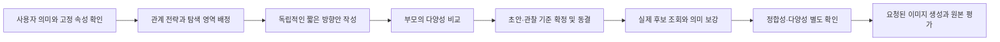

# 서브에이전트 작업 절차와 복장 다양성 분석

핵심 원인은 독립 초안 작성 단계의 선택 수렴과, 세 안을 함께 비교하는 다양성 기준의 부재다. 후보팩 조회 전에 이미 세 안 모두 짙은 붉은색 실크 드레스를 선택했고, 최종 복장 문장은 세 안 모두 그대로 유지됐다. 관계 전략과 프레임 범위에는 실제 차이가 있었지만, 복장군·소재·주요 배색의 탐색은 같은 방향으로 좁아졌다.

기록된 방향 비교, 복장 선택 사유, 동결 파일, 후보 채택, 공개 작업 메시지와 실행 내역으로 절차를 확인했다. 모델의 내부 원인을 실험으로 분리해 증명한 것은 아니다. 확인된 사실과 가능한 설명을 구분한다. [진단 데이터](DIAGNOSIS.json), [서브에이전트 공개 작업 기록](AGENT-VISIBLE-WORK.json)

## 실제 작업 순서

| 단계 | 실제 작업 | 다양성과 관련된 결과 |
|---|---|---|
| 1. 부모의 주제 배정 | A는 장난스러운 주의 끌기, B는 가까운 교감, C는 기다림을 배정. 같은 얼굴·머리 참조와 동일한 고정 스킬을 제공 | 관계 전략은 나눴지만 의복군·소재·색상·생활 영역은 나누지 않음 |
| 2. 설정 해석 | 세 안 모두 실험자 선택 `sensual=3`, `fetish=0`; 저장된 `creativity=1` 유지 | 유혹성이 중심인 같은 입력을 공유. 창의성은 절제된 변주를 안내하지만 옷을 지정하지 않음 |
| 3. 독립 방향 비교 | A는 2개, B는 3개, 새 C는 2개 방향을 기록 | 비교 중심은 장소·관계·행동. 복장군·소재·배색이 다른 대안 비교는 기록에 없음 |
| 4. 관찰축 선택·초안 작성 | A 9개, B 9개, C 8개의 중립 범주 선택. 모두 `feature.clothing` 포함 | 복장 항목의 누락은 아님. 선택 이유와 실현이 밤 외출·실크 드레이프 쪽으로 수렴 |
| 5. 동결 | 기본 프롬프트, 코어, 신체 관계 검토, 관찰 기준을 후보 조회 전에 고정 | 부모의 복장 다양성 검토보다 먼저 복장과 일부 복장 판정 기준이 고정됨 |
| 6. 후보 조회·보강 | 각 안에 실제 팩 1개 생성. A는 표정·고개, B는 시선·얼굴/의복 가독성, C는 시선·쿠션 지지 채택 | 의복 종류·소재·배색을 새로 선택한 슬롯은 없음. 이미 선택한 복장은 유지 |
| 7. 부모 검토·감사 | 의미·참조 범위·신체 관계·후보 증거·런타임 입력 확인 | 각 안의 정합성은 확인했으나 세 안의 복장 중복 판정은 없음 |
| 8. 생성 | A 2회, B 2회, C 1회. 모두 출력 검토 차단 | 이미지가 없으므로 이번 분석은 프롬프트와 작업 절차에 대한 결론 |

부모는 최초 C의 공연장 문턱 장면이 A·B와 가까운 것을 발견해 장소와 행동을 바꾸었다. 이미 Phase 2 생성기를 실행한 최초 C는 중단·보존했고, 데이터를 보지 않은 새 에이전트 C2를 투입했다. 이 조정으로 C는 야외의 정적 기다림으로 바뀌었지만, 복장 차이를 확인하는 절차는 추가하지 않았다. 최초 C도 버건디 실크 홀터 드레스를 작성했다. [시험 배정과 재배정](../TEST-PROTOCOL.ko.md), [최초 C 중단 기록](../arm-c/SUPERSEDED.json)

## 각 에이전트가 어떻게 선택했는가

| 안 | 기록된 대안·선택 이유 | 복장 선택 사유 | 결과 |
|---|---|---|---|
| A | 햇빛 드는 해변 테라스의 춤 초대는 열린 낮 공간이 이 강도에서 친밀감을 약하게 한다고 평가. 문턱·윙크·손짓이 있는 재즈 살롱을 선택 | 실루엣과 소재가 밤 외출의 매력을 보조 | 진홍색 실크 홀터 미니드레스 |
| B | 극장 발코니·붐비는 댄스 플로어·카페 속삭임 비교. 군중·동작은 짧은 교감을 방해하고, 속삭임은 상호 시선을 가리기 쉽다고 평가 | 부드러운 실크와 저녁 외출의 차림이 매력을 보조 | 와인색 실크 이브닝드레스 |
| C2 | 퍼골라 아래에서 재킷을 든 기다림과, 옆자리를 비워 둔 정적 앉음을 비교. 재킷 장면은 일반 패션 대기로 보일 수 있다고 평가 | 앉은 자세의 실크 드레이프가 데이트의 매력을 보조 | 버건디 실크 슬립드레스 |

세 선택 모두 유혹적인 관계를 눈에 잘 보이게 하려는 사유가 있다. 다만 낮의 생동감, 움직임, 일상적 상황을 제외하는 쪽으로 판단하면서 결과가 조용한 저녁의 친밀감에 모였다. A의 명시적인 낮 장면 탈락 사유가 특히 직접적인 근거다. B·C의 기록도 ‘유혹성을 유지하는 서로 다른 생활 장면’을 탐색하기보다 관계를 방해할 수 있는 대안을 줄이는 데 집중했다.

근거: [A 방향 비교](../arm-a/independent_design.json), [B 방향 비교](../arm-b/PRECORE-CHOICE.json), [C 방향 비교](../arm-c2/independent_design.json), 세 안의 [복장 선택 이유와 원문 대조](DIAGNOSIS.json).

## 원인과 판단의 확실성

**1. 배정은 관계만 나눴다 — 확인됨.** 장난스러운 초대·상호 교감·기다림은 서로 다른 관계 전략이다. 이 축의 차이만으로 복장이나 미감까지 달라지지는 않는다. 같은 요청·스킬·설정에서 서로의 초안을 보지 않아도 비슷한 저녁 외출 차림을 독립적으로 선택할 수 있다.

**2. 방향 비교의 폭이 좁았다 — 기록에서 확인됨.** 비교 문서에는 장소·손짓·상대 반응에 대한 대안이 있고, 의복군이나 소재가 다른 실현을 함께 비교한 기록은 없다. 기록 밖에서 어떤 대안을 떠올렸는지는 확정하지 않는다. 중요한 운영상의 공백은 서로 다른 복장 실현을 검토했다는 증거가 없고, 최종 포트폴리오도 그것을 요구하지 않았다는 점이다.

**3. 강도 3을 좁게 해석한 선택이 있었다 — 확인된 선택과 해석을 구분.** A는 낮 공간이 친밀감을 희석한다는 이유로 방향을 제외했다. 그러나 스킬은 강도 3에서도 일상적이거나 친밀한 표현이 이미지의 중심이 될 수 있다고 명시한다. 제어 정의도 높은 강도가 특정 의복·소재·표현군을 지정하지 않는다고 명시한다. 따라서 밤·실크·드레스는 필수 조건이 아니었다. 공통 입력과 익숙한 저녁 외출 연상이 작성 편향을 만들었을 가능성은 높지만, 모델 내부 원인이나 각 단어의 인과 효과를 증명한 것은 아니다. [당시 제어 정의](../runtime/skills/photo-prompt-image-generator/precore/creative_controls.json), [당시 스킬](../runtime/skills/photo-prompt-image-generator/SKILL.md:68)

**4. 자기 선택이 후속 보존 기준으로 들어갔다 — A·C에서 확인됨.** A의 `A7_supporting_nightlife_forms`는 진홍색 실크 홀터 미니드레스를 관찰 기준으로 정했다. C의 `c2_silk_date_wardrobe`는 버건디 얇은 끈 카울 슬립드레스의 앉은 드레이프를 정했고, 조명 기준도 얼굴과 실크를 언급한다. 작성자 소유의 시험 기준이며 사용자 요구로 가장하지는 않았지만, 일단 동결한 후에는 그 복장을 유지하는 쪽으로 시험이 구성된다. B에는 같은 수준의 특정 실크·색상 복장 기준이 없다. [A 관찰 기준](../arm-a/observable_test_gates.json), [C 관찰 기준](../arm-c2/experimental_gates.json)

**5. 감사는 개별 정합성을 검사했다 — 확인됨.** 중립 범주 검증기는 한 코어·한 선택 기록을 받는다. 5–10개 범주, 출처, 해시, 기본 문장의 증거를 확인하고, 한 기록 안의 반복 사유·증거에 경고한다. 여러 안의 의복군·소재·배색을 비교하지 않는다. 사후 의미 검토 역시 초대·시선·접촉·지지·잠긴 의미를 보존하는 데 집중했다. 프롬프트 감사 PASS는 복장 다양성의 증거가 아니었다. [범주 검증 코드](../runtime/skills/photo-prompt-image-generator/scripts/validate_precore_feature_selection.py:219), [A 자기 검토](../arm-a/semantic_self_review.json), [B 자기 검토](../arm-b/bounded_semantic_self_review.json), [C 자기 검토](../arm-c2/semantic-self-review.json)

**6. `creativity=1`은 보조적인 설명 후보다 — 인과 효과 미검증.** 정의상 요청 가까이의 절제된 변주를 안내하고, 후속 추가 후보의 탐색 범위도 가까운 항목으로 제한한다. 익숙한 차림이 반복되는 데 영향을 주었을 수 있지만, 이 설정에서 반드시 붉은색 실크 드레스가 나온다는 규칙은 없다. 이 수치만 높이면 다양성이 해결된다는 증거도 없다.

**7. 서로 다른 seed는 초기 복장을 바꾸지 않았다 — 확인됨.** 세 팩의 seed와 variation key는 서로 달랐다. 복장은 그 팩 검색 이전에 에이전트가 작성했다. 따라서 팩 seed의 차이는 먼저 작성된 의상군·소재·배색에 대한 분산 조건이 아니었다.

스킬은 Phase 3에서도 열린 차원의 작성자 선택을 유지·명확화·삭제·교체할 수 있도록 허용한다. 코어 동결 자체가 실크 드레스를 요구하는 것은 아니다. 이번 실행에서는 이미 정한 초안의 충실성과 고정 관찰 기준을 유지했고, 복장을 다시 탐색하도록 하는 단계가 없었다. 과거 시험의 기준을 지금 바꾸는 방식으로 개선을 주장해서는 안 된다. [Phase 3의 허용 범위](../runtime/skills/photo-prompt-image-generator/SKILL.md:376)

## 다양성을 늘리는 권장 절차

가장 먼저 바꿀 것은 에이전트 배정과 후보 조회 전 비교 절차다. 의상 데이터 양을 늘리기 전에, 독립 작성 단계에서 여러 미감을 실제로 탐색하고 선택하도록 해야 한다.

1. **고정할 것과 달리할 것을 처음에 구분한다.** 실제 사용자 요구, 얼굴·머리 참조, 중심 유혹 관계와 필수 형태는 보존한다. 열린 복장·소재·배색·생활 영역·시간대를 다양성 축으로 삼는다. 이 배정은 실험자의 선택이며 새 사용자 요구로 등록하지 않는다.
2. **서로 다른 탐색 영역을 배정한다.** 예를 들어 일상적이고 활동적인 차림, 구조적인 테일러링, 부드러운 니트·분리형 차림처럼 의복 구조와 소재 반응이 다른 범위다. 매번 같은 세 의상 메뉴를 고정하지 않는다. 관계 전략도 같이 배정해 의상만 다른 무관한 장면이 되지 않게 한다.
3. **에이전트가 의미 있는 대안을 간단히 비교한다.** 선택이 열려 있을 때 익숙한 실현과 의복 구조 또는 소재·장면이 실질적으로 다른 실현을 비교한다. 밤이 더 유혹적이라는 가정만으로 낮·일상 장면을 탈락시키지 않는다. 수치나 노출량이 아니라 대상·시선·행동·반응·자리 관계가 중심 인상을 만드는지 판단한다.
4. **팩 조회 전에 부모가 세 안을 비교한다.** 의복군, 실루엣, 입는 방식, 소재 반응, 주요 배색, 생활 영역, 시간·빛을 짧은 표로 비교한다. 중복된 안에는 다른 탐색 영역만 돌려주며, 다른 에이전트의 전체 프롬프트나 후보 정보를 전달하지 않는다. 이 방식은 배정된 범위 안에서의 독립 설계이며, 완전한 무배정 무작위 표본으로 표현하지 않는다.
5. **다양성 확인 후 코어와 관찰 기준을 확정한다.** 현재 A·C처럼 먼저 특정 실크 복장을 고정 픽셀 기준으로 만든 뒤 중복을 발견하는 순서를 피한다. 그 다음 신체 관계를 검토하고 최종 기본 문장·코어·기준을 동결한다. 이미 후보 데이터를 읽은 에이전트가 새 독립 시험을 맡아야 하면 데이터 미열람 후속 에이전트를 사용한다.
6. **정합성과 다양성을 별도로 확인한다.** 최종 후보 보강이 다시 복장이나 미감을 같은 방향으로 모으지 않았는지 부모가 재확인한다. 동결한 코어와 기준을 바꿔야 할 정도의 변경이면 기존 기록을 보존하고 새 계보의 시험으로 진행한다. 후보 ID의 강제 채택이나 구성요소 조건 완화는 하지 않는다.

권장 다양성 조건은 각 두 안 사이에서 열린 복장 축이 최소 두 개 달라지고, 그중 하나는 **눈에 보이는 의복군 또는 입는 방식의 구조적 차이**인 것이다. 색상만 바꾼 같은 드레스는 충분하지 않다. 보이지 않거나 지정되지 않은 길이·하의·소재를 다르다고 계산하지 않는다. 예를 들어 현재 B의 프레임은 허리 위이므로, 정의되지 않은 드레스 길이를 다양성 근거로 사용할 수 없다. 사용자가 같은 복장을 명시했다면 그 속성은 이 조건에서 제외한다.

## 다음 배정의 예시

아래는 아직 작성·생성하지 않은 탐색 영역 예시다. 이 세 조합을 영구 기본값으로 제안하는 것은 아니다.

| 관계 전략 | 다른 생활 장면의 예 | 복장 탐색 영역 | 주된 유혹의 표현 |
|---|---|---|---|
| 장난스러운 초대 | 밝은 낮의 해변 산책로에서 발걸음을 멈추고 상대를 돌아봄 | 흰 면 셔츠와 청색 데님, 일상적인 분리형 차림 | 한 사람을 향한 윙크·손짓·몸의 되돌림 |
| 상호 교감 | 비가 갠 전시장 밖 계단에서 가까운 대화가 잠시 멎음 | 차콜색 무광 울 재킷, 구조적인 테일러링 | 같은 상대의 시선·가벼운 접촉·이미 보이는 응답 |
| 정적인 기다림 | 오전의 창가 벤치에서 옆자리를 남겨 상대를 맞음 | 올리브색 리브 니트와 밝은 리넨 하의 | 시선·작은 미소·몸 방향과 옆자리의 연결 |

각 에이전트는 구체적인 시각 형태가 동시에 읽히는 옷·손·시선·프레임을 선택해야 한다. 넓은 구도에 작은 인물만 넣거나 손을 가리는 차림을 선택해 정밀 키워드를 평가할 수 없게 만들면 안 된다. 장소와 복장이 바뀌어도 유혹적인 관계가 이미지의 중심으로 남아야 한다.

## 시각 의미 데이터 적용 시험과의 연결

다양한 복장이 나왔다는 사실과 연구 데이터가 적용됐다는 사실은 각각 검증해야 한다. 현재 연구 프로필 27개는 세 팩에 노출·채택되지 않았고, 보조적인 일반 프로필 2개의 표현 6개만 최종 문장에 반영됐다. 이 문제를 복장 다양성 점수로 대신 통과시키지 않는다.

다음 데이터 시험에서는 원래 조사한 키워드에서 소수의 시각 형태 목표를 먼저 정한다. 이 목표는 실험 입력임을 표시하고, 에이전트가 데이터의 ID나 대체 표현 원문을 복사하지 않은 자연스러운 문장으로 서로 다른 장면에 배치하게 한다. 각 소유자·구성요소·관계의 독립 관찰 기준을 후보 조회 전에 고정한 뒤 원본 존재 → 노출 → 채택 → 전체 프롬프트 증거 → 실제 렌더 기준 → 원본 픽셀을 추적한다.

A의 굽힌 검지 후보는 사용 자격이 있었지만 팩에 나오지 않았고, 손 포즈의 실제 검색문에는 구체적인 손짓 설명이 없었다. 이것은 동결 관찰이 검색에 전달되는 경로를 따로 조사할 이유다. 프로필의 자연스러운 대체 표현 인식과 후보 순위·배분을 각각 확인해야 하며, 이번 작성 다양성 개선과 같은 원인으로 묶지 않는다. [기존 검색 진단](../PARENT-RETRIEVAL-DIAGNOSTIC.json)

## 적용 순서와 검증 기준

- **P0 — 배정 절차부터 적용:** 짧은 방향 비교 기록과 후보 조회 전 부모의 포트폴리오 비교를 추가한다. 첫 비교에서는 기존 `creativity=1`을 유지해 절차 변경과 설정 변경의 효과를 섞지 않는다.
- **P1 — 반복 작업에 정착:** 스킬에 다중 결과 요청에 한정된 짧은 지침을 두고, 개별 의미 감사와 별도의 포트폴리오 확인 기록을 만든다. 정확한 복장을 지정한 단일 요청에는 불필요한 대안이나 다양성 강제를 추가하지 않는다.
- **P2 — 데이터 검색 공백 해결:** 이번에 놓친 독립 관찰의 슬롯 전달과 대체 표현 매칭을 별도 변경으로 검토한다. 후속 요청에서 창의성 2와 기존 1의 차이를 비교할 수 있지만, 수치 변경만을 해결책으로 삼지 않는다.

향후 확인해야 할 사례는 다음과 같다. 현재의 세 붉은색 실크 드레스는 제안한 복장 다양성 조건을 충족하지 않는다. 목선만 바꾼 같은 복장이나 색만 바꾼 드레스도 충분하지 않다. 의복 구조와 소재가 다른 안은 구체적인 형태가 보이고 중심 관계가 유지될 때 인정한다. 사용자가 고정한 동일 복장은 보존하며, 가려진 차이는 관찰 불가로 남긴다. 데이터의 전체 형태가 빠진 경우는 스타일 다양성과 관계없이 해당 의미 검증에 실패한다. 이미지가 차단된 경우 픽셀 결과는 미판정으로 유지한다.

이 문서는 분석과 제안이다. 원래 arm의 코어·프롬프트·팩·관찰 기준·오류·이미지 호출 기록을 수정하지 않았고, 런타임 코드나 DATA 변경·새 이미지 호출은 수행하지 않았다. [제안 프로토콜](PROPOSED-DIVERSITY-PROTOCOL.json)은 현재 런타임에 바로 입력할 수 있는 스키마가 아니다.
