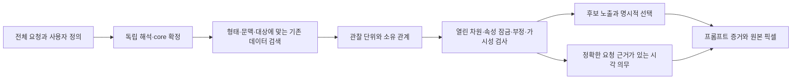

# 유혹적 표현 요소: 시각 의미와 후보팩 보강 리서치

시작 2026-10-04 / 완료 2026-10-05 KST. 참조 대화: [유혹적 표현 요소 조사](https://chatgpt.com/c/6ac24a9a-1078-83e8-a97f-674a9a76061a).

## 1. 결론과 산출물

보강의 중심은 **분위기 라벨을 늘리는 일이 아니라, 눈·입·손·지지·시점·빛의 형태와 소유 관계를 더 정확히 작성하는 일**이다. 원 대화의 120개 항목을 모두 확보해 현재 데이터와 대조했다. 15개는 고정된 형태로 환원하기 어려운 해석어이고, 9개는 순서·지속·전환이 핵심인 시간 항목이다. 같은 단어 아래 여러 형태가 가능한 경우와, 같은 형태가 다른 의미로 읽히는 경우를 함께 보존해야 한다.

현재는 주요 포즈와 조명에 이미 좋은 후보/프로필이 있다. 기존 후보 157개와 프로필 17개를 대응표에 연결했다. 추가안은 **기존 후보 보강 22건, 신규 후보 제안 14건, 기존 프로필 보강 14건, 좁은 형태 프로필 제안 12건, 선택형 묶음 10건**이다. 신규 수량은 설치 목표가 아니다. 같은 의미가 다른 소유 파일에 이미 있으면 기존 ID를 보강하는 쪽으로 줄인다.

| 산출물 | 내용 | 상태 |
|---|---|---|
| [120항목 상세 대응표](/Users/chasoik/Projects/image-prompt/docs/research-evidence/photo-prompt/seduction-expression-20261004/CATALOGUE.md) | 형태, 소유·관계, 혼동 경계, 크롭/관찰 조건, 기존 ID, 항목별 반영안 | 작성 |
| [구조화된 항목 연구](/Users/chasoik/Projects/image-prompt/docs/research-evidence/photo-prompt/seduction-expression-20261004/TERM-RESEARCH.json) | 120항목의 분류·출처·시각 분해·현재 대응 | 연구 스키마 |
| [후보 보강 초안](/Users/chasoik/Projects/image-prompt/docs/research-evidence/photo-prompt/seduction-expression-20261004/CANDIDATE-DRAFTS.json) | 신규 14건과 기존 22건의 단위·관계·차원·속성 제안 | 미설치 |
| [프로필 초안](/Users/chasoik/Projects/image-prompt/docs/research-evidence/photo-prompt/seduction-expression-20261004/PROFILE-DRAFTS.json) | 신규 좁은 형태 12건과 기존 14건의 보강 | 미설치 |
| [선택형 묶음](/Users/chasoik/Projects/image-prompt/docs/research-evidence/photo-prompt/seduction-expression-20261004/BUNDLE-DRAFTS.json) | 문맥에 맞춰 개별 요소를 선택하는 10개 대안 | 미설치 |
| [검증 계획](/Users/chasoik/Projects/image-prompt/docs/research-evidence/photo-prompt/seduction-expression-20261004/REGRESSION-PLAN.json) | 120항목 검토 프로브, 경계 회귀 45건 | 제안; 실행 0건 |
| [원본 픽셀 검증 계획](/Users/chasoik/Projects/image-prompt/docs/research-evidence/photo-prompt/seduction-expression-20261004/PIXEL-QUALIFICATION-PLAN.json) | 8개 장면군, 노출·선택·프롬프트·원본 픽셀 분리 | 생성 0건 |
| [반영 계획](/Users/chasoik/Projects/image-prompt/docs/research-evidence/photo-prompt/seduction-expression-20261004/IMPLEMENTATION-PLAN.md) | 우선순위, 실제 파일 소유, 마이그레이션, 완료 기준 | 작성 |

활성 자산·런타임·인덱스는 수정하지 않았다. 이 패키지는 연구 및 구현 준비 자료다. 아직 후보 노출률, 선택률, 생성 이미지 품질 개선을 주장할 수 없다.

## 2. 조사 범위와 증거의 성격

원 대화의 앞부분은 `read_thread`로 읽었고, API의 20,000자 절단 뒤 115–120번과 끝부분은 렌더링된 대화 DOM으로 보완했다. 번호 1–120의 원 용어·뜻·예시를 [원문 항목 기록](/Users/chasoik/Projects/image-prompt/docs/research-evidence/photo-prompt/seduction-expression-20261004/REFERENCE-KEYWORDS.json)에 보관했다. 원 대화의 예시 조합은 가능한 연출 중 하나로 취급했다. 이를 각 용어의 보편적인 필수 형태로 채택하지 않았다.

독립 근거는 39건이다. 사전 17건은 어휘의 범위를, 얼굴 연구 3건은 형태와 해석의 관계를, 사진가의 지침 4건은 실무의 형태 구분을, 미술기관 2건은 포즈/명암 개념을, 촬영·조명·Adobe 자료 13건은 장면의 관찰 관계를 뒷받침한다. 각 링크, 주장 범위와 열람 한계는 [출처 장부](/Users/chasoik/Projects/image-prompt/docs/research-evidence/photo-prompt/seduction-expression-20261004/SOURCES.md)에 있다. Getty 콘트라포스토 자료는 검색 엔진의 본문 추출로 확인했으며 직접 열기는 오류였다는 점도 기록했다.

여기서 제시한 **관찰 단위, 데이터 효과, 회귀 사례, 이미지 게이트는 연구자가 작성한 설계안**이다. 사전이나 사진 지침이 해당 JSON 설계 전체 또는 생성 모델의 성공을 검증한 것은 아니다. 특정 사진가의 포즈 추천은 촬영 선택지의 근거이며 모든 사람에게 적용되는 미적 규칙으로 일반화하지 않는다.

현재 저장소의 작성 자산은 `load_json` 및 시각 의무 registry loader로 읽었다. 스냅샷에는 후보 9,949개, 프로필 1,774개, 작성 자산/관련 코드 88개 파일의 해시가 들어 있다. 전체 런타임/생성 인덱스의 유효성은 이번 연구에서 검사하지 않았다. [스냅샷](/Users/chasoik/Projects/image-prompt/docs/research-evidence/photo-prompt/seduction-expression-20261004/SOURCE-SNAPSHOT.json)은 진행 중인 다른 변경을 포함한 조사 시점의 목록이다.

120개 원 용어의 문자 일치/부분 문자열 프로브에서는 71개가 어떤 항목과 접촉했고 49개는 접촉하지 않았다. 이는 의미 커버리지 71/120 또는 신규 누락 49개라는 뜻이 아니다. 다른 번역과 구체적 형태로 이미 구현된 의미가 있고, 프로필의 반례 설명에 단어가 등장할 수도 있다. 실제 재사용 판단은 원문 문자열 히트와 별도로 형태·관계·적용 범위를 읽어 수행했다. [현재 데이터 대조](/Users/chasoik/Projects/image-prompt/docs/research-evidence/photo-prompt/seduction-expression-20261004/CURRENT-DATA-AUDIT.json)는 런타임 검색 결과가 아니다.

## 3. 분위기 말과 관찰 가능한 형태를 나누는 기준

`seductive`, `flirtatious`, `coquettish`, `coy`, `sultry`, `smoldering`, `come-hither`, `teasing`, `sensual`, `languid`, `provocative`, `commanding`, `femme fatale`, `bedroom eyes`와 `smirk`를 해석층으로 둔다. 이 말들은 같은 수준의 얼굴 동작명이 아니다. `provocative`는 정치·광고 등에서도 쓰이고 `commanding`은 권위와 존재감의 말이다. `femme fatale`는 서사 역할의 어휘다. 이런 차이는 고정된 옷·노출·소품·표정 레시피를 만들 이유가 되지 않는다. [Merriam-Webster: provocative](https://www.merriam-webster.com/dictionary/provocative), [commanding](https://www.merriam-webster.com/dictionary/commanding), [femme fatale](https://www.merriam-webster.com/dictionary/femme%20fatale)

FACS는 얼굴의 관찰 가능한 움직임을 분해하는 체계다. 얼굴 형태에서 감정·의도·성격을 곧바로 확정하는 용도로 사용하지 않는다. 유료 매뉴얼의 전체 규약은 열람하지 않았으므로 이번 데이터에 미확인 AU 번호를 붙이지 않았다. 얼굴 움직임과 감정의 관계에 대한 연구 검토도 문맥과 표현의 변이를 고려해야 함을 뒷받침한다. [Paul Ekman: FACS](https://www.paulekman.com/facial-action-coding-system/), [Barrett 등, 2019](https://pmc.ncbi.nlm.nih.gov/articles/PMC6640856/)

플러팅 표정을 다룬 2020년 연구는 가능한 조합의 근거로 읽을 수 있다. 하지만 특정 집단의 연출 사진, 인식 과제와 연구 범위를 그대로 넘어 모든 성별·문화·연령의 보편 표정으로 만들 수 없다. 논문 스스로 자발적 표현과 다른 표본에서의 후속 검증 필요를 논의한다. 이 패키지는 그 연구의 조합을 `flirtatious`의 필수 all-of 프로필로 설치하지 않는다. [Identifying a Facial Expression of Flirtation and Its Effect on Men](https://cdn2.psychologytoday.com/assets/identifying_a_facial_expression_of_flirtation_and_its_effect_on_men.pdf)

보강 흐름은 다음과 같다.

이 흐름에서 넓은 해석어는 가능한 대안을 안내한다. 구체 형태가 독립적으로 요청되거나 선택되면 그 요소를 검사한다. 예를 들어 `coy`만으로 턱 내림·위 시선·작은 미소·라펠 접촉을 모두 요구하지 않는다. 사용자가 이 네 가지를 명시하면 각각의 형태와 관계를 의무로 삼을 수 있다.

## 4. 눈과 입의 미세 차이

### 눈꺼풀: half-lidded / squinch / smize

스퀸치의 실무 설명은 아랫눈꺼풀을 조금 올리고 윗눈꺼풀을 비교적 그대로 두는 구성과, 눈 전체를 강하게 찡그리는 구성을 구분한다. 창시자의 자신감 효과 설명은 연출 방법에 대한 주장으로 기록하고 보편적인 심리 판정으로 사용하지 않는다. [Peter Hurley: Squinch](https://peterhurley.com/blog/squinch-single-easiest-tip-looking-confident-photos)

현재 `expression.ae_squinch`와 `ae_profile_squinch`는 아래 경계 상승과 열린 양눈을 이미 갖고 있다. 보강할 부분은 **윗눈꺼풀 닫힘이 주원인인 좁힘과 구별되는 현재 형태**, 그리고 그 경계를 실제로 읽을 얼굴 크롭이다. 단일 사진은 중립 상태에서의 실제 상승이나 윗눈꺼풀의 시간적 유지를 증명하지 못한다.

반면 `expression.pv_half_lidded`는 위/아래 눈꺼풀의 기여를 충분한 근거 없이 정하지 않는 넓은 의미를 이미 보존한다. 이를 윗눈꺼풀 하강 전용으로 덮어쓰지 않는다. 원 대화의 윗눈꺼풀 예시가 필요한 경우 `se_upper_lid_dominant_half_lid`라는 좁은 하위 제안을 선택하거나 기존 후보의 문맥 변형으로 작성한다.

`ae_smize`와 `ae_duchenne_shape`는 눈가·볼 형태의 기존 재사용 대상이다. 입을 벌린 미소나 실제 기쁨을 자동 요구하지 않는다. 윙크는 한 눈의 닫힘과 다른 눈의 열림, 눈 감기는 양눈의 닫힘을 구분한다. 모발 가림은 닫힘을 대체하는 증거가 아니다.

### 시선 방향과 머리 방향

`direct gaze`는 눈이 렌즈를 향하는 관계이고 얼굴 정면은 머리의 방향이다. `downcast gaze`는 눈의 아래 목표이고 `chin tuck`은 머리 pitch다. `looking up through lashes`는 머리/턱과 눈 방향을 분리하고, 속눈썹과 열린 눈의 겹침을 더해야 원 대화의 세부 형태를 보존한다. 하이 앵글 카메라는 별도 축이다.

옆눈은 같은 배우의 얼굴 기준 좌우, 카메라/화면 기준 좌우, 거울 반사 좌우를 분리한다. 시선 대상이 상대 입술이면 입술은 상대의 소유이고 시선 출발점은 주체의 눈이다. 아직 상대가 없는 한 사람 요청에 이 관계 후보가 상대를 새로 만들어서는 안 된다.

### 입 모양과 태도

현재 `expression.pv_asymmetric_mouth`에는 `Smirk`가 별칭으로 있다. 그 후보의 기하는 좌우 입꼬리 차이이며, smirk의 자기만족적·우쭐한 읽힘을 보장하지 않는다. 이는 **의미 등가성을 정비할 데이터 지점**이다. 이 별칭이 실제 잘못된 하드 의무를 활성화하는지는 별도의 런타임 회귀가 필요하다. [Merriam-Webster: smirk](https://www.merriam-webster.com/dictionary/smirk)

입술 열림, 압축, 돌출, 물기, 혀 접촉을 구분한다.

| 형태 | 최소 관찰 관계 | 다른 형태로 대체하면 안 되는 부분 |
|---|---|---|
| parted lips | 위/아래 입술 사이 열린 틈 | 크게 벌린 턱, 혀/치아 노출, 헐떡임 |
| lip press | 같은 얼굴의 양 입술 접합·압축 | 앞으로 모인 pucker, 안으로 만 lip roll |
| pout / pucker | 현재 입술의 전방 돌출·모임 | 영구 입술 두께, 키스 상대/의도 |
| lower-lip bite | 위 치열과 같은 얼굴 아랫입술의 접점 | 접점 없는 lip roll, 혀 접촉 |
| lip-lick의 정지 상태 | 구강에 이어진 혀와 같은 입술의 접촉 | 전체 핥는 경로·시작/복귀 |

`expression.ctx_c126`의 아랫입술 물기는 작업 집중 문맥이다. 이 ID를 유혹 후보로 바꾸지 않는다. 현재 접촉 형태를 보강하되 원래 행동·가드·시선 목표를 유지한다. `ne_current_lip_protrusion`, `sv_tongue_lip_boundary` 등 기존 프로필도 먼저 검토한다.

## 5. 몸의 형태보다 지지·관절·방향을 먼저 쓴다

콘트라포스토는 지지 다리, 자유 다리, 골반/어깨 대응 경사와 전체 균형이 핵심이다. 미술기관 설명과 기존 `contrapposto_weight_shift` 프로필 모두 이 구분을 뒷받침한다. S자 윤곽은 실루엣 경로이고 하중 지지는 다른 주장이다. 그림에서 검사하는 것은 **지지 자세의 시각적 단서**이며 실제 힘을 측정하는 것이 아니다. [Getty: Exploring Contrapposto](https://www.getty.edu/education/k-12-learning/strike-a-pose-exploring-contrapposto/)

보강 원칙은 다섯 가지다.

1. `S curve`, hip shift, back arch를 영구 체형이나 특정 비율 변경으로 치환하지 않는다.
2. pelvis lateral shift와 anterior tilt, thorax/pelvis의 다른 yaw와 몸 전체 회전, head roll과 camera roll을 각각 분리한다.
3. 좌면 가장자리 앉기는 골반-좌면 접점을, 뒤로 기대는 손 지지는 손바닥-지지면과 팔 연결을 작성한다.
4. 무릎 교차·발목 교차·정강이 교차·figure-four는 교차 높이와 상/하 다리 소유가 다르다.
5. reverse chair의 의자 방향과 straddle의 양다리 배열을 분리한다. pointed toe는 발목의 plantarflexion이며 발레 pointe의 체중 지지를 뜻하지 않는다.

기존 포즈 자산은 이 연구의 재사용 중심이다. `pv_single_support`, `pv_prone_forearms`, `pv_side_lying`, `pv_seated_palm_brace`, `pv_knee_over_knee`, `pv_reverse_chair` 등의 ID를 유지한다. 사진 실무의 3/4 방향·팔 공간·얼굴/몸 방향 지침은 선택 가능한 연출 근거로 사용한다. [Canon: Posing Tips](https://www.usa.canon.com/learning/training-articles/training-articles-list/posing-tips-for-successful-portraits)

원 대화의 `dropped shoulder`는 신체 어깨 높이의 말이다. 문자 프로브는 의복의 드롭 숄더 봉제선에도 접촉했다. 신체 자세는 `body_orientation.pv_shoulder_lower`, 옷 구조는 해당 clothing/Y2K 소유 항목을 사용한다. 현재 히트를 실제 오라우팅으로 단정하지 않고 양방향 음성례를 만든다.

## 6. 손은 자세·접촉·하중을 따로 작성한다

손의 곡선, 이완한 손가락, 카메라에 손날을 보이는 배치, 양손 높이의 비대칭은 실무에서 구분할 만한 형태다. 해당 사진가도 이를 엄격한 보편 규칙으로 제시하지 않는다. 보강의 목적은 손을 특정 미감에 맞게 변형하는 것이 아니라 실제 손 평면·관절·접점을 명시하는 것이다. [Neil van Niekerk: Posing Hands](https://neilvn.com/tangents/tips-on-posing-hands/)

| 항목 | 기존 데이터 | 보강/분리할 내용 |
|---|---|---|
| relaxed fingers / curved wrist | `pv_relaxed_fingers`, `relaxed_wrist_offset_line` | 손가락-손-손목-전완의 연결과 관찰 크기 |
| hand edge toward camera | 좁은 직접 재사용 ID 미확정 | 손바닥/손등 평면의 회전; 어느 손날인지 명시 때만 고정 |
| hands at asymmetric heights | 직접 재사용 ID 미확정 | 같은 사람의 두 손과 몸통 기준 높이 차이 |
| fingertip cheek | `hand_touching_face` 등 넓은 후보 | 손끝-자기 볼 접점;턱/관자놀이와 구분 |
| hand under chin | `pv_chin_support` | hover / light touch / load-bearing support 세 변형 |
| hair tuck | `tucking_hair_behind_ear` | 자기 손-모발-귀 소유;정지 상태의 현재 접점 |
| hand behind head | `pv_arms_behind_head`는 양손 | 지정 한 손 변형;반대 손 잠금 보존 |
| clavicle / lapel | `pv_collarbone_touch`, `pv_lapel_grip` | 피부/옷 표면과 touch/grip 차이;피복 보존 |
| fabric pinch | 밑단 잡기·실 집기와 관련 | 손끝 사이 원단·옷 연결·국소 접힘 |
| pendant hold | 기존 accessory 외형 | 이미 있는 장식 본체-체인-손 접점;장식 추가 금지 |
| reach toward camera | `reaching_toward_camera`, `pv_foreshortened_reach`, `pc_pc16` | 가까운 손의 원근과 같은 팔 소유;손 실제 크기와 분리 |

특히 `hand-under-chin`을 무조건 턱 지지로 바꾸면 하중과 접촉을 추가한다. `lapel touch`를 grip으로 바꾸면 원단 집음이 추가된다. `hand-behind-head`를 양손형으로 바꾸면 반대 팔의 잠금을 침범한다. 이 세 차이는 후보 수보다 실제 장면 정확도에 직접 영향을 줄 보강 대상이다.

## 7. 샷·포즈·시점·초점의 좌표를 분리한다

샷 크기, 카메라 앵글, 프레이밍, 초점과 카메라 움직임은 별개 범주다. `three-quarter body turn`은 몸 방향이고 `three-quarter/medium-full shot`은 대략 무릎 위의 범위다. `eye-level`은 카메라와 피사체 높이의 관계이며 직접 시선의 동의어가 아니다. [StudioBinder: Camera Shots](https://www.studiobinder.com/blog/ultimate-guide-to-camera-shots/), [Camera Angles](https://www.studiobinder.com/blog/types-of-camera-shot-angles-in-film/)

`over-shoulder look`은 주체가 **자기 어깨** 너머 돌아보는 포즈다. OTS는 전경 어깨와 그 너머 인물을 놓는 **카메라 구성**이다. 현재 `pc_pc17_owner_relation`과 네 구성 후보를 OTS의 재사용 중심으로 둔다. `POV`도 시점 소유의 말이며 모든 경우에 전경 손이나 추가 인물이 있어야 하는 것은 아니다. [StudioBinder: OTS](https://www.studiobinder.com/blog/over-the-shoulder-shot/), [POV](https://www.studiobinder.com/blog/point-of-view-shot-camera-movement-angles/)

프레이밍은 관찰 의무와 함께 검사한다. ECU 입 크롭에 전신 지지 의무를 붙이거나 무릎 위 크롭으로 발목 교차를 PASS 처리하지 않는다. 반대로 전신 shot의 얼굴이 너무 작으면 스퀸치·치아-입술 접점을 읽지 못할 수 있다. 고정 크롭을 임의로 넓혀 문제를 숨기지 않는다.

얕은 심도는 특정 거리층의 선명도와 앞뒤 흐림의 관계다. 흐린 주체 자체를 soft light로 읽거나, 흐린 손접점에 실제 접촉을 추정하지 않는다. 삼분할은 선택 anchor와 프레임 격자의 관계, 거울 구성은 실제/반사 인물의 소유와 광학 평면 관계다. [Adobe: Shallow Depth of Field](https://www.adobe.com/creativecloud/photography/discover/shallow-depth-of-field.html), [Rule of Thirds](https://www.adobe.com/creativecloud/photography/discover/rule-of-thirds.html)

## 8. 조명은 분위기와 얼굴 패턴을 서로 독립시킨다

조명을 다음 축으로 나누면 broad/sultry 같은 단어가 광질·면 방향·분위기를 한꺼번에 바꾸는 문제를 줄일 수 있다.

| 축 | 항목 | 관찰할 대상 |
|---|---|---|
| 광질 | soft / hard | 선명한 표면의 그림자 전이 폭 |
| 명도 분포/모델링 | low-key / chiaroscuro | 장면 명도 비중과 형상의 명암 면 |
| 얼굴 그림자 패턴 | Rembrandt / butterfly / split / loop | 코-볼 연결/분리, 코밑 중심, 얼굴 분할 |
| 카메라 기준 조명 면 | short / broad | 얼굴 yaw에 따른 좁은/넓은 투영 면과 밝은 면 |
| 국소 반사/광역 | catchlight / selective illumination | 각막 반사점 또는 지정 영역과 주변의 차이 |

chiaroscuro는 밝음/어두움으로 형태를 드러내는 개념이다. low-key와 연관될 수 있지만 동일한 정의로 합치지 않는다. 또한 어두운 장면, 검은 옷이나 단순 저노출을 low-key 전체 의미로 대체하지 않는다. [National Gallery: Chiaroscuro](https://www.nationalgallery.org.uk/paintings/glossary/chiaroscuro), [StudioBinder: Low-key Lighting](https://www.studiobinder.com/blog/what-is-low-key-lighting-definition/)

현재 Rembrandt와 butterfly 등은 이미 상세한 프로필이 있다. Rembrandt는 **그림자 쪽** 코-볼 연결과 눈 아래 삼각광, loop는 그 사이의 분리 간격, butterfly는 코 바로 아래 중심 그림자가 핵심이다. clamshell의 아래 반사광은 butterfly의 필수 정의가 아니다. [Neil van Niekerk: Loop and Butterfly](https://neilvn.com/tangents/portrait-lighting-patterns-loop-lighting-butterfly-lighting/), [StudioBinder: Rembrandt](https://www.studiobinder.com/blog/rembrandt-lighting-photography/), [Butterfly](https://www.studiobinder.com/blog/what-is-butterfly-lighting-definition/)

`lighting.sff_pro_l07/l08`의 short/broad 정의는 카메라에서 투영된 좁은/넓은 면을 기준으로 보강한다. 얼굴 yaw나 광원 방향이 바뀌면 배우의 같은 왼쪽 면이 항상 short가 되지 않는다. 이 면 방향 축은 loop/Rembrandt 같은 그림자 패턴과 조합될 수 있다. [PPA: Portrait Lighting](https://www.ppa.com/ppmag/articles/9-types-of-portrait-lighting)

`sff_pro_l01/l05/l07/l08`과 일부 portrait/lighting 구성 후보에는 `affected_properties`가 없다. 후보의 의미 단위가 존재하더라도 실제 잠금 검사를 통과할 소유자/속성 매핑이 충분하다는 뜻은 아니다. 이 부분을 먼저 보강한다. `sensual_editorial` 등 현재 태그의 실제 적용 가드도 읽고, 중립 촬영 기술을 유혹 의미로 자동 승격시키지 않는지 검사한다. 태그 이름만으로 그러한 오류가 이미 발생했다고 주장하지 않는다.

캐치라이트는 눈 표면의 광원 반사다. 기존 `glossy_wet_catchlight_eyes`는 젖은 질감을 포함하고 `lit_clean_vertical_catchlight_pair`는 두 점 구성을 포함한다. 순수 반사점 요청을 두 복합 조건으로 바꾸지 않도록 별도 좁은 제안을 작성했다. 실제 광원 장비/개수는 반사점만으로 모두 확정하지 않는다. [Adobe Camera Raw: Catchlight Adjustment](https://helpx.adobe.com/in/camera-raw/desktop/edit-and-enhance-images/masking-and-local-adjustments/red-eye-camera-raw.html)

## 9. 시간 항목 9개의 단일 이미지 경계

| 번호 | 항목 | 정지 사진에서 가능한 것 | 전체 의미에 추가로 필요한 것 |
|---|---|---|---|
| 24 | brief eyebrow raise | 현재 올라간 눈썹 | 중립→상승→복귀와 지속 |
| 25 | eyes-leading turn | 눈/머리 방향이 다른 현재 상태 | 눈이 먼저, 머리가 뒤라는 순서 |
| 26 | look away and return | 봄/외면 중 한 상태 | 동일 목표로 복귀하는 세 단계 |
| 27 | lingering gaze | 현재 목표 시선 | 같은 목표의 유지 구간 |
| 28 | eye-to-lip glance | 기존 상대 입술을 보는 상태 | 상대 눈→같은 상대 입의 전환 |
| 35 | lip lick | 혀-입술 접촉 상태 | 접촉·이동·복귀 |
| 81 | beckoning gesture | 굽힌 손가락과 손바닥 방향 | 반복 굽힘과 대상 문맥 |
| 107 | push-in | 가까운 현재 프레임 | 카메라 접근·원근 변화 |
| 108 | rack focus | 한 거리층의 현재 초점 | 두 대상 사이 초점 전환 |

push-in을 CU나 zoom의 동의어로 만들지 않는다. rack focus를 얕은 심도 한 장으로 PASS 처리하지 않는다. 촬영 기법의 전체 시간 의미와 그 결과의 한 상태는 다른 검사 항목이다. `languid`의 느린 속도도 별도로 시간적 한계가 있지만, 이 연구에서는 넓은 해석어군으로 관리한다. [StudioBinder: Camera Shots and Movement](https://www.studiobinder.com/blog/ultimate-guide-to-camera-shots/)

## 10. 보강 초안을 실제 데이터로 옮길 때의 조건

후보 초안은 실제 지원 필드인 `concept_units`, `relations`, `affected_dimensions`, `affected_properties`, 긍정 paraphrase를 사용했다. 단, 연구 wrapper는 활성 확장 스키마가 아니다. 기존 22건의 patch는 **검토를 위한 예시**다. 기존 설명과 새 설명이 충돌하는 경우 단순 합집합으로 합치지 않는다. short lighting의 옛 축약, Smirk 별칭 등은 한 의미로 편집해야 한다.

관계의 `core_existing_*` 표기는 연구의 바인딩 요구다. 이 문자열을 넣는 것만으로 실제 인물이 생기거나 target resolver가 구현되지 않는다. `hair`, `garment`, `eyes.light_reflection`, `face.illumination_pattern`, `camera.viewpoint`, `scene.foreground_subject_relation` 등 제안 속성도 실제 잠금 경로와 대조해야 한다. 경로가 불분명하면 보수적인 기존 상위 경로를 유지하거나 채택을 막는다. 데이터를 노출시키기 위해 잠금 검사를 느슨하게 만들지 않는다.

새 프로필 12건은 넓은 유혹 라벨 대신 구체 형태를 정확 문구로 삼는다. 하지만 실제 core의 사람/손/모발/옷/장식/시점 관계 검사가 완료되기 전 활성화하면 안 된다. 중립 형상에 성인 끌림 문맥을 몰래 넣지 않으며, 기존 유혹 표현 후보의 실행 가능한 성인·끌림 가드는 그대로 보존한다. `contextual_usage`의 산문 조건은 실행 가드가 아니다.

반영 완료는 다음 증거를 차례로 확보한 뒤 판단한다.

1. 작성 데이터의 정의·소유·효과와 기존 의미 보존.
2. core 문맥과 부정/정의/잠금에 맞는 검색 적격성.
3. 정확한 ID의 후보팩 노출과 실제 선택 또는 문맥 유효한 하드 의무.
4. 채택된 구성요소의 프롬프트/런타임 증거.
5. 원본 픽셀에서 모든 요구 형태·접점·소유·제외 조건.
6. 사용자 수용.

현재 완료한 것은 출처 조사, 전체 대응표와 미설치 초안, 반영/검증 계획이다. 이미지 생성이나 활성 데이터 반영은 아직 수행하지 않았다. 구현 순서와 파일별 완료 조건은 [반영 계획](/Users/chasoik/Projects/image-prompt/docs/research-evidence/photo-prompt/seduction-expression-20261004/IMPLEMENTATION-PLAN.md)에 있다.
