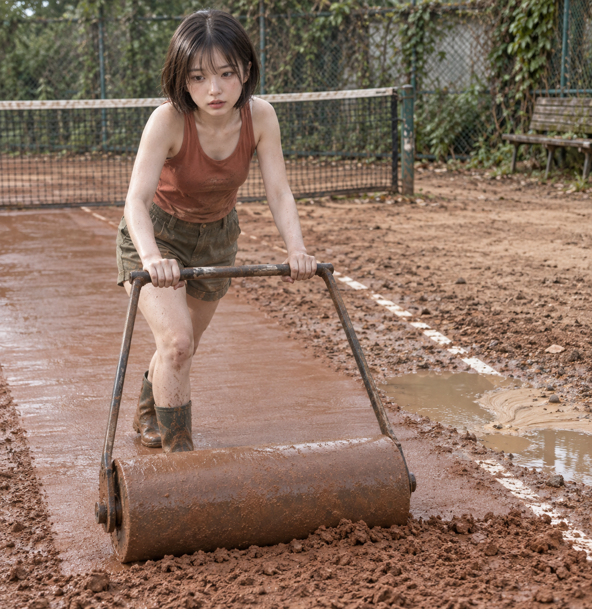
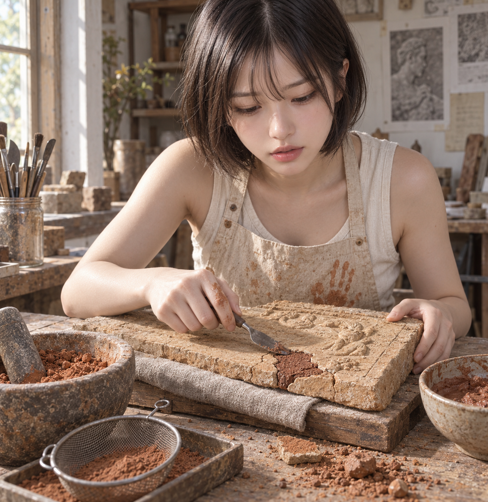
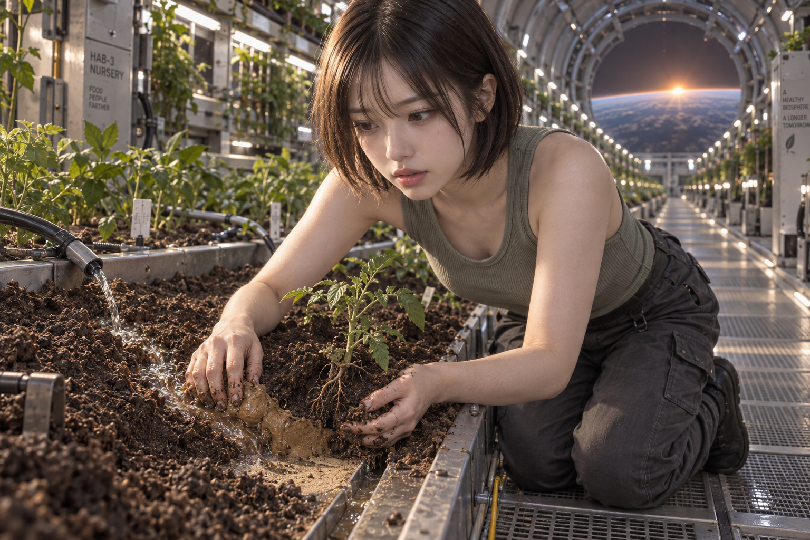

# 흙·땅 반영 후 독립 이미지 테스트

2026-10-08 KST · 최신 로컬 스킬과 게시된 원본 사용

## 결과

독립 서브에이전트 3개가 첨부 사진을 외형 참고로 사용해 서로 다른 복잡한 컨셉을 정하고, 테스트케이스·프롬프트·이미지를 작성했다. 실제 native `image_gen` 호출은 각 1회, 총 3회였다. 세 이미지 모두 흙의 상태와 작업 관계, 참조 사진의 얼굴·머리카락 외형을 확인했다.

새 후보가 실제 프롬프트에 추가된 사례는 2개다. 부조 복원에서는 **같은 토양 패치의 색·입자·국소 경계**, 우주선 온실에서는 **같은 식물의 줄기·뿌리·토양 단면 연결**을 원본 픽셀에서 확인했다. 클레이 코트는 새 후보를 채택하지 않았으므로 기존 독립 프롬프트의 구현 사례로 기록한다.

| 독립 컨셉 | 신규 후보 채택 | 흙 주제 구현 | 스킬의 실제 하드 게이트 | 사전 작성한 자체 기대값 | 전체 자체 케이스 |
|---|---|---|---|---|---|
| 비에 손상된 클레이 코트의 수동 롤러 복구 | 0 | PASS | 신체 관계 5/5 | 6/8 | FAIL: 물길 연결·입자 분급 불명확 |
| 흙 안료 작업실의 부서진 흙 미장 부조 복원 | `soil_e021` | PASS | 신체 관계 5/5 | 7/8 | FAIL: 집중에서 안도로의 변화 불명확 |
| 미래 세대 우주선 온실의 토양 유실·뿌리 복구 | `soil_e081` | PASS | 신체 관계 5/5 | 8/8 | PASS |

자체 기대값 합계는 21/24다. 부분 구현을 PASS로 올리지 않았다. 공식 신체 하드 게이트 15/15와 흙 주제 구현 3/3은 별도 범위다. **신규 흙 시각 프로필은 세 실제 후보팩에서 노출·선택되지 않았다.** 따라서 프로필 선택 경로와 96개 전체 프로필의 렌더 효과를 통과로 주장하지 않는다. 부모의 추가 검토에서 `soil_rel_e021`·`soil_rel_e081`의 각각 3개 물리 성분과 대응되는 외형은 확인했지만, 이는 선택된 후보의 내용 비교이며 해당 프로필 활성화 테스트가 아니다.

## 독립성과 최신 버전

세 에이전트는 `fork_turns=none`으로 시작했다. 다른 arm·리서치 초안·후보 원본에 접근하기 전에 현재 스킬, 저장된 neutral controls, 참조 사진과 일반 지식으로 컨셉·테스트 기대·독립 core·baseline을 동결했다. 이후 게시 완료 통지를 받아 동일한 원본 generation에서 후보팩을 만들고, 노출된 후보 전체 의미를 검토해 채택 또는 기각했다. 다른 arm의 프롬프트나 결과를 입력으로 쓰지 않았다.

| arm | 컨셉 추첨 seed | 실제 pack ID | 독립 결과 기록 |
|---|---:|---|---|
| 1 | 126364945 | `2cb0afc9676d67ee` | [ARM-RESULT](arm-1/ARM-RESULT.json) |
| 2 | 3830837209 | `3107f200060a6604` | [ARM-RESULT](arm-2/ARM-RESULT.json) |
| 3 | 4214803537 | `e5865769d15a9b50` | [ARM-RESULT](arm-3/ARM-RESULT.json) |

사용한 `photo-prompt-image-generator/SKILL.md` SHA-256은 `503f03f5ba8fb65181071858e93f17123223e40964c54e27ff8314b2bce948d0`이다. 세 pack 모두 게시 generation `b731e8ce874eb58e76404f5d61045ccc0de201dac6e4a47137c6635d5ed32e7c`, source fingerprint `af4d683da46af4be552933e9b94a129769bc99a83d2ade5e8fb1aec5ccd56969`에 묶였다. 저장 controls는 sensual 1 / fetish 0 / creativity 1 / surreal 0을 유지했다. 컨셉 추첨 seed는 이미지 도구의 비공개 난수 seed나 모델 식별자가 아니다.

부모가 요청 원문과 active spans를 먼저 동결했다. 에이전트가 정한 장소·행위·촬영·기대값은 에이전트 소유 컨셉으로 남겼다. 이를 사용자의 원래 하드 요구로 승격하지 않았다. [COORDINATOR](COORDINATOR.json), [READY](READY.json), 각 arm의 envelope·core freeze·source receipt가 그 경계를 기록한다.

## 이미지와 실제 데이터 기여

### 1. 클레이 코트 복구

롤러 앞의 거친 입자와 뒤의 평평하고 반사되는 표면, 바닥과 롤러 원통의 접촉, 부츠·의복의 국소 흙 부착물을 확인했다. 침식 홈에서 퇴적 부채꼴로 이어지는 연속 관계와 그 안의 입자 분급은 뚜렷하지 않아 각각 FAIL이다.

노출된 새 후보 `soil_e082`의 쟁기 고랑·뒤집힌 흙덩이, `soil_e097`의 안료·색 견본·결합제는 선택한 롤러 다짐 복구와 전체 의미가 맞지 않아 기각했다. 최종 프롬프트는 독립 baseline과 동일하다. 흙 주제는 구현됐지만 신규 데이터의 추가 효과는 성립하지 않는다.

[최종 프롬프트](arm-1/final_prompt_en.txt) · [negative](arm-1/negative_en.txt) · [데이터 기여](arm-1/DATA-CONTRIBUTION.json) · [픽셀 기대값 심사](arm-1/SUPPLEMENTAL-PIXEL-REVIEW.json) · [상세 보고서](arm-1/report.md)

### 2. 흙 미장 부조 복원

독립 baseline에 이미 있던 건조 흙덩이·가루·젖은 충전재, 흙이 묻은 앞치마와 작업 손, 지지 손과 칼의 복원 동작을 확인했다. 새 `slot:color:soil_e021`은 붉은 갈색 충전 패치의 색을 같은 패치의 입자에 연결하고, 밝은 주변 부조와 만나는 불규칙 경계에서 색이 끝나게 보강했다. 이 3개 성분이 실제 픽셀에 보인다. 발굴 격자 후보 `soil_e099`는 컨셉 밖이라 기각했다.

작업실과 집중 표정은 보이지만 안도로의 변화는 구별되지 않아 자체 감정 기대값은 FAIL이다. 손의 흙은 검지 쪽이 가장 뚜렷해 엄지의 정확한 위치 표현도 약하다. 자체 테스트의 사전 정의는 엄지/작업 손을 허용했으며 그 소유 관계는 통과했다. 실제 프레임 1237×1272는 에이전트의 가로 구도 선호와 다르지만 핵심 복원 관계가 프레임 안에 남았다.

[최종 프롬프트](arm-2/final_prompt_en.txt) · [negative·호출 기록](arm-2/image_runs.ndjson) · [데이터 기여](arm-2/DATA-CONTRIBUTION.json) · [픽셀 기대값 심사](arm-2/PIXEL-TEST-RESULTS.json) · [상세 보고서](arm-2/report.md)

### 3. 우주선 온실의 토양 유실 복구

응축수 유입, 흙 경사와 작은 물길, 점착성 둑을 누르는 손, 노출 뿌리와 흙을 받치는 다른 손을 확인했다. 새 `augmentation:adult_appeal:sensual:location:soil_e081`은 같은 묘목의 줄기에서 큰 뿌리로 이어지는 연결, 그 식물에 속하는 가지 뿌리, 뿌리 주변 토양 단면을 추가했다. 손이 상단 연결부를 가리지 않아 이 관계가 보인다. 자연 제방 뒤 습지 `soil_e051`과 조간대 `soil_e057`는 전체 환경이 맞지 않아 기각했다.

자체 8개 기대와 선택된 데이터 관계 기대를 통과했다. 장면의 토양 외형·연결을 관찰한 결과이며 토양 성분이나 생육 능력을 측정한 것은 아니다.

[최종 프롬프트](arm-3/final_prompt_en.txt) · [negative](arm-3/negative_en.txt) · [데이터 기여](arm-3/DATA-CONTRIBUTION.json) · [픽셀 심사](arm-3/PIXEL-REVIEW.json) · [상세 보고서](arm-3/report.md)

## 감사와 증거 범위

각 arm은 composition·runtime 감사, native 시작/결과 기록, 실제 이미지 리뷰, 독립 manifest 검증을 마쳤다. ledger에 정확히 1개 성공 행과 실제 도구 반환 경로가 있다. 저장 이미지 복사본은 도구 반환 원본과 바이트가 같다. 부모도 세 전체 이미지를 원본 해상도로 추가 검토했다. [부모 관찰](parent-native-observations.json), [최종 파일·ledger 대조](parent-final-validation.json), [종합 전달 기록](DELIVERY.json)을 함께 보관한다.

프롬프트 품질 감사에서 후보를 쓰지 않고 literal description으로 처리한 core anchor 경고가 남았다. 이는 통과한 필수 감사와 구별해 각 결과에 보존했다. 리뷰의 pending enum 등 준비·기록 오류는 원본 실패 기록을 남기고 수정했으며 이미지나 픽셀 판정을 바꾸지 않았다. 추가 이미지 호출, API fallback, 다른 모델로의 전환은 없었다. native 도구는 모델 이름을 제공하지 않았다.

참조 사진 SHA-256은 `06d6c6feeed0d2397ec9562d46113cd221ac54a0e190295f0aa7f7868c22ece7`이다. 얼굴·머리카락의 보이는 외형 참고 범위로만 사용했다. 사용자 미학적 수락은 아직 받지 않았다. baseline-only 이미지를 생성하지 않았으므로 데이터 추가가 비교 이미지 품질을 얼마나 개선했는지는 측정하지 않았다.

## 이후 반영 판단

현재 데이터는 유지한다. 새 후보 두 개의 소유·관계 성분은 프롬프트와 픽셀까지 확인됐고, 기각 후보는 독립 컨셉 보존 경계가 작동한 사례다. 신규 프로필을 억지로 선택시키거나 전체 의무를 낮춰 성공 수치를 늘리지 않았다.

이번 테스트의 후속 검증은 다음 범위로 한정한다. 이 보고서 이후의 추가 생성은 수행하지 않았다.

1. 시각 프로필의 선택 경로: 연구 계획의 자연 관찰문 중 전체 관계가 실제 core에 들어 있는 별도 사례에서, 신규 프로필 노출·채택과 3개 native gate를 추적한다. 이번 무작위 3개 테스트의 core를 사후 변경하지 않는다.
2. 코트의 물길·분급: 후속 사례에서 롤러 작업과 경쟁하지 않는 관찰 영역·거리를 먼저 설계하고, 홈→퇴적부 연속 관계와 입자 위치를 검사한다. 흙 데이터의 정의를 두 흐린 부성분 때문에 낮추지 않는다.
3. 감정 전환: 후속 프롬프트에서 실제 보이는 반응과 작업 결과의 연결을 더 분명하게 설계한다. ‘안도’라는 단어만으로 판정하지 않는다.
4. 비교 효과: 필요하면 같은 core·참조·도구 조건의 baseline과 데이터 보강본을 쌍으로 렌더해 비교한다. 현재 2개 후보의 픽셀 구현 확인과 인과적인 품질 개선을 구별한다.

최종 파일 대조에서 초기 보호 파일 4,763개에 예상 밖 내용 변경이나 누락이 없었다. 공유 저장소 HEAD는 `30fc97a8`에서 `c7a71021`로 이동했다. 해당 이력은 fire 데이터·native transport 통합 커밋이며 새 흙 원본·흙 테스트·이 연구 증거 폴더는 포함되지 않았다. 현재 스킬과 반영 원본의 지문은 세 테스트에 묶인 값과 같다. [HEAD 관측 기록](parent-head-observation.json)에 이력 범위를 보존했으며 이를 되돌리거나 다른 작업을 수정하지 않았다.

원본 반영·27개 회귀·인덱스와 런타임 게시 결과는 [반영 보고서](../integration/README.md)에 기록했다. 이 작업에서는 commit/push/PR을 수행하지 않았다.
