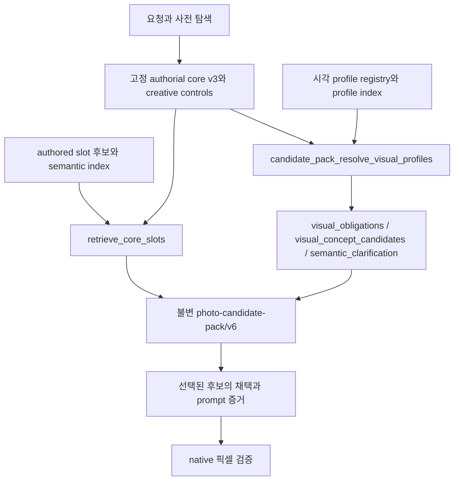

# 제복 코스튬 시각 의미·후보팩 보강 리서치

조사일: 2026-10-04, Asia/Seoul. 대상: `photo-prompt-image-generator`의 의복·액세서리 시각 의미와 `photo-candidate-pack/v6`에 공급하는 authored data.

기관·시대·판본을 보존한 의복 구조 관계와 선택형 조합으로 데이터를 강화하는 것이 적합하다. 제복의 색, 부착 표식, 실제 직업, 직무 동작, 무대 변형은 각각 다른 정보다. 이들을 한 이름에 묶으면 서로 다른 판본의 부품을 섞거나 의복만 요청한 인물에게 업무·소품·신체 변화를 추가할 수 있다.

이번 결과는 **145개 원 대화 키워드의 대조표, 62개 출처 장부, 83개 시각 관계 초안, 30개 비교·조합 설계 풀, 59개 검증 요청 쌍**이다. 83개 중 출처 범위가 지지하는 관계 초안은 46개, 기존 관계 우선 재사용은 12개, 직접 근거 추가 확인은 19개, 요청에 따른 디자인 제안은 5개, 관찰한 크롭만 지지하는 초안은 1개다. 이는 새 런타임 레코드의 수나 렌더 성공률이 아니다.

상세 산출물:

- [145개 키워드별 추가 조사·반영 판단](keyword-catalogue.md)
- [83개 관계의 소유·구성 요소·혼동 경계](relation-proposals.md) 및 [구조화 초안](relation-proposals.json)
- [62개 출처의 확인 수준과 한계](sources.json)
- [실제 파일과 단계별 반영 계획](implementation-plan.md)
- [59개 향후 검증 요청 쌍](validation-cases.jsonl)
- [검토용 candidate/profile 예제](runtime-example-drafts.json)

## 1. 입력과 근거를 어떻게 다뤘는가

참조 대화 [제복 코스튬 조사](chatgpt-conversation://6ac191c8-a004-83ec-9aac-b87ac6a8f714)를 읽어 11개 분야의 표 행 145개를 추출했다. 읽기 API가 반환한 답변은 20,000자에서 끝났지만 11개 표는 포함되어 있었다. 끝 문장 이후의 서술이나 원 대화의 도구 검색 결과는 확보하지 못했다. 원래 문구는 [keyword-inventory.json](keyword-inventory.json), 반환 기록은 [reference-thread.json](reference-thread.json)에 보존했다.

원 대화의 인용 마커에는 이번 읽기에서 사용할 수 있는 원문 URL이 없었다. 따라서 그 설명을 사실로 승인하지 않고 박물관·기관·제조사·공식 작품 사이트를 새로 대조했다. 검색 결과에 실제 박물관 본문이 반환된 경우와 게시물 제목·날짜만 확인한 경우도 구분했다.

| 확인 방식 | 출처 수 | 이 증거로 가능한 판단 |
|---|---:|---|
| 1차 자료 본문 반환 | 43 | 반환 본문이 직접 지지하는 설명 |
| 1차 검색 본문 발췌 | 10 | 발췌 안의 사실; 전체 페이지 검토는 아님 |
| 1차 반환 본문 일부 | 2 | 반환 범위 안의 사실 |
| 공식 페이지 읽기 | 1 | 읽은 페이지의 구성·설명 |
| 제품 문서 일부 | 1 | 그 제품의 구성; 전 업종 공통 규정 아님 |
| 공식 소개 허가 복제품 | 2 | 그 복제품의 설명; 원 촬영복과 구분 |
| 공식 화면 일부 크롭 관찰 | 1 | 실제 보인 부분의 형태 |
| 공식 인터뷰 색인 | 1 | 인터뷰가 다루는 주제; 영상 전체 검증 아님 |
| 공식 게시물 메타데이터만 | 1 | 게시물 존재·날짜; 외형 확정 불가 |

한 유물이나 하나의 제품이 모든 시대·계급·기관의 표준을 증명하지 않는다. 자료 링크가 달린 행도 그 행 전체가 검증된 것은 아니다. 대조표의 ‘추가 조사·반영 판단’과 출처 장부의 `supported_scope_ko`, `limits_ko`를 함께 읽어야 한다.

## 2. 현재 데이터와 실제 후보팩 경로

[baseline-audit.json](baseline-audit.json)은 작업 중 소스의 정적 스냅샷이다. 당시 HEAD는 `dee9f95896cf1e8eaa60d4cb02925b19f5c91374`, 설정된 시각 registry는 31개 파일·1,671개 profile이었다. 기본 사전과 설정된 research extension의 slot 레코드는 9,840개였다. 이 집계는 모든 런타임 후보 종류를 합친 수나 검색 가능한 고유 의미 수를 뜻하지 않는다. 코스튬 extension 자체에는 94개 후보와 27개 `visual_semantics` 조합이 있었다.

작업 트리에 다른 의복·시각 의미 작업의 변경이 존재했다. 감사에는 파일별 SHA-256을 남겼으며, 이 결과의 기준은 그 스냅샷이다. 키워드 부분 문자열 hit는 추가 대조 위치를 찾는 데만 사용했다. `ASU`, `2B` 같은 짧은 문자열은 무관한 단어에서도 맞을 수 있으므로 hit 수로 커버리지 비율을 주장하지 않았다.

실제 [prompt_generator.py](../../../../skills/photo-prompt-image-generator/scripts/prompt_generator.py)의 `build_candidate_pack()`은 다음 순서다.

pre-core 탐색은 post-core 팩 생성과 별도 단계다. post-core에서는 `retrieve_core_slots(data, authorial_core, creative_controls)`가 동일 슬롯의 근거 있는 후보를 검색하고, `candidate_pack_resolve_visual_profiles()`가 고정 요청/core에 맞는 registry profile을 따로 해석한다. ‘의복 후보가 검색되면 그 후보의 모든 profile이 의무로 자동 활성화된다’는 구조가 아니다.

새 데이터는 **후보를 발견할 경로와, 선택된 형태의 hard 증거를 표현할 경로를 모두** 보강해야 한다. 생성된 v6 팩은 사후 편집 대상이 아니다. authored 원천을 고친 다음 새 팩을 만든다.

### 재사용할 수 있는 현재 관계

| 보강 영역 | 확인한 기존 ID | 이번 조사에서 더 필요한 차이 |
|---|---|---|
| 앞치마 층·지지 | `costume_b01`, `ccx_cc01_01..03` | 가슴판형/허리형, 실제 유물/무대 변형, 길이 차이 |
| 연미복·조끼 | `costume_b02`, `ccx_cc02_01..02` | 국가·행사별 배색과 무릎바지/긴 바지 대안 |
| 세일러 칼라·리본 | `costume_b03`, `clothing_ct041_v2` | 수병/학교/성인 무대 문맥, 시대·학교별 선 수 |
| 견장·가슴끈 | `costume_b04`, `ccx_cc05_01..02` | 펠리스의 어깨 지지·빈 소매, 기관별 표식 조건 |
| 갑옷·직물 관절 | `costume_b08..10`, `ccx_cc13_01..03` | 현실 의장 흉갑/작품 장갑판/압력복의 연결 차이 |
| 코르셋·여밈 | `costume_b17`, `ccx_cc26_01..02` | 장교 모티프 외피와 코르셋의 각각의 소유 |
| 헤짐·수선 | `costume_b21`, `ccx_cc32_01..02` | 손상 위치·기관/판본과의 독립성 |
| 발광 패널 | `costume_b23`, `ccx_cc35_01..02` | 반사 광택과 자체 발광의 분리 |
| 케바야·사롱 | `clothing_ct141_v2` | 항공사 판본과 색-직급 대응의 별도 근거 |

군인·학생·승무원·간호사·경찰·소방의 broad profile도 이미 있다. 특히 `cabin_crew_safety_role`, `clinical_nursing_duty_system`, `police_public_safety_duty_system`, `firefighter_protective_response_system`은 명시된 직무 절차가 hard 활성화의 조건이다. 의복 연구를 여기에 넣어 안전 시연·환자·교통 통제·호스 연결을 자동 요구하도록 바꾸면 기존 경계를 무너뜨린다.

## 3. 분야별 연구 결과와 시각 의미 분해

### 3.1 조선 군사 복식

철릭은 상체와 주름 하체의 허리 연결이 중요한 구조다. 전복은 민소매 덧옷으로, 안쪽 옷의 소매가 겉옷 진동에서 나오는 층 관계가 핵심이다. 흥완군 동다리의 소매 배색은 특정 유물의 근거이며 모든 시대 동다리의 연대별 색 법칙을 입증하지 않는다. [철릭](https://encykorea.aks.ac.kr/Article/E0056124), [전복](https://encykorea.aks.ac.kr/Article/E0049431), [흥완군 의복](https://encykorea.aks.ac.kr/Article/E0066034).

`U01..04`는 색의 소유, 겉·속옷의 분리, 허리 접합, 선택 소매 경계로 분해했다. 황색 철릭=군악 역할의 대응, 18~20세기 동다리의 연대 분류는 보류했다. `전복`이라는 단어만 hard alias로 쓰면 식재료와 충돌하므로 의복 문맥과 구조 구문을 요구한다.

### 3.2 기병복·보병 의장복·역사 군복

펠리스는 한쪽 어깨에 걸친 별도 짧은 코트의 빈 소매와 지지끈으로 모델링할 수 있다. 차프카는 각진 윗판과 아래 몸체·챙을 구분한다. 특히 Met의 Keystone Zouaves 유물은 재킷에 가짜 조끼가 붙어 있어 독립 조끼를 필수로 넣으면 틀린 버전이 된다. [NAM 기병복](https://www.nam.ac.uk/explore/cavalry-roles), [창기병 사례](https://collection.nam.ac.uk/detail.php?acc=1978-02-37-91), [주아브 유물](https://www.metmuseum.org/art/collection/search/151912).

근위대 단추 묶음과 모자 깃털은 연대의 변이 축이다. Scots Guards의 세 개씩 묶인 단추·깃털 없음은 그 연대 사례에 한정한다. [British Army 설명](https://www.army.mod.uk/news/scots-guards-fond-farewell-to-hrh-the-duke-of-kent/).

SS 역사복은 검은 직물 외피, 완장·깃·모자의 표식, 야전 회색, 위장 스모크를 나누어 중립적인 외형 자료로 다룬다. 검정이라는 색만으로 조직을 추론하지 않는다. M42 스모크는 양면 계절 무늬와 여밈·허리·손목 관계를 기록할 수 있다. 원 대화의 특정 도입 연도와 모든 무늬 계열은 더 확인해야 한다. [NMM](https://www.nmm.nl/nl/stories/uniform-hugo-boss/), [덴마크 유물](https://samlinger.natmus.dk/khs/object/60162), [AWM M42](https://www.awm.gov.au/collection/C106357).

`U05..14`, `U18`, `U81`이 대상이다. 표식 없는 일반 군복, 특정 역사 유물 재현, 가상의 군복을 각각 요청 근거에 따라 처리한다. 명시된 유물 표식을 임의의 가상 문양으로 바꾸거나 표식에서 인물의 신념·행동을 추가하는 것도 실패다.

### 3.3 현대 군복·수병·비행복

AGSU와 ASU는 외피·셔츠·하의의 각각의 배색이 다르다. ACU 재단과 OCP 표면 무늬는 독립 축으로 유지한다. 공식 제품 설명의 외형과 최신 착용 규정·보호 성능은 별도 근거가 필요하다. [AGSU](https://www.peosoldier.army.mil/Equipment/Equipment-Portfolio/Project-Manager-Soldier-Survivability-Portfolio/Army-Green-Service-Uniform/), [ASU](https://www.peosoldier.army.mil/Equipment/Equipment-Portfolio/Project-Manager-Soldier-Survivability-Portfolio/Army-Service-Uniform/), [ACU](https://www.peosoldier.army.mil/Equipment/Equipment-Portfolio/Project-Manager-Soldier-Survivability-Portfolio/Army-Combat-Uniform/).

수병복은 1859년 흰 덧깃·커프스의 제거, 후대 깃 파이핑, 노퍽 코트의 여성 Yeoman (F) 버전을 나눌 수 있다. 파이핑 줄 수의 역사적 구분을 모든 시대·학교 세일러 칼라에 복사하지 않는다. [해군 변천 기록](https://www.history.navy.mil/research/library/online-reading-room/title-list-alphabetically/u/uniforms-usnavy/historical-surveys-of-the-evolution-of-us-navy-uniforms.html), [Yeoman 규정](https://www.history.navy.mil/research/library/online-reading-room/title-list-alphabetically/w/womens-uniform-1918.html).

청색 NASA 복장은 색만으로 하나의 의복이 되지 않는다. 직물 훈련복과 헬멧·바이저가 연결된 압력복의 경계를 별도 후보로 둔다. 항공사 조종사 견장·윙 배지·모자 역시 기관·직급의 확인 없이 기본으로 강제하지 않는다. [NASA 훈련](https://www.nasa.gov/centers-and-facilities/johnson/summer-training-catching-up-with-nasas-astronaut-candidates/), [NASA 압력복](https://www.nasa.gov/blogs/commercialcrew/2024/05/06/nasas-boeing-crew-flight-test-astronauts-suiting-up-2/), [NASM 조종사 모자](https://airandspace.si.edu/collection-objects/cap-pilot-northwest-airlines/nasm_A20060603000).

`U15..25`의 의복 관계를 우선하고, 1841 프록 전체 구조·초기 데님·1973 개편 전체 구성·사막색 비행복 모델·초기 가죽 비행사복·Pan Am의 특정 모자는 후속 근거를 확보한다.

### 3.4 근위대·궁정 리버리

스위스 갈라, 청색 훈련, 군악 고수, 갑옷을 추가한 대례는 각각 선택 버전이다. 2025년 대표복 발표와 정확한 검은 재킷 형상 검증도 다른 수준이다. 왕실 리버리에는 역할·행사별 차이가 있고, 1887년 자료에는 손으로 채색한 사진이라는 한계가 있다. [스위스 공식 자료](https://schweizergarde.ch/fileadmin/files/Kasernenstiftung/SPENDENBROSCHUERE_SCHWEIZERGARDE_I.pdf), [스위스 국립도서관](https://www.nb.admin.ch/en/uniforms-arent-uniform), [Vatican News](https://www.vaticannews.va/it/vaticano/news/2025-10/guardia-svizzera-pontificia-tradizione-e-modernita-nuova-divisa.html), [Royal Collection](https://www.rct.uk/collection/stories/royal-mews/liveries-worn-by-royal-mews-staff-at-the-time-of-queen-victorias-golden-jubilee).

`U26..30`은 삼색 면의 귀속, 흉갑/러프 층, 군악 배색, 조끼/연미복 층, 무릎바지/스타킹 경계다. 영국 현대 일상복의 정확한 조합과 네덜란드 청·적·황 구성은 미확인으로 남겼다. 오스트리아·영국의 근거를 네덜란드에 대신 적용하지 않는다.

### 3.5 경찰·소방·교정

런던 경찰의 초기 톱햇·테일코트와 후대 헬멧·튜닉을 분리한다. RCMP의 의례용 적색과 일상복도 같은 이름의 대안이다. 한국 경찰 2026 개편은 공식 게시물 존재만 확인했으며 원문 접근 실패로 네이비 외형·보급을 확정하지 않았다. [Met 변천](https://www.met.police.uk/police-forces/metropolitan-police/areas/about-us/about-the-met/met-museums-archives/timeline/), [RCMP](https://rcmp.ca/en/gazette/evolution-rcmp-uniform-historical-look), [한국 경찰 게시물](https://police.go.kr/eng/user/bbs/BD_selectBbs.do?q_bbsCode=1110&q_bbscttSn=20260430190624726).

소방 방화 외피는 서내 복장과 나누며, 띠의 부착 위치와 광학 반응을 관찰한다. CDC가 제공한 제조사 자료는 특정 제품 사례다. 교정복에는 회색 분리형 실제 유물이 있고, 확인한 주황 일체형은 드라마 소품이다. [제품 문서](https://stacks.cdc.gov/view/cdc/210816/cdc_210816_DS1.pdf), [실제 회색 교정복](https://nmaahc.si.edu/object/nmaahc_2017.34.1-.2), [Luke Cage 소품](https://nmaahc.si.edu/object/nmaahc_2020.47.1).

`U31..38`이 대상이다. 소방서 복장에서 호스·진압을, 제복 초상에서 교통 통제를, 교정복에서 유죄·행동을 추가하지 않는다. 반사 외형만으로 방화·방탄 인증을 주장하지 않는다.

### 3.6 간호·의료·산업

역사 간호복의 원피스·앞치마·깃·커프스·모자와 현대 분리형을 구분한다. Science Museum 전시 구성은 서로 다른 간호복의 합성이라고 명시되어 있으며, NMHM의 c1910 복장은 복제품이다. 후드 보호복은 모델별로 후드·손목·발덮개 구성이 다르다. [역사 간호복](https://collection.sciencemuseumgroup.org.uk/objects/co122317), [NMHM](https://medicalmuseum.health.mil/micrograph/index.cfm/posts/2026/BUMED-collection-expands-navy-medicine-story-at-NMHM), [DuPont 모델 목록](https://www.dupont.com/safespec/tyvek/featured-products.facetgroup%24%24F%40%40PS30.html).

`U39..43`은 겉·속옷, 독립 상하의, 후드 연결, 수술모/마스크 소유를 다룬다. 백의·대학 간호학생 지정복의 정확한 기관 자료는 더 필요하다. 흰 옷·모자·마스크만으로 직업·환자·의료 행위를 요구하지 않는다.

### 3.7 항공사 객실승무원

JAL은 기간별 여밈·모자·속옷·상하 구성을 공식 변천표에 연결하기 좋다. 특히 1970 계열의 뒤지퍼, 1977 계열의 원피스, 1996 일반/책임자 코트와 모자 폐지처럼 **버전 간 부품 혼합을 막는 차이**를 우선한다. 원 목록에 없는 1960·2004·2013·2020 계열도 같은 페이지에 있어 후속 확장 대상으로 남긴다. [JAL 공식 변천표](https://www.jal.com/ja-jp/about/uniform/).

대한항공 2005 계열에서는 스카프와 머리 장식의 소유 위치, 스커트/바지 대안을 분리한다. 2019 회고의 ‘현재’를 2026 현행 규정으로 옮기지 않는다. SQ는 사롱 케바야 구조와 네 색의 존재를 확인했지만, 읽은 페이지는 네 색-직급 대응을 모두 설명하지 않았다. [대한항공 회고](https://news.koreanair.com/?p=1204), [SQ 공식 소개](https://www.singaporeair.com/en_UK/bn/flying-withus/our-story/our-cabin-crew/).

`U44..50`과 `UB18..20`을 사용한다. 후자의 풀은 비교용으로, JAL 1970 드레스와 JAL 1996 재킷을 한 필수 조합에 넣지 않는다. 케바야에 기존 일반 구조를 재사용하더라도 SQ 판본에 미확인 브로치 수를 강제하지 않는다.

### 3.8 서비스 제복

실제 c1925 maid 유물은 무릎 길이로, 긴 검정 치마·흰 앞치마가 모든 실제 가사직의 필수라는 가정을 반박한다. 앞치마 자체도 패션 액세서리 사례가 있다. 조리복은 흰색 이외의 실제 유물이 존재한다. 버니의 레오타드와 머리 장식은 독립된 물건으로 분해한다. [maid 유물](https://www.detroithistorical.org/learn/online-research/collection/object/uniform-occupational-1), [패션 앞치마](https://www.metmuseum.org/art/collection/search/123766), [붉은 조리복](https://nmaahc.si.edu/object/nmaahc_2021.96.2), [레오타드](https://americanhistory.si.edu/collections/object/nmah_1117598), [머리 장식](https://www.americanhistory.si.edu/de/collections/object/nmah_1117599).

`U51..55`는 벨홉, 실제 가사복, 짧은 무대 메이드, 조리복, 버니를 다른 선택으로 둔다. 벨홉의 실제 호텔 모델과 검정 조리복의 직접 근거는 남았다. 의복에서 접객·가사 동작, 토끼 종, 성적 행위나 신체 비율을 추가하지 않는다.

### 3.9 교복·학위복

학교복의 역사 추세, 학교별 칼라 선 수, 개조 착용을 서로 다른 축으로 둔다. 초란·탄란·본탄은 상의 길이·바지 폭의 선택이며 인물의 품행 근거가 아니다. 가운·모자는 학위·기관·행사에 조건화해야 한다. [Kanko 변천표](https://kanko-gakuseifuku.co.jp/museum/history_uniform), [학교별 칼라 차이](https://kanko-gakuseifuku.co.jp/media/parents/purchase), [Oxford academic dress](https://www.ox.ac.uk/students/academic/dress).

`U56..60`은 가쿠란의 깃/앞섶, 칼라 선의 위치, 점퍼스커트 겹침, 개조 비례, 가운/모자의 소유다. 성인 모델의 교복 코스튬에 미성년 나이를 부과하지 않는다. 원래 미성년 인물의 일반 교복에 성인 무대 변형을 전이하지 않는다. 사각모·soft cap·tam도 기관 근거 없이 같은 물건으로 합치지 않는다.

### 3.10 종교 복식

수도복의 튜닉·후드·허리끈은 같은 의복 계통 안에서도 색·부품·서원 상태에 따라 다르다. 프란치스코회 갈색·회색 사례와 매듭 없는 수련자 사례를 구분한다. 가사는 내부 패치워크와 외부 테두리를, 미코는 기본 홍백과 치하야 추가를 나눈다. [갈색 수도복](https://www.sbfranciscans.org/be-a-friar/formation/stages-of-formation/), [회색 수도복](https://franciscanfriars.org/2025/03/03/preparation-of-the-grey-conventual-habits/), [가사 유물](https://www.metmuseum.org/art/collection/search/69886), [미코·치하야](https://mamechishiki.tokyo/?p=906).

`U61..65`는 종교복 구조의 초안이다. 수단의 정확한 계급별 규격·검정 수도복·수녀 베일은 더 직접적인 교단/유물 자료가 필요하다. 의복은 신앙·수행·의례 동작을 자동 요구하지 않는다. 종교 문맥의 넓은 profile에 무장 수도회 장비를 묶지 않는다.

### 3.11 작품 속 제복과 성인 무대·호러 변형

Star Trek은 부서색을 어느 부품에 놓는지, 어깨 요크·몸판·목층을 어떻게 나누는지가 판본 차이다. 후기 DS9/First Contact의 회색 어깨·검은 몸판·색 목층을 초기판과 바꾸지 않는다. 공식 소개 복제품은 원 촬영복의 재질 근거와 구분한다. [공식 회고](https://www.startrek.com/news/you-wear-it-well-the-uniforms-of-star-trek), [DS9 복제품](https://www.startrek.com/news/check-it-out-star-trek-first-contact-deep-space-nine-standard-line-uniform), [Wrath 복제품](https://www.startrek.com/news/first-look-spocks-wrath-of-khan-uniform).

Star Wars는 검은 보디글러브 위 장갑판과 임무별 외피가 중요하다. 스노트루퍼 후드·벨트 아래 케이프를 일반·스카우트·퍼스트 오더에 복사하지 않는다. Phase I/II 등의 얼굴 면은 공식 확대 도판을 더 확인해야 한다. [클론 장갑](https://www.starwars.com/databank/clone-trooper-armor), [스노트루퍼](https://www.starwars.com/databank/snowtroopers).

NieR 애니 2B 공식 화면에서 상체 일부를 관찰했지만 치마 끝·부츠는 확인 화면 밖이었다. 9S·사령관·오퍼레이터의 존재 확인은 전신 의복 검증이 아니다. 퀴디치는 초기/후기 로브, 훈련/경기 장비를 나눈다. Handmaid는 디자이너 인터뷰 색인을 확인했으나 전체 영상과 전·후면을 검증하지 않았다. [2B 공식 화면](https://nierautomata-anime.com/character/detail/?chara=2b), [공식 로스터](https://nierautomata-anime.com/character/), [WB 의상 제작 소개](https://www.wbstudiotour.co.uk/the-experience/explore-the-tour/costumes/), [디자이너 인터뷰 색인](https://interviews.televisionacademy.com/shows/handmaids-tale-the).

`U66..77`은 판본별 관계, `U78..83`은 성인 코르셋·바디수트·광택·손상·발광·명시 소품의 선택 변형이다. 성인 무대·호러 항목도 원 목록에 그대로 남겼다. 무대 디자인을 실제 조직 규정으로 주장하지 않으며, 코르셋에서 신체 크기·성적 행동을, 의복 헤짐에서 신체 손상을, 병사 코스튬에서 전투 동작을 추가하지 않는다.

## 4. 데이터에 필요한 표현 단위

### 원자료 버전과 재사용 형태의 분리

연구 목록의 식별 축은 `국가/기관 → 시대/발표 → 직무/의례 → 계급/역할 → 계절 → 매체/판본 → 재단 변형`이다. 확인한 축만 채운다. 모든 항목에 모든 축을 강제로 채우거나 서로 다른 출처에서 빈칸을 보충하지 않는다.

이 목록 자체를 runtime schema로 넣지 않는다. 런타임 후보에는 해당 선택이 만드는 관찰 가능한 관계를 작성한다. 예를 들어 전복 후보의 `concept_units`는 ‘민소매 외피 진동을 통과하는 별도 안쪽 소매’이고, `relations`는 외피의 착용자 소유와 외피-안쪽 의복의 층 관계다. `전복` 이름만 hard 활성화하기보다 정확한 의복 관계 구문을 사용한다. [검토용 실제 필드 예제](runtime-example-drafts.json).

### 각 관계에 반드시 남길 정보

| 항목 | 이번 초안의 표현 | 반영 시 주의 |
|---|---|---|
| 소유 | 요청이 지지하는 의복 착용자 | 다른 인물·배경·신체에 전이 금지 |
| 구성 요소 | 각 관계의 두 관찰 증거 | 더 복잡한 관계는 실제 필요한 구성 수로 분해 |
| 방향 관계 | 부착·겹침·지지·이어짐·경계 | type 문자열은 현행 검증기에 매핑 |
| 검색 어휘 | 정확한 관계와 제한된 버전 alias | 직업명·색 하나를 필수 의복·행동으로 확대 금지 |
| 영향 범위 | appearance 및 의복/소품의 소유 속성 | 임시 연구 property 경로를 배포하지 않음 |
| 혼동 경계 | 가장 가까운 오답·잘못된 판본 | 완전히 무관한 오답만 테스트하지 않음 |
| prompt 증거 | 선택 관계의 구성 요소별 evidence field | label 존재만으로 통과 금지 |
| native gate | 부품과 같은 소유자의 연결을 실제 픽셀로 확인 | 부분은 FAIL, 가려짐은 UNOBSERVABLE |

모든 관계의 두 관찰 문장은 연구자의 형태 추상화다. 웹 원문을 그대로 인용한 규격이나 완전한 유물 측정값이 아니다. `affected_properties_research`는 소유·충돌 검토를 위한 임시 경로이며 `runtime_key_status=unvalidated_mapping`으로 표시했다.

### 조합의 의미

30개 `UB` 항목은 **연구 비교 풀**이다. 예를 들어 `UB15`의 줄무늬·주황 일체형·회색 분리형은 서로 다른 대안이다. 전부를 `required_group_ids`로 넣는 all-of bundle이 아니다. 실제 반영 때 단일 버전의 선택 부품으로 나누고 concrete candidate ID를 연결해야 한다.

현행 `visual_semantics`를 만들 때에도 `candidate_only`와 개별 구성 선택 근거를 유지한다. 조합의 `hard_profile_ids`는 연결 목록이며 그 목록만으로 모든 profile을 hard 활성화하지 않는다. 대략적인 semantic/BM25F 검색 결과도 선택 전에는 advisory다.

## 5. 다음 반영의 완료 기준

첫 반영은 출처가 지지하는 관계와 기존 관계 재사용부터 시작한다. 이름별 전체 복장 profile은 더 높은 증거 문턱을 둔다. 미확인 연도·계급 배색·화면 밖 구조는 해당 profile의 exact term에 넣지 않는다.

1. 145개 키워드의 원형과 출처/한계를 유지하고, 우선 반영 항목의 근거를 구조별로 연결한다.
2. 중복 관계를 현재 ID에 병합하고, 다른 물건·소유·효과만 별도 candidate로 만든다.
3. 후보 eligibility·선택·속성 충돌과 exact/advisory 활성화 경계를 검증한다.
4. authored 원천을 합친 후 두 검색 index를 재생성하고 해시·닫힌 참조를 확인한다.
5. 59개 요청 쌍에서 판본 혼합·역할 동작·신체 전이가 없는지 확인한다.
6. 실제 이미지를 생성하는 후속 작업에서는 선택된 관계의 native gate를 모두 관찰한다. hidden 구조·가려진 지퍼·화면 밖 모자를 추론하여 PASS로 기록하지 않는다.

이번 작업은 연구 파일의 개수·ID·참조·기존 재사용 ID·초안 경계를 검증한다. 실제 authored assets, generator, 검색 index, 기존 후보팩을 수정하지 않았고 이미지 생성·런타임 회귀·commit·push는 수행하지 않았다. 구체적인 작업 단위와 후속 근거 확보 순서는 [implementation-plan.md](implementation-plan.md)에 있다.
