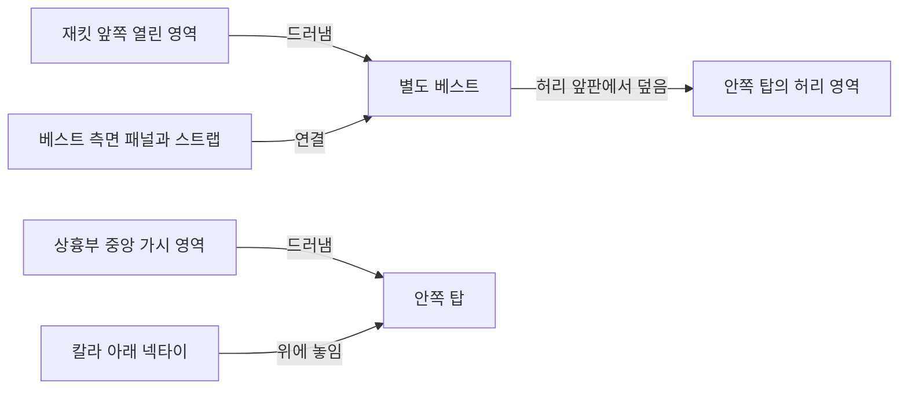

# vel 외형 요소 분해 추가 리서치

2026-10-07 · 참조 [프롬프트 분석 리스트 vel](https://chatgpt.com/c/6ac5bdb5-f8a4-83ee-adbd-170a43f642de) 뒤쪽의 「조사한 키워드의 외형적인 특징…외형 요소 분해」 응답과 첨부 전체본

추가 분석의 핵심은 **같은 물체의 여러 요소를 나열하는 데서 더 나아가, 어느 층이 무엇을 덮고 어느 경계가 남으며 누가 무엇에 닿는지를 보존하는 것**이다. 이를 기존 60개 제안의 세분화·보완으로 정리했다. 키워드별 외형 문장을 모두 독립적인 필수 형상으로 승격하면 원래 의도를 바꾸기 쉽다. 직접 분해, 사례의 문맥값, 선택 가능한 연기 예시, 부정 조건, 외형으로 확인할 수 없는 설정을 구별해야 한다.

[반영 계획](IMPLEMENTATION-PLAN.md), [28개 관계 카드](SEMANTIC-CARDS.md), [217개 대조표](KEYWORD-CROSSWALK.md), [46개 검토 메모](FIDELITY-CORRECTIONS.json)를 함께 제공한다.

## 1. 이번에 실제로 읽고 대조한 범위

뒤쪽 응답의 본문과 `past_prompt_visual_decomposition_217.json`·`.md` 첨부를 내려받아 전체를 읽었다. JSON은 317,359 bytes, SHA-256 `382b0a1492cf308a9b70fbbe3443ba7684f0aa22a99105a06775b90b779d30ad`이다. 그 안의 원본 audit SHA-256은 기존 `SOURCE-KEYWORDS.json`과 일치한다. K001–K217의 ID·분류·구절·극성·뜻·출처·출처 종류·연령 문맥 8개 필드는 전 행 비교에서 그대로다.

| 자료 구분 | 항목 수 | 이번 연구에서의 권한 |
|---|---:|---|
| 직접 분해 | 128 | 외형을 구체화한 제안. 모든 세부의 원문 인용·실제 이미지 관찰을 의미하지 않음 |
| 문맥 결합 | 36 | 해당 원자료의 층위·색·소품·가림 조건을 결합한 사례값 |
| 해석 예시 | 32 | 감정·분위기·역할의 한 가지 연기/연출. 다른 실현도 가능 |
| 제외 조건 | 20 | 원래 부정 지시의 대상과 범위 안에서 유지할 형상 |
| 대상 조건 | 1 | 한 명·성인이라는 명시 설정. 사진으로 연령을 인증한 결과가 아님 |

22개 분류, 19개 출처, 긍정 100·이미지 설명 97·부정 20의 구분을 유지했다. 원본의 외형 요소 465개도 보존했지만, 이를 465개 hard 의무로 등록하지 않았다. 192개 키워드는 추가 관계 카드와 연결했고, 25개는 검토 후 기존 계획을 유지했다. 빠진 행은 없다.

추가 파일은 P01–P11의 보충 문맥 인용과 `new_original_source_read` 표기를 포함한다. 이는 **참조 대화 작성자가 원문을 확인했다고 기록한 주장**이다. 이번 연구에서 그 역사적 원문·최종 생성 입력·원본 이미지·SNS 게시물을 각각 새로 인증한 것은 아니다. [다운로드 영수증](SOURCE-DOWNLOAD-RECEIPT.json)과 [대화 스냅샷](REFERENCED-CONVERSATION.json)에 이 경계를 남겼다.

## 2. 기존 조사보다 더 구체화해야 할 데이터

기존 연구는 예를 들어 코르셋형 절개선, 수건 가림, 거울 반사, 물리적 접촉을 구분했다. 추가 분석은 그 안의 **영역별 연결·가림·접촉 도구·허용되는 비대칭**을 더 세밀하게 요구한다.

| 추가 분해의 주요 사례 | 기존 계획의 보완점 | 추가 카드 |
|---|---|---|
| K010 닫힌 허리 베스트와 중앙 탑/넥타이 | 허리 앞판의 닫힘과 상흉부 중앙의 가시성을 다른 영역으로 표현 | VD-001 |
| K009 골지와 K008 핀스트라이프 | 높낮이가 있는 골, 평면 무늬, 봉제선의 다른 소유자 | VD-002 |
| K030 한쪽 끈만 위팔로 내려옴 | 두 끈의 부착과 반대쪽 잔존 지지를 함께 확인 | VD-003 |
| K047 초커 앞 O-ring | 금속 테두리·실제 구멍·초커 부착점의 동시 보존 | VD-007 |
| K071 작은 입술 틈, 치아 비노출 | 작은 틈을 없애지 않고 치아는 가림. 수치 실측 주장은 분리 | VD-011 |
| K114 신발 접촉, K119 다른 발 지지 | 접촉 도구·받는 사람·지지 발을 다른 관계로 연결 | VD-016/017 |
| K132 손과 얼굴 사이의 간격 | 양 끝점과 사이 공간을 함께 보여 비접촉을 확인 | VD-018 |
| K169 유리에 눌린 상태 | 가까움이나 반사상의 겹침만으로 pressed를 대체하지 않음 | VD-021 |
| K209 양손 타월, K210 수영복 끈 | 양손 잡힘·윗단 장력·중앙 전면 가림·작은 가시 창 | VD-024 |
| K214/215 붉은 코드/기계 발광 | 발광 주체·공중 위치·금속 수신면과 혈흔을 별도로 연결 | VD-023/028 |

### 닫힌 베스트가 가슴 중앙까지 가려야 한다는 뜻은 아니다

K010은 단순한 “몸에 맞는 코르셋형 상의”보다 구체적이다. 허리 앞판은 닫혀 있고, 측면 패널/스트랩이 위로 올라가며, 상흉부 중앙에는 안쪽 탑과 넥타이가 남는다. 여기서 `closed front`를 의상 전체의 완전 차폐로 해석하면 탑/넥타이의 가시성이 사라진다. 반대로 중앙 가시성을 이유로 허리 패널까지 뚫으면 하네스로 바뀐다.

이것은 S02의 사례 연결이다. 검정/흰색/파랑, 핀스트라이프, 가죽 넥타이는 해당 사례의 값으로 둔다. 일반 베스트 후보는 색·문양·여밈을 바꿀 수 있어야 한다. 기존 `clt_ct023_v2`는 busk hooks, `y2kr_corset_top`은 boning channels까지 포함한다. 둘을 K010에 그대로 붙이면 원문에 없는 구조를 추가한다. 그래서 VD-001은 별도 관계 trial이고, 기존 항목은 동등성 검토 이웃이다. 천의 층과 접촉을 독립 구조로 다뤄야 한다는 방향은 [Bridson 등의 천 접촉 논문](https://www.cs.ubc.ca/~rbridson/docs/cloth2002.pdf)과 [Khronos 속성 구분](https://www.khronos.org/gltf/pbr)을 참고한 연구자의 설계다.

### 골지는 색 줄무늬가 아니라 표면 높낮이와 반복 구조다

K009의 세로 골은 탑 표면에 있고 K008의 핀스트라이프는 재킷 패널에 있다. 골지의 돌출과 골 사이 작은 음영을 프린트 선으로 대체해서는 안 된다. 봉제선도 원단 구획이며 피부 긁힘이 아니다. `sw_rib`는 수영복 패널, `vg_faille_crossgrain_ribs_profile`은 가로 직조 리브이므로 U넥 골지 탑에 자동 전용하지 않는다.

재사용에 가장 가까운 것은 `y2kr_rib_tank`다. 단, U목선·흰 바탕·밀착·다른 층 가시성은 별도 요청값이다. 골 간격이 당김에 따라 달라지는 모습도 선택된 편직의 실현으로 둔다. 편직의 반응은 스티치 위상과 패턴에 관여하므로 모든 골지에 같은 신장률을 적용할 수 없다. [편직 역학 연구 v2](https://arxiv.org/abs/2302.13467v2), [Cornell Stitch Meshes](https://www.cs.cornell.edu/projects/stitchmeshes/), [직물 미세 외관 연구](https://www.cs.cornell.edu/projects/ctcloth/).

### 한쪽 끈의 흘러내림은 원숄더 디자인과 다르다

K030은 같은 드레스의 두 끈 중 한쪽이 위팔 바깥에 느슨하게 걸리고 반대쪽은 어깨 지지에 남은 현재 상태다. 기존 `pfe_one_shoulder`는 한쪽 어깨를 지나는 하나의 지지와 대각선 목선의 구조를 요구한다. 이 후보를 동의어처럼 쓰면 “원래 두 끈 중 하나가 내려옴”이 “원래 한 어깨 디자인”으로 바뀐다.

VD-003에는 두 끈의 앞뒤 부착점, 내려온 쪽 위치, 남은 쪽 어깨 지지를 넣었다. 끈을 누가 내렸는지나 앞으로 벗겨지는지는 포함하지 않는다. 머리에 가려 보이지 않는 끈도 내려온 끈의 증거가 아니다.

## 3. 재질·광학 분해에서 조건을 붙여야 하는 부분

### 레이스의 빈 셀, 목선 개방, 원단 투과는 다른 경로다

레이스에는 열린 셀이 있어도 그 뒤에 불투명 바탕 원단이 있으면 피부는 보이지 않는다. 목선의 빈 영역은 의복의 형상 경계이며, 반투명 원단은 여전히 존재하는 표면을 통해 아래 색이 전달되는 경우다. 이를 같은 “비침”으로 합치면 레이스 장식 하나 때문에 전체 의복이 투명해질 수 있다.

따라서 VD-004는 바탕 원단·레이스 띠·실제 구멍·열린 목선·그 뒤의 대상/층을 나눈다. 원문이 명시한 부분 노출은 유지하고 나머지 의복 가림도 보존한다. 그래픽 표준도 alpha coverage와 transmission을 다른 속성으로 다룬다. 이는 표현 구분을 돕는 근거이며, 실제 의복의 가시 투과를 수치로 인증하는 모델은 아니다. [Khronos PBR](https://www.khronos.org/gltf/pbr).

### 젖음·밀착·반사·투과를 한 개 재질 기본값으로 만들지 않는다

K035/037은 젖음과 약한 비침이 함께 명시된 사례다. 반면 K036의 밀착은 투명도를 요구하지 않는다. K042의 `wet or clingy`는 둘 중 하나일 수 있다. `satin/silk`, `choker or neck armor`, `melancholic or dreamy`, `teary or pained`, `exhaustion or surrender`도 일괄 all-of가 아니다.

새 검토 메모는 다음을 보완한다.

- 젖었을 때 어두워지는 패치·무거운 드레이프·겹쳐 덜 비침은 소재·빛·두께에 따른 조건부 실현이다.
- 주름의 능선이 항상 밝고 골이 항상 어두운 것은 아니다. 광원, 보는 방향, 표면 방향이 함께 결정한다.
- 가죽처럼 보인다고 결·두꺼운 모서리·짧은 딱딱한 주름을 모든 변형에 강제하지 않는다.
- 새틴은 표면/직조 외관이고 실크는 섬유 구분이다. 하나의 재료로 합치지 않는다.
- 피부 물방울 하이라이트는 원단의 윤기나 기계 금속 반사와 다른 소유자다.

층의 빛 경로와 두께 의존성은 [PBRT layered materials](https://pbr-book.org/4ed/Light_Transport_II_Volume_Rendering/Scattering_from_Layered_Materials), 직물 구조 의존성은 [Cornell 연구](https://www.cs.cornell.edu/projects/ctcloth/)를 참고했다. [Smith의 젖은 섬유 색 연구](https://onlinelibrary.wiley.com/doi/pdf/10.1111/j.1478-4408.1979.tb03477.x)는 초록 범위만 확인했다. 이를 “모든 젖은 천은 가시광으로 투명하다”는 근거로 쓰지 않는다. UV/NIR 투과 측정이나 젖은 종이 실험도 가시 의복의 노출 증거로 전용하지 않는다.

### 거울 표면의 결로와 얼굴 초점은 서로 다른 평면이다

K043의 “희뿌연 막”은 시각적 재서술이다. 결로를 언제나 흰 연속 물막이라고 고정하기보다 국소 방울·산란 흐림·반사상 대비 저하로 모델링한다. 모든 물막이 불투명한 것은 아니다. 또한 카메라 디포커스, 거울 표면 흐림, 반사 얼굴의 가상 거리도 분리한다.

VD-006은 결로가 있는 패치와 얼굴을 읽을 수 있는 영역을 함께 계획한다. K079의 얼굴 주 초점을 결로 효과를 보여주겠다는 이유로 없애지 않는다. 유리 응축 방울과 가시 영상의 저하를 다룬 [Nature Communications 연구](https://www.nature.com/articles/s41467-026-75037-1)는 publisher indexed 초록/실험 설명 범위에서 사용했다. 거울 초상을 직접 실험한 논문이나 모든 물막의 흐림 법칙은 아니다. 초점 평면 구분은 [PBRT projective cameras](https://www.pbr-book.org/4ed/Cameras_and_Film/Projective_Camera_Models)를 참고했다.

### O-ring과 파편의 광학도 위치와 경계가 먼저다

초커 앞 O-ring은 금속 테두리, 비어 있는 중앙, 초커 부착점을 함께 요구한다. 중앙에 검정 원을 칠하거나 은색 원판을 달아도 동일한 구조가 아니다. 고리 안으로 보이는 것은 실제 겹침과 시점에 맞아야 한다. 귀걸이·허리 벨트의 금속 고리도 목 장식의 대체 증거가 아니다.

유리 파편은 불투명 잔해와 다른 표면으로 둔다. 모든 유리 모서리에 하이라이트를 강제하지 않고 빛·거칠기·오염 조건을 적용한다. 환경 파편을 피부에 박힌 파편으로 이동하면 원문의 파손 소유자가 달라진다. 이 구분의 광학 원리는 [PBRT specular reflection/transmission](https://www.pbr-book.org/4ed/Reflection_Models/Specular_Reflection_and_Transmission)과 [roughness](https://www.pbr-book.org/4ed/Reflection_Models/Roughness_Using_Microfacet_Theory)를 참고한 이전 조사에서 계승했다.

## 4. 접촉·가림·시선은 상대항까지 함께 기록한다

### 양손으로 잡은 타월은 몸에 두른 타월과 다르다

S07의 타월 초상은 양손이 같은 윗단을 잡고, 윗단은 가로로 당겨지며, 중앙과 아래는 처져 전면을 가린다. 산호색 수영복은 타월 뒤에 있고 좁은 어깨끈만 작게 보인다. 여기서 가림은 “의복이 없음”이 아니라 **특정 의복이 존재하지만 가려짐**이다.

VD-024는 `왼손→타월 윗단 A`, `오른손→같은 윗단 B`, `타월 중앙→앞 몸통/골반 가림`, `작은 가시 창→뒤 수영복의 끈`으로 나눈다. 윗단 잡힘과 중앙의 아래 처짐은 같은 천의 다른 영역이다. 팔을 벌리면서 중앙에 구멍을 만들거나 타월을 두 개로 나누는 결과는 실패다. 반대로 배면 전체 가림, 젖음, 정확한 타월 치수는 원문에 없는 새 의무로 만들지 않는다.

현행 `water_rel_w159`는 수건의 연속면·몸을 감싸는 겹침·가장자리 접촉에 가깝다. **몸에 감싸는 변형과 양손으로 앞에 드는 변형은 동등하지 않다.** 그래서 기존 항목을 넓은 alias로 확장하기보다 VD-024를 독립 trial로 계획했다.

### 작은 입술 틈을 남기면서 치아를 가릴 수 있다

K071은 작은 입술 틈과 S07 문맥의 치아 비노출을 함께 보존해야 한다. K197의 큰 웃음·pout 배제가 입을 완전히 닫으라는 뜻은 아니다. 1–2 mm는 요청 수치로 남기되 스케일 없는 이미지에서 실제 mm를 측정해 통과했다고 기록하지 않는다.

K207/208의 손목/어깨 오류 배제도 자연스러운 양손 높이 차이, 어깨 비대칭, 골반의 미세 이동을 없애는 지시가 아니다. 일반 서 있는 균형을 모두 contrapposto로 바꾸지 않는다. VD-011/025는 **형태 연결의 타당성과 요청된 비대칭 유지**를 별도 검사한다. 표정의 형태와 실제 감정 추론을 구별하는 원칙은 [Barrett 등의 수정본](https://affective-science.org/wp-content/uploads/2024/04/barrett-et-al-2019-emotional-expressions-reconsidered-challenges-to-inferring-emotion-from-human-facial-movements.pdf)을 계승했다.

### 시선은 머리 방향과 다른 축이다

S07은 렌즈, S06은 자신의 거울상, S14는 상대 얼굴을 목표로 한다. 턱을 조금 들어도 눈은 상대를 볼 수 있다. 기존 `head_eye_counterorientation_relation`과 `pv_gaze_direct`가 이 분리에 도움이 된다. 같은 인물의 거울상이 두 번째 사람으로 바뀌거나 거울을 보는 눈이 렌즈로 옮겨가면 목표가 달라진다.

카메라 높이·광축 목표·거리/크롭·초점도 구별한다. close-up이라는 프레임만으로 실제 거리를 계측하지 않고, 초점거리 하나로 원근을 인증하지 않는다. 특히 S15의 낮은 POV는 **상대 얼굴을 향한 비성적 관찰 위치**를 유지한다. [PBRT camera model](https://www.pbr-book.org/4ed/Cameras_and_Film/Projective_Camera_Models). 시선이 오래 머무르거나 주변 움직임을 따라가지 않는다는 설명은 시간 조건이다. [Following Gaze in Video](https://openaccess.thecvf.com/content_iccv_2017/html/Recasens_Following_Gaze_in_ICCV_2017_paper.html)는 공식 indexed 초록 범위에서 프레임 간 목표의 구별을 참고했다.

### 신발 접촉과 바닥 지지는 서로 다른 발의 관계다

K114의 추가 분해는 신발을 접촉 도구로 명시한다. 이를 반영할 때 접촉 신발의 소유자, 상대의 윗가슴 옷, 다른 발의 바닥 지지를 함께 묶어야 한다. 낮은 카메라와 인물의 높이 차이만으로 실제 누름을 통과시키면 안 된다.

그러나 천의 눌림이 실제 압력 크기나 호흡 영향의 계측값은 아니다. K116의 지속 압력도 한 장으로 인증되지 않는다. 제압의 강압 의미는 유지하면서, 보여지는 배치와 실측되지 않은 힘/시간을 구별한다. S15의 미성년/연령 모호 원자료는 비성적 관계 분석으로만 유지한다. 일반 검증 장면은 원자료 재현과 구별되는 별도 성인 가상 인물의 비성적 장면으로 계획했다. [천 접촉 연구](https://www.cs.ubc.ca/~rbridson/docs/cloth2002.pdf)는 관통·접촉·마찰의 구별 근거이며 인체 압력을 측정하는 도구가 아니다.

## 5. 의미가 약해지거나 과해질 수 있는 분해의 수정

### pressed against glass는 near glass로 대체할 수 없다

K169의 분해에는 “바로 가까이”와 “반사가 겹침”이 섞여 있다. 이 둘만 남으면 실제 접촉이 사라질 수 있다. VD-021은 유리면과 지정된 접촉 부위가 만나는 패치, 소재에 맞는 국소 눌림/경계, 반사상을 별도로 기록한다. 강한 변형·밀어붙인 행위자·부상을 새로 추가하지 않는다.

### 출구가 안 보인다는 이유만으로 갇힘을 증명할 수 없다

K170은 물·기포·용기 경계로 수중 외형을 구성하고 갇힘 설정을 서사로 남긴다. “프레임에 열린 출구가 없음”은 크롭 사실이며 실제 탈출 불가의 충분조건이 아니다. 갇힘이 명시된 미래 장면은 지정된 시도 방향과 이를 막는 경계를 함께 보이도록 설계할 수 있다. 일반 수중 초상에 감금·질식·공포를 발명하지 않는다.

### no blood 아래에서도 붉은 기계 빛은 남는다

K214의 기호는 공중의 발광 형상, K215는 기계 틈 광원과 가까운 금속 수신면이다. 혈흔은 다른 표면에 붙은 자국이다. no blood를 모든 빨강 삭제로 처리하면 원래 장비/기억 장면이 달라진다. 반대로 dark red stain이라는 색 표현만으로 혈액이라고 인증하지 않는다. [Khronos emission/base-color/roughness 구분](https://www.khronos.org/gltf/pbr)을 데이터의 소유자·빛 경로 분리에 활용했다.

20개 부정 항목은 원래 극성과 사례 범위를 유지한다. no gore 아래 무기·폐허가 남을 수 있고, 노골적 표현 금지 아래 원래 핏·슬릿이 남을 수 있다. 이 연구의 목적은 원래 허용한 형상을 더 정확히 유지하는 것이다. 부정 토큰의 positive retrieval 유입을 막는 계획은 기존 [NegBench](https://arxiv.org/abs/2501.09425) 조사에서 계승한다. 해당 연구의 결과를 현행 이미지 생성 모델의 실패율로 전용하지 않는다.

## 6. 실제 corpus 대조와 반영 판단

추가 작업 시작 시 authored corpus를 native loader로 새로 읽었다. 최초 연구 이후 다른 작업의 manifest가 바뀌었으므로 기존 스냅샷을 덮지 않았다.

| 기준 | 초기 연구 스냅샷 | 추가 연구 스냅샷 |
|---|---:|---:|
| 등록 source | 98 | 100: 후보 59 + profile 41 |
| 슬롯 | 112 | 112 |
| 슬롯 후보 항목 | 10,500 | 10,518 |
| 전체 semantic documents | 10,536 | 10,554 |
| visual profiles | 2,290 | 2,308 |
| candidate bundles | 1,099 | 1,117 |

이는 작업 중의 authored source 읽기 결과다. generated index의 최신성, runtime publication, pack에서의 실제 노출/선택을 검증한 결과는 아니다. [native snapshot](CURRENT-INVENTORY.json), [현행 항목 상세](EXISTING-ENTRY-REVIEW.json), [property adapter 계획](RUNTIME-MAPPING.json)에 실제 ID와 데이터를 기록했다.

| 판단 | 수 | 반영 원칙 |
|---|---:|---|
| 새 관계 trial | 13 | 다른 소유자/연결/가림/현재 상태를 새 표현으로 분리 |
| 기존 항목 재사용·확장 검토 | 7 | 같은 의미일 때만 보완. 소재·행동·소유자를 바꿔 alias 확장하지 않음 |
| 주장 한계·문맥·작성·부정 guard | 8 | 후보 형상으로 강제하지 않고 해석/검증 층에 유지 |

후보 초안은 20개, 선택형 조합 메뉴는 6개다. 28개 카드와 기존 60개는 중복 없는 88개 새 의미가 아니라 **기존 의미를 더 구체화한 두 단계 연구 기록**이다. 버스크 코르셋→패션 베스트, 원숄더→내려온 끈, 수건 감쌈→양손 전면 가림, 창문 반사→유리 신체 접촉 같은 교체는 동등하다고 처리하지 않는다.

이번에 공식 논문/기술 자료 11개를 추가 확인하고, 초기 자료 12개를 확인 범위와 함께 계승했다. 일부 publisher/CVF 원문은 접근 제한이 있어 indexed 초록/설명 범위라고 표시했다. [자료별 근거와 제한](SOURCES.md)에 전체를 남겼다.

## 7. 반영 후 무엇을 검증할 것인가

개발 회귀 사양 193개와 native 픽셀 평가군 14개를 작성했다. 핵심 비교는 골지↔프린트, 열린 고리↔원판, 접촉↔근접/반사, 타월의 앞 가림↔감싸기, 붉은 발광↔얼룩처럼 같은 분위기의 대체물을 실제 관계로 착각하지 않는지 확인하는 것이다. 별도의 문구 표현 pilot은 5군 × 3문구 × 3반복으로 45장 계획이며 실행은 0장이다.

단순 미감 점수 대신 소유자, 필수 경계, 관계 방향, 가림 범위, 현재 상태, 기존 긍정 조건의 유지 여부를 검사한다. 속성 결합과 공간/비공간 관계를 분리 평가하는 [T2I-CompBench 원래 v1](https://arxiv.org/abs/2307.06350v1)을 평가 축 설계에 참고했다. 최신 v3는 제목과 범위가 달라 원래 v1과 섞지 않았다.

문구 pilot은 runtime 채택의 인과 증명이 아니다. 각 문구는 자신의 core를 먼저 동결하고 원래 의미를 보존하는지 독립 확인한다. 실제 후보팩 통합은 별도로 source/index generation → exposure → detail review → selection → final prose → native pixels의 증거가 필요하다. 일부만 보이거나 다른 소유자에 나타나면 실패이고, 관찰 불가/전달 이미지 없음은 미점수다.

현재 완료한 것은 전체 추가 분석의 읽기·원본 대조·근거 조사·관계 설계·반영 및 평가 계획이다. active source/index 채택, live candidate pack, 이미지 생성은 모두 0회다. 상세 실행 순서와 완료 기준은 [반영 계획](IMPLEMENTATION-PLAN.md)에 있다.
